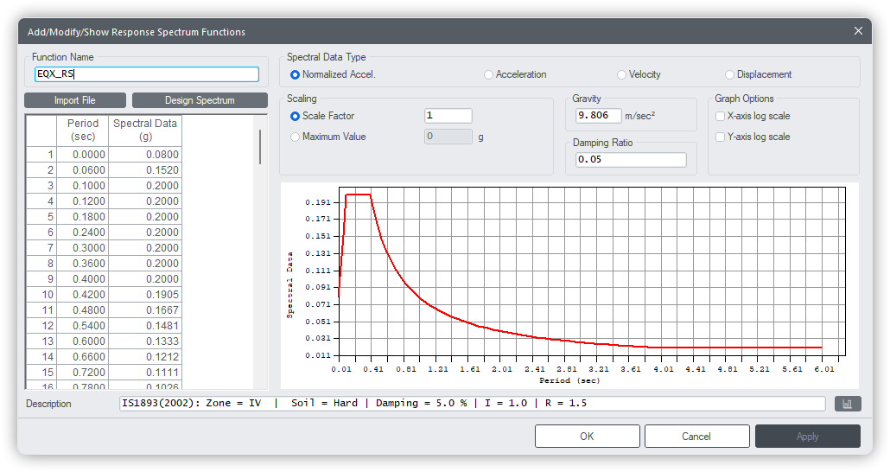

# Response Spectrum Function




## USER Defined
---

Create User-defined Response Spectrum function.

**`RS.Function.USER(name , RSdata = [(0,0),(0.1,0.1)] , spectral_type='Normalized Accel' , scaling=1 , max_value=None , gravity=None , `
   `damping_rat = 0.05 , desc="" , id=None)`**  


#### Parameters
* `name`: Name of the response spectrum function.
* `RSdata`: Sequence of `(period, value)` pairs defining the response spectrum data.
    Default is `[(0, 0), (0.1, 0.1)]`.
* `spectral_type`: Type of spectral data represented by the function. Expected values:   
&emsp;&emsp;&emsp;&emsp;
'Normalized Accel' <font color="orange">&nbsp;&nbsp;|&nbsp;&nbsp;</font> 
'Acceleration'  <font color="orange">&nbsp;&nbsp;|&nbsp;&nbsp;</font> 
'Velocity'  <font color="orange">&nbsp;&nbsp;|&nbsp;&nbsp;</font> 
'Displacement'  
* `scaling`: Scale factor applied to the response spectrum values.   
* `max_value`: Maximum spectral value associated with the function.   
* `gravity`: Gravitational acceleration used for normalization.
    If `None`, the value returned by `Model.gravity()` is used.   
* `damping_rat`: Damping ratio of the response spectrum. Default is `0.05` (5% damping).   
* `desc`: Description of the response spectrum function.   
* `id`: Manually assign an ID.   If **None**, ID will be auto-assigned.


#### Examples
```py

fun_data = [(0,0.0533),(0.06,0.1133),(0.08,0.1333),(0.4,0.1333),(0.48,0.1111),(1.26,0.0423),(2.4,0.0222),(3.36,0.0159),(6,0.0089)]
RS.Function.USER("User Function",fun_data,'Normalized Accel',desc='Descrition')

RS.Function.create()

```

---

## India
---

Create Response Spectrum function based on Indian codes such as IS 1893 and IRC:SP:114-2018.   

**`RS.Function.India(name , code='IS1893(2002)' , soilType='Hard' , zone='IV' , imp_factor=1.0 , RRF=1.5 , max_period=6 , spectral_type='Normalized Accel', scaling=1 ,max_value=None , gravity=None , damping_rat = 0.05 , desc="" , id=None)`**  


#### Parameters
* `name`: Name of the response spectrum function.

* `code`: Seismic design code.  Expected values:    
&emsp;&emsp;&emsp;&emsp;
"IS1893(2016)" <font color="orange">&nbsp;&nbsp;|&nbsp;&nbsp;</font> 
"IS1893(2002)"  <font color="orange">&nbsp;&nbsp;|&nbsp;&nbsp;</font> 
"IRC:SP114(2018)"   

* `soilType`: Soil classification for spectral shape definition.  Expected values:  
&emsp;&emsp;&emsp;&emsp;
"Hard" <font color="orange">&nbsp;&nbsp;|&nbsp;&nbsp;</font> 
"Medium"  <font color="orange">&nbsp;&nbsp;|&nbsp;&nbsp;</font> 
"Soft"  

* `zone`: Seismic zone as per Indian seismic zoning map.  Expected values:  
&emsp;&emsp;&emsp;&emsp;
"II" <font color="orange">&nbsp;&nbsp;|&nbsp;&nbsp;</font> 
"III"  <font color="orange">&nbsp;&nbsp;|&nbsp;&nbsp;</font> 
"IV"  <font color="orange">&nbsp;&nbsp;|&nbsp;&nbsp;</font> 
"V"   

* `imp_factor`: Importance factor (I) of the structure.   
* `RRF`: Response Reduction Factor (R).   
* `max_period`: Maximum time period considered in the spectrum.     
* `spectral_type`: Type of spectral data represented by the function. Expected values:   
&emsp;&emsp;&emsp;&emsp;
'Normalized Accel' <font color="orange">&nbsp;&nbsp;|&nbsp;&nbsp;</font> 
'Acceleration'  <font color="orange">&nbsp;&nbsp;|&nbsp;&nbsp;</font> 
'Velocity'  <font color="orange">&nbsp;&nbsp;|&nbsp;&nbsp;</font> 
'Displacement'  
* `scaling`: Scale factor applied to the response spectrum values.   
* `max_value`: Maximum spectral value associated with the function.   
* `gravity`: Gravitational acceleration used for normalization.
    If `None`, the value returned by `Model.gravity()` is used.   
* `damping_rat`: Damping ratio of the response spectrum. Default is `0.05` (5% damping).   
* `desc`: Description of the response spectrum function. If `desc = ""` , a sample description is automatically generated.       
* `id`: Manually assign an ID.   If **None**, ID will be auto-assigned.


#### Examples
```py

RS.Function.India(name="EQX_RS", code="IS1893(2002)", soilType="Hard", zone="IV")

RS.Function.create()

```