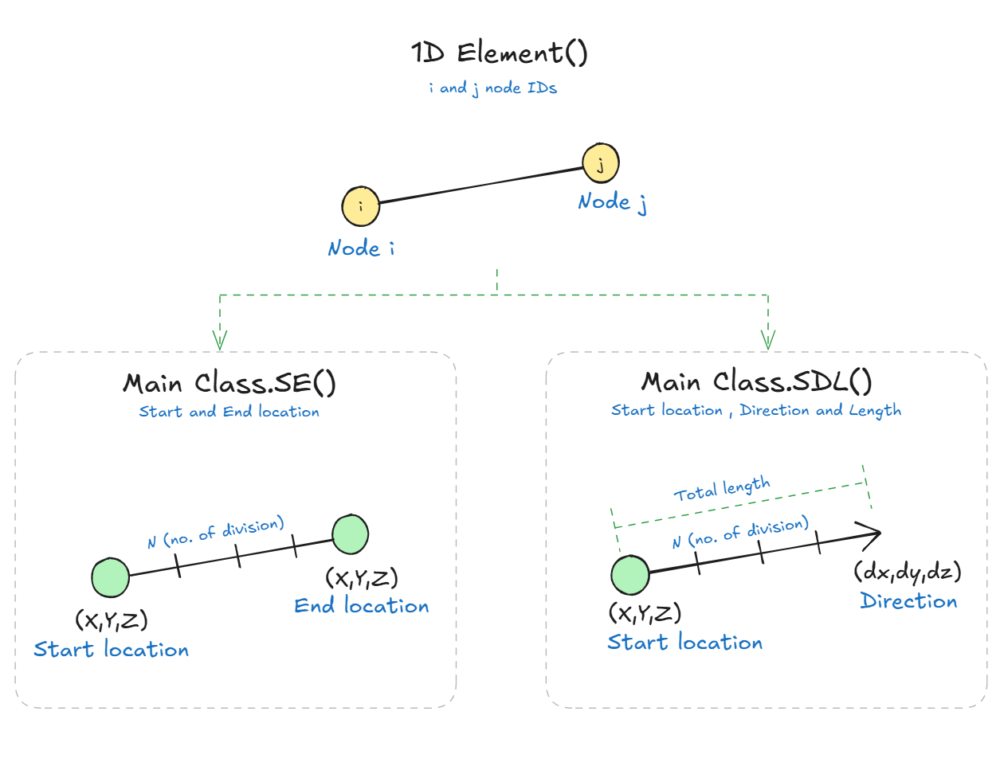
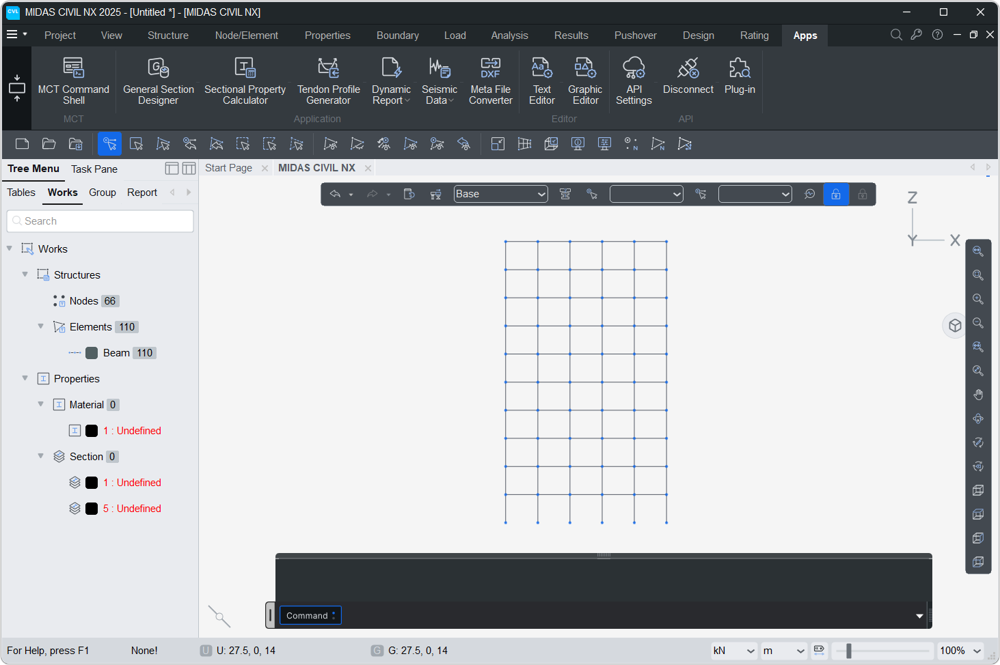

# 1D Elements


### Creation Methods  
There are three methods available to create 1D elements:

* Single Element (Main Class) :  eg. `Truss` , `Beam`  
    Creates one element connecting two nodes by their IDs:`i` and `j`.  
    Use this when we know the specific node IDs to connect.

* Start and End location (`SE`method) :  eg. `Truss.SE` , `Beam.SE`  
    Creates multiple equally spaced elements between a given start and end location.
http://localhost:8000/Element/1D/
* Start, Direction and Length (`SDL` method) :  eg. `Truss.SDL` , `Beam.SDL`  
    It creates equally divided elements at Start location along the the direction with given total length.



## TRUSS
---
A nested class within Element used to create truss elements.

### Object Attributes

`ID`: Element ID  
`TYPE`: Element type = <font color="red">'TRUSS'</font>  
`MATL`: Material ID of the truss element  
`SECT`: Section ID of the truss element  
`NODE`: Nodes of element in list. eg: [1,2]   
`ANGLE`: Beta angle of the truss element  


To create truss element we have total 3 methods :  

### 1. Truss
**<font color="green">`Element.Truss(i:int, j:int, mat = 1, sect = 1, angle = 0, group = '' , id = 0)`</font>**  
Creates a truss between nodes `i` and `j`.

#### Parameters
* `i`: Node ID of i-th end
* `j`: Node ID of j-th end
* `mat (default=1`: Material ID of the truss element
* `sect (default=1)`: Section ID of the truss element
* `angle (default=0)`: Beta angle of the truss element
* `group (default='')`: Structure group of the element and its nodes (can be str or list eg. 'SG' or ['SG1','SG2'])
* `id (default=0)`: Manually assign an ID.   If **0**, ID will be auto-assigned.

#### Examples
```py
Node(0,0,0)    # Create Node at 0,0,0 with ID = 1(default)
Node(1,1,1)    # Create Node at 1,1,1 with ID = 2(default)

beam1 = Element.Truss(1,2)  # Create Truss connecting Node 1 and Node 2 (default ID = 1)

Node.create()
Element.create()
```


### 2. Truss.SE
**<font color="green">`Element.Truss.SE(s_loc: list, e_loc: list, n: int = 1, mat, sect, angle, group, id)`</font>**  
Creates `n` truss elements between start and end location.

#### Parameters
* `s_loc`: Start location. [x,y,z]
* `e_loc`: End location. [x,y,z]
* `n (default=1)`: Number of elements
* `mat,sect,angle,group,id` : Same as Element.Truss() method

#### Examples
```py
Element.Truss.SE([0,0,0],[10,0,0],10) # Create 10 truss between (0,0,0) and (10,0,0) 

Node.create()
Element.create()
```

### 3. Truss.SDL
**<font color="green">`Element.Truss.SDL(s_loc: list, dir: list, l: float, n: int = 1, mat, sect, angle, group, id)`</font>**  
Creates `n` truss elements along a straight line defined by direction `dir` and length `l` starting at `s_loc`.

#### Parameters
* `s_loc`: Starting location [x, y, z]
* `dir`: Direction vector [dx, dy, dz]
* `l`: Total length of element
* `n (default=1)`: Number of elements
* `mat,sect,angle,group,id` : Same as Element.Truss() method

#### Examples
```py
Element.Truss.SDL([0,0,0],[0,0,1],10) # Create a vertical truss of length 10 at (0,0,0)

Node.create()
Element.create()
```


----------------------------------------------------------------------------------------------------------------------


## BEAM

A nested class within Element used to create Beam elements.

### Object Attributes

`ID`: Element ID  
`TYPE`: Element type = <font color="red">'BEAM'</font>  
`MATL`: Material ID of the beam element  
`SECT`: Section ID of the beam element  
`NODE`: Nodes of element in list. eg: [1,2]   
`ANGLE`: Beta angle of the beam element  


To create Beam element we have total 3 methods :  

### 1. Beam
**<font color="green">`Element.Beam(i:int, j:int, mat = 1, sect = 1, angle = 0, group = '' , id = 0)`</font>**  
Creates a Beam between nodes `i` and `j`.

#### Parameters
* `i`: Node ID of i-th end
* `j`: Node ID of j-th end
* `mat (default=1`: Material ID of the Beam element
* `sect (default=1)`: Section ID of the Beam element
* `angle (default=0)`: Beta angle of the Beam element
* `group (default='')`: Structure group of the element and its nodes(can be str or list eg. 'SG' or ['SG1','SG2'])
* `id (default=0)`: Manually assign an ID.   If **0**, ID will be auto-assigned.

#### Examples
```py
Node(0,0,0)    # Create Node at 0,0,0 with ID = 1(default)
Node(1,1,1)    # Create Node at 1,1,1 with ID = 2(default)

beam1 = Element.Beam(1,2)  # Create Beam connecting Node 1 and Node 2 (default ID = 1)

Node.create()
Element.create()
```


### 2. Beam.SE
**<font color="green">`Element.Beam.SE(s_loc: list, e_loc: list, n: int = 1, mat, sect, angle, group, id)`</font>**  
Creates `n` Beam elements between start and end location.

#### Parameters
* `s_loc`: Start location. [x,y,z]
* `e_loc`: End location. [x,y,z]
* `n (default=1)`: Number of elements
* `mat,sect,angle,group,id` : Same as Element.Beam() method

#### Examples
```py
Element.Beam.SE([0,0,0],[10,0,0],10) # Create 10 Beam between (0,0,0) and (10,0,0) 

Node.create()
Element.create()
```

### 3. Beam.SDL
**<font color="green">`Element.Beam.SDL(s_loc: list, dir: list, l: float, n: int = 1, mat, sect, angle, group, id)`</font>**  
Creates `n` Beam elements along a straight line defined by direction `dir` and length `l` starting at `s_loc`.

#### Parameters
* `s_loc`: Starting location [x, y, z]
* `dir`: Direction vector [dx, dy, dz]
* `l`: Total length of element
* `n (default=1)`: Number of elements
* `mat,sect,angle,group,id` : Same as Element.Beam() method

#### Examples
```py
Element.Beam.SDL([0,0,0],[0,0,1],10) # Create a vertical beam of length 10 at (0,0,0)

Node.create()
Element.create()
```

### 4. Beam.PLine
**<font color="green">`Element.Beam.PLine(points_loc: list, n_div:int=0,deg:int=1,includePoint:bool=True, mat, sect, angle, group, id)`</font>**  
Creates equal `n_div` Beam elements passing through curve defined by `points_loc`.   
It allows dividing a curve into equal-length segments while providing an option to include the original input points (even if they don’t coincide with the division points).

#### Parameters
* `points_loc`: List of control points defining the curve. [[x1, y1, z1],[x2, y2, z2],...]
* `n_div`: No. of beam elements to be generated. If `n_div` = 0 , no interpolation will be considered. 
* `deg`: Degree of interpolation curve.   
&emsp;&emsp;&emsp;&emsp;
1 : Linear <font color="orange">&nbsp;&nbsp;|&nbsp;&nbsp;</font> 
2 : Quadratic  <font color="orange">&nbsp;&nbsp;|&nbsp;&nbsp;</font> 
3 : Cubic
* `includePoint`: Whether to include original input points in the final curve.   
&emsp;&emsp;&emsp;&emsp;
• True: Original points always appear in the mesh. <font color="orange">&nbsp;&nbsp;|&nbsp;&nbsp;</font> 
• False: Only equal subdivisions are used.
* `mat,sect,angle,group,id` : Same as Element.Beam() method


#### Examples  

```py
pts = [[0,0,0],[10,0,0],[20,5,0],[40,-10,0],[50,0,0],[60,0,0]]
Element.Beam.PLine(pts,100,1,True)

Node.create()
Element.create()
```  

----------------------------------------------------------------------------------------------------

## TENSION

A nested class within Element used to create tension-only elements, hooks, and cables.

### Object Attributes

`ID`: Element ID  
`TYPE`: Element type = <font color="red">'COMPTR'</font>  
`MATL`: Material ID of the compression element  
`SECT`: Section ID of the compression element  
`NODE`: Nodes of element in list. eg: [1,2]   
`ANGLE`: Beta angle of the compression element  
`STYPE`: Subtype of compression element (1=Compression-only, 2=Gap)  
`TENS`: Allowable tension or initial compression force  
`T_LIMIT`: Compression limit value  
`T_bLMT`: Compression limit flag (automatically set when T_LIMIT is provided)  
`NON_LEN`: Non-linear length parameter (for Gap subtype)  

### Tension Element
**<font color="green">`Element.Tension(i:int, j:int, stype:int, mat = 1, sect = 1, angle = 0, group = '' , id = 0, non_len = None, cable_type = None, tens = None, t_limit = None)`</font>**  
Creates a tension element between nodes `i` and `j`.

#### Parameters
* `i`: Node ID of i-th end
* `j`: Node ID of j-th end
* `stype`: Tension element subtype (1=Tension-only, 2=Hook, 3=Cable)
* `mat (default=1)`: Material ID of the tension element
* `sect (default=1)`: Section ID of the tension element
* `angle (default=0)`: Beta angle of the tension element
* `group (default='')`: Structure group of the element and its nodes (can be str or list eg. 'SG' or ['SG1','SG2'])
* `id (default=0)`: Manually assign an ID. If **0**, ID will be auto-assigned.
* `non_len (default=None)`: Non-linear length parameter for Hook/Cable
* `cable_type (default=None)`: Cable type for stype=3 (1=Pretension, 2=Horizontal, 3=Lu)
* `tens (default=None)`: Initial tension force or allowable compression
* `t_limit (default=None)`: Tension limit value

#### Examples
```py
Node(0,0,0)    # Create Node at 0,0,0 with ID = 1(default)
Node(1,1,1)    # Create Node at 1,1,1 with ID = 2(default)

# Simple tension-only member
tension1 = Element.Tension(1,2,stype=1)

# Tension-only with allowable compression and tension limit
tension2 = Element.Tension(1,2,stype=1,tens=0.5,t_limit=-15)

# Hook element with slack length
hook1 = Element.Tension(3,4,stype=2,non_len=0.5)

# Cable with initial tension and catenary effects
cable1 = Element.Tension(5,6,stype=3,cable_type=3,tens=1000.0,non_len=0.1)

Node.create()
Element.create()
```

### Subtypes

#### 1. Tension-only (stype=1)
- Transfers tension forces only
- Can have allowable compression (`tens` parameter)
- Can have tension limit (`t_limit` parameter)

#### 2. Hook (stype=2)
- Has slack length defined by `non_len` parameter
- Only active when stretched beyond slack length

#### 3. Cable (stype=3)
- Supports catenary analysis
- Requires `cable_type` parameter
- Can have initial tension and slack length


----------------------------------------------------------------------------------------------------


## COMPRESSION

A nested class within Element used to create compression-only elements and gaps.

### Object Attributes

`ID`: Element ID  
`TYPE`: Element type = <font color="red">'COMPTR'</font>  
`MATL`: Material ID of the compression element  
`SECT`: Section ID of the compression element  
`NODE`: Nodes of element in list. eg: [1,2]   
`ANGLE`: Beta angle of the compression element  
`STYPE`: Subtype of compression element (1=Compression-only, 2=Gap)  
`TENS`: Allowable tension or initial compression force  
`T_LIMIT`: Compression limit value  
`T_bLMT`: Compression limit flag (automatically set when T_LIMIT is provided)  
`NON_LEN`: Non-linear length parameter (for Gap subtype)  

### Compression Element
**<font color="green">`Element.Compression(i:int, j:int, stype:int, mat = 1, sect = 1, angle = 0, group = '' , id = 0, tens = None, t_limit = None, non_len = None)`</font>**  
Creates a compression element between nodes `i` and `j`.

#### Parameters
* `i`: Node ID of i-th end
* `j`: Node ID of j-th end
* `stype`: Compression element subtype (1=Compression-only, 2=Gap)
* `mat (default=1)`: Material ID of the compression element
* `sect (default=1)`: Section ID of the compression element
* `angle (default=0)`: Beta angle of the compression element
* `group (default='')`: Structure group of the element and its nodes (can be str or list eg. 'SG' or ['SG1','SG2'])
* `id (default=0)`: Manually assign an ID. If **0**, ID will be auto-assigned.
* `tens (default=None)`: Allowable tension or initial compression force
* `t_limit (default=None)`: Compression limit value
* `non_len (default=None)`: Non-linear length parameter for gap

#### Examples
```py
Node(0,0,0)    # Create Node at 0,0,0 with ID = 1(default)
Node(1,1,1)    # Create Node at 1,1,1 with ID = 2(default)

# Simple compression-only member
comp1 = Element.Compression(1,2,stype=1)

# Compression-only with tension limit and buckling limit
comp2 = Element.Compression(1,2,stype=1,tens=27,t_limit=-15)

# Gap element with initial gap
gap1 = Element.Compression(3,4,stype=2,non_len=0.25)

Node.create()
Element.create()
```

### Subtypes

#### 1. Compression-only (stype=1)
- Transfers compression forces only
- Can have allowable tension (`tens` parameter)
- Can have compression limit (`t_limit` parameter)

#### 2. Gap (stype=2)
- Has initial gap defined by `non_len` parameter
- Only active when compressed beyond gap length


----------------------------------------------------------------------------------------------------


## Examples

### 1. Portal Frame

```py
h = 3.5        # Height of each storey
w = 4.0       # Width of each Bay

n_storey = 10 # Total no. of storey
n_bay = 5      # Total no. of bay

for i in range(n_bay+1):
    for j in range(n_storey):
        if i!=n_bay:
            Element.Beam.SDL([i*w,0,j*h],[0,0,1],h,sect=1)  # Column -> Sect ID = 1
            Element.Beam.SDL([i*w,0,(j+1)*h],[1,0,0],w,sect=5) # Beam -> Sect ID = 5
        else:
            Element.Beam.SDL([i*w,0,j*h],[0,0,1],h,sect=1) # Column -> Sect ID = 1

Node.create()
Element.create()

```


------------------------------------------

### 2. Warren Truss

```py
span = 20.5  # Span of truss
n_div = 8    # No. of bottom divisions
h = 2.5      # Height of truss

dx = 0.5*span/n_div

Element.Truss.SDL([0,0,0],[1,0,0],span,n_div)

Element.Truss.SDL([dx,0,h],[1,0,0],span-2*dx,n_div-1)

for i in range(n_div):
    Element.Truss(i+1,i+2+n_div)
    Element.Truss(i+2,i+2+n_div)

Node.create()
Element.create()
```


------------------------------------------