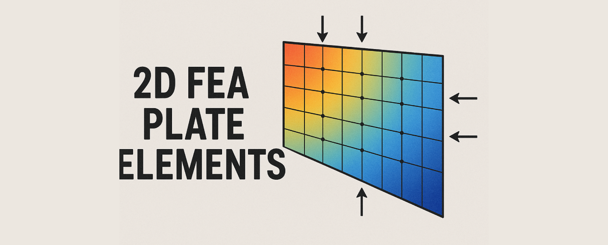
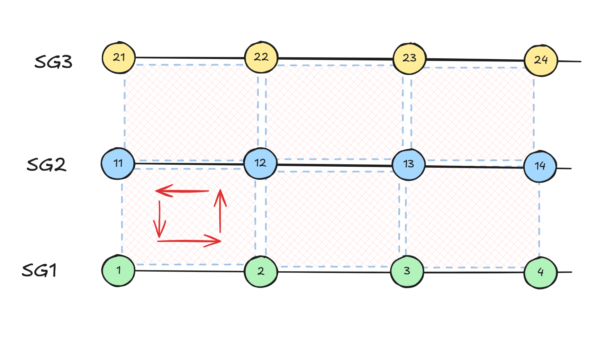
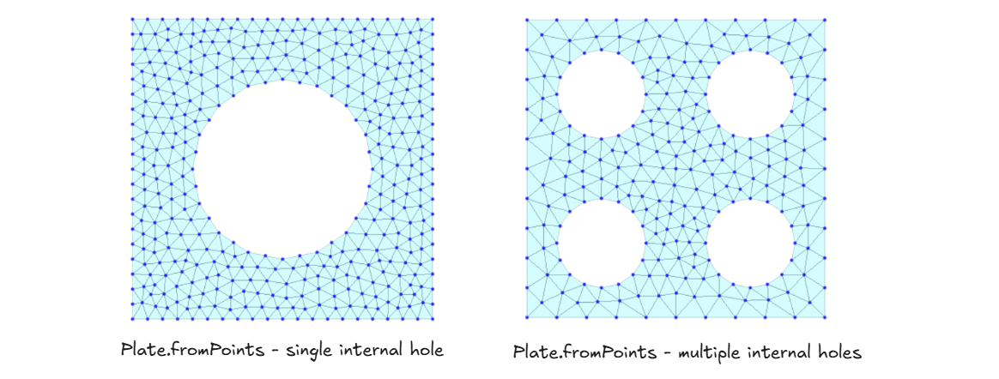
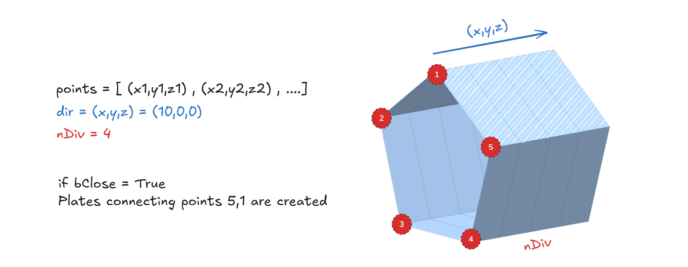
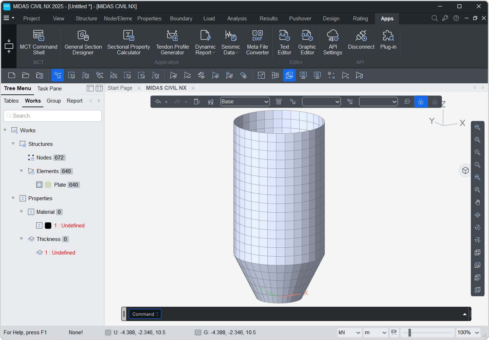

# 2D Elements




## PLATE
---
A nested class within Element used to create Plate elements.

### Object Attributes

`ID`: Element ID  
`TYPE`: Element type = <font color="red">'PLATE'</font>  
`MATL`: Material ID of the plate element  
`SECT`: Section/Thickness ID of the plate element  
`NODE`: Nodes of element in list. eg: [1,2,3,4]   
`ANGLE`: Beta angle of the plate element  
`AREA` : Area of Plate element  
`NORMAL` : Normal vector of the Plate element   eg: (0,0,1)   
`CENTER` : Centroid location of the Plate element   (x,y,z)   
`STYPE`: Type of Plate element   
&emsp;&emsp;&emsp;&emsp;1 : Thick <font color="orange">&nbsp;&nbsp;|&nbsp;&nbsp;</font> 
2 : Thin  <font color="orange">&nbsp;&nbsp;|&nbsp;&nbsp;</font> 
3 : Thick w Drilling dof  <font color="orange">&nbsp;&nbsp;|&nbsp;&nbsp;</font> 
4 : Thin w Drilling dof  

To create Plate element we have total 2 methods :  

### 1. Plate
**<font color="green">`Element.Plate(nodes:list, stype:int=1, mat = 1, sect = 1, angle = 0, group = '' , id=None)`</font>**  
Creates a Plate element.

#### Parameters
* `node`: Nodes of the Plate element
* `stype (default=3)`: Sub Type of Plate element   
&emsp;&emsp;&emsp;&emsp;
1 : Thick <font color="orange">&nbsp;&nbsp;|&nbsp;&nbsp;</font> 
2 : Thin  <font color="orange">&nbsp;&nbsp;|&nbsp;&nbsp;</font> 
3 : Thick w Drilling dof  <font color="orange">&nbsp;&nbsp;|&nbsp;&nbsp;</font> 
4 : Thin w Drilling dof  
* `mat (default=1)`: Material ID of the Plate element  
* `sect (default=1)`: Thickness ID of the Plate element  
* `angle (default=0)`: Beta angle of the Plate element  
* `group (default='')`: Structure group of the element and its nodes(can be str or list eg. 'SG' or ['SG1','SG2'])
* `id (default=None)`: Manually assign an ID.   If **None**, ID will be auto-assigned.  

#### Examples
```py
Node(0,0,0)
Node(1,0,0)
Node(1,1,0)
Node(0,1,0)
Element.Plate([1,2,3,4])

Node.create()
Element.create()
```


### 2. Plate.loftGroups
**<font color="green">`Element.Plate.loftGroups(strGroups:list, stype:int=1, mat = 1, sect = 1, angle = 0, group = '' , id=None , nDiv:int=1 , bClose:bool=False)`</font>**  
Creates Plate elements connecting the nodes in Structure groups.




#### Parameters
* `loftGroups`: List of Structure groups whose nodes are to be used(eg. ['SG1','SG2','SG3']) .   
&emsp;&emsp;&emsp;&emsp; Min. 2 groups with 2 nodes are nodes are required.
* `stype (default=3)`: Sub Type of Plate element   
&emsp;&emsp;&emsp;&emsp;
1 : Thick <font color="orange">&nbsp;&nbsp;|&nbsp;&nbsp;</font> 
2 : Thin  <font color="orange">&nbsp;&nbsp;|&nbsp;&nbsp;</font> 
3 : Thick w Drilling dof  <font color="orange">&nbsp;&nbsp;|&nbsp;&nbsp;</font> 
4 : Thin w Drilling dof  
* `mat (default=1)`: Material ID of the Plate element  
* `sect (default=1)`: Thickness ID of the Plate element  
* `angle (default=0)`: Beta angle of the Plate element  
* `group (default='')`: Structure group of the element and its nodes(can be str or list eg. 'SG' or ['SG1','SG2'])
* `id (default=None)`: Manually assign an ID.   If **None**, ID will be auto-assigned.   
* `nDiv (default = 1) `: Number of divisions between each loft.   
* `bClose (default=False)`: Whether to close the loop or not.  

#### Examples
```py
Element.Beam.SDL([0,0,0],[1,0,0],10,10,group='SG1')
Element.Beam.SDL([0,1,0],[1,0,0],10,10,group='SG2')
Element.Beam.SDL([0,3,0],[1,0,0],10,10,group='SG3')

Element.Plate.loftGroups(['SG1','SG2','SG3'])

Node.create()
Element.create()
```


### 3. Plate.fromPoints
**<font color="green">`Element.Plate.fromPoints(points: list, meshSize=1.0 , meshType='Tri', innerPoints=None , stype = 1, mat = 1, sect = 1, angle = 0, group = "" , id = None )`</font>**  
Creates meshed Plate elements connecting the boundary points.



#### Parameters
* `points`: List of points representing outer boundary(eg. `[(x1,y1,z1) , (x2,y2,z2), (x3,y3,z3)]`) .   
* `meshSize`: Mesh size .   
* `meshType`: Type of meshing (`Tri` or `Quad`).  
    <font color="blue" size="2px">*Gmsh is being used for meshing. So, depending upon `points` and `innerPoints` input , Quad mesh-size can differ or Quad meshing can even fail.*</font>
* `innerPoints (optional)`: List of points representing internal holes can be single or multiple holes.    
&emsp;&emsp;&emsp;&emsp;Single hole - `[(x1,y1,z1) , (x2,y2,z2), (x3,y3,z3)]`     
&emsp;&emsp;&emsp;&emsp;Multiple hole - `[[(x11,y11,z11) , (x12,y12,z12), (x13,y13,z13)],[(x21,y21,z21) , (x22,y22,z22), (x23,y23,z23)]]`      
* `stype (default=3)`: Sub Type of Plate element   
&emsp;&emsp;&emsp;&emsp;
1 : Thick <font color="orange">&nbsp;&nbsp;|&nbsp;&nbsp;</font> 
2 : Thin  <font color="orange">&nbsp;&nbsp;|&nbsp;&nbsp;</font> 
3 : Thick w Drilling dof  <font color="orange">&nbsp;&nbsp;|&nbsp;&nbsp;</font> 
4 : Thin w Drilling dof  
* `mat (default=1)`: Material ID of the Plate element  
* `sect (default=1)`: Thickness ID of the Plate element  
* `angle (default=0)`: Beta angle of the Plate element  
* `group (default='')`: Structure group of the element and its nodes(can be str or list eg. 'SG' or ['SG1','SG2'])
* `id (default=None)`: Manually assign an ID.   If **None**, ID will be auto-assigned.  

#### Examples

```py
# PLATE MESHING WITH SINGLE HOLE

from midas_civil import *
import math

# Creates circle with given radius and center
def CirclePts(origin,radius,nSides):
    pts = []
    for i in range(nSides):
        theta = i*2*math.pi/nSides
        pts.append([origin[0]+radius*math.sin(theta),origin[1]+radius*math.cos(theta),origin[2]])
    return pts

innerHole=CirclePts((0,0,0),6,16)
outerBoundary = [(-10,-10,0),(10,-10,0),(10,10,0),(-10,10,0)]

Element.Plate.fromPoints(outerBoundary,1,'Tri',innerPoints=innerHole,sect=2,group='Pile Cap')

Node.create()
Element.create()
```

```py
# PLATE MESHING WITH MULTIPLE HOLES
from midas_civil import *
import math

# Creates circles with given radius and center
def CirclePts(origin,radius,nSides):
    pts = []
    for i in range(nSides):
        theta = i*2*math.pi/nSides
        pts.append([origin[0]+radius*math.sin(theta),origin[1]+radius*math.cos(theta),origin[2]])
    return pts

innerHole=[CirclePts((-5,-5,0),3,16),CirclePts((-5,5,0),3,16),CirclePts((5,-5,0),3,16),CirclePts((5,5,0),3,16)]
outerBoundary = [(-10,-10,0),(10,-10,0),(10,10,0),(-10,10,0)]

Element.Plate.fromPoints(outerBoundary,2,'Tri',innerPoints=innerHole,sect=2,group='Pile Cap')

Node.create()
Element.create()
```


### 4. Plate.extrude
**<font color="green">`Element.Plate.extrude(points: list , dir:list , nDiv:int=1 , bClose:bool=False , inpType='XYZ' , stype = 1, mat = 1, sect = 1, angle = 0, group = "" , id = None)`</font>**  
Creates meshed Plate elements connecting the boundary points.



#### Parameters
* `points`: List of points to be connected and extruded. Input depends upon the `inpType`.       
* `dir`: Direction and length of extrusion (eg. `(0,0,2)` - extrude along z direction by 2 units)    
* `nDiv`: No. of divisions along the extrusion.       
* `bClose`: Whether to close the loop or not.      
* `inpType`: Type of `points` input (eg. `XYZ` or `ID` or `NODE`)    
&emsp;&emsp;&emsp;&emsp;
1 : `XYZ` - points (`list(x,y,z)`) = `[(x1,y1,z1) , (x2,y2,z2), (x3,y3,z3)]`    
&emsp;&emsp;&emsp;&emsp;
2 : `ID` - points (`list(int)`) = `[nID_1 , nID_2 , nID_3]`    
&emsp;&emsp;&emsp;&emsp;
3 : `NODE` - points (`list(Node)`) = `[Node1 , Node2 , Node3]`    

* `stype (default=3)`: Sub Type of Plate element   
&emsp;&emsp;&emsp;&emsp;
1 : Thick <font color="orange">&nbsp;&nbsp;|&nbsp;&nbsp;</font> 
2 : Thin  <font color="orange">&nbsp;&nbsp;|&nbsp;&nbsp;</font> 
3 : Thick w Drilling dof  <font color="orange">&nbsp;&nbsp;|&nbsp;&nbsp;</font> 
4 : Thin w Drilling dof  
* `mat (default=1)`: Material ID of the Plate element  
* `sect (default=1)`: Thickness ID of the Plate element  
* `angle (default=0)`: Beta angle of the Plate element  
* `group (default='')`: Structure group of the element and its nodes(can be str or list eg. 'SG' or ['SG1','SG2'])
* `id (default=None)`: Manually assign an ID.   If **None**, ID will be auto-assigned.  

#### Examples

```py
from midas_civil import *
import math

def CirclePts(origin,radius,nSides):
    pts = []
    for i in range(nSides):
        theta = i*2*math.pi/nSides
        pts.append([origin[0],origin[1]+radius*math.sin(theta),origin[2]+radius*math.cos(theta)])
    return pts

Element.Plate.extrude(CirclePts((0,0,0),6,5),(10,0,0),4,True,inpType='XYZ')

Node.create()
Element.create()
```


### Examples

#### 1. Silo

```py
import math
R_top=5.0   # Radius at the top of Silo
R_bot = 2.5 # Radius at the bottom of Silo < R_top

H_tot=20.0 # Total height of Silo
H_tap = 5  # Height of tapered portion < H_tot

nR=32      # Sides of cylinder
nH=20      # Divisions along height

for q in range(nH+1):
    for i in range(nR):
        theta = i*2*math.pi/nR
        R = min(R_top,R_bot+q*H_tot/nH*(R_top-R_bot)/(H_tap))
        Node(R*math.sin(theta),R*math.cos(theta),q*H_tot/nH)

for q in range(nH):
    n_list = list(range(q*nR+1,(q+1)*nR+1))
    for i in range(nR):
        n1=n_list[i]
        n2=n_list[(i+1)%nR]
        Element.Plate([n1,n2,n2+nR,n1+nR])
        
Node.create()
Element.create()
```



## WALL
---
A nested class within Element used to create Wall elements. <font color="red">(Only applicable in GEN NX) </font>    

### Wall
**<font color="green">`Element.Wall(nodes: list, stype: int, wtype:int , wID:int , mat , sect , group = "" , id: int = None)`</font>**  
Creates a Wall element.

#### Parameters
* `node`: Nodes of the v element
* `stype (default=2)`: Sub Type of Wall element   
&emsp;&emsp;&emsp;&emsp;
1 : Membrane <font color="orange">&nbsp;&nbsp;|&nbsp;&nbsp;</font> 
2 : Plate     

* `wtype (default=2)`: Wall type   
&emsp;&emsp;&emsp;&emsp;
0 : Plate Base <font color="orange">&nbsp;&nbsp;|&nbsp;&nbsp;</font> 
1 : CRB-Pin <font color="orange">&nbsp;&nbsp;|&nbsp;&nbsp;</font> 
2 : CRB-Fixed      

* `wID (default=1)`: Wall ID of the Wall element  
* `mat (default=1)`: Material ID of the Wall element  
* `sect (default=1)`: Thickness ID of the Wall element  
* `angle (default=0)`: Beta angle of the Wall element  
* `group (default='')`: Structure group of the element and its nodes(can be str or list eg. 'SG' or ['SG1','SG2'])
* `id (default=None)`: Manually assign an ID.   If **None**, ID will be auto-assigned.  


### Object Attributes

`ID`: Element ID  
`TYPE`: Element type = <font color="red">'WALL'</font>  
`MATL`: Material ID of the Wall element  
`SECT`: Section/Thickness ID of the Wall element  
`NODE`: Nodes of element in list. eg: [1,2,3,4]   
`ANGLE`: Beta angle of the Wall element  
`AREA` : Area of Wall element  
`NORMAL` : Normal vector of the Wall element   eg: (0,0,1)   
`CENTER` : Centroid location of the Wall element   (x,y,z)   
`STYPE`: Sub-Type of Wall element   
&emsp;&emsp;&emsp;&emsp;
1 : Membrane <font color="orange">&nbsp;&nbsp;|&nbsp;&nbsp;</font> 
2 : Plate     

`WTYPE`: Wall type   
&emsp;&emsp;&emsp;&emsp;
0 : Plate Base <font color="orange">&nbsp;&nbsp;|&nbsp;&nbsp;</font> 
1 : CRB-Pin <font color="orange">&nbsp;&nbsp;|&nbsp;&nbsp;</font> 
2 : CRB-Fixed     

`WID`: Wall ID of the Wall element  

#### Examples
```py
Node(0,0,0)
Node(1,0,0)
Node(1,1,0)
Node(0,1,0)
Element.Wall([1,2,3,4])

Node.create()
Element.create()
```
