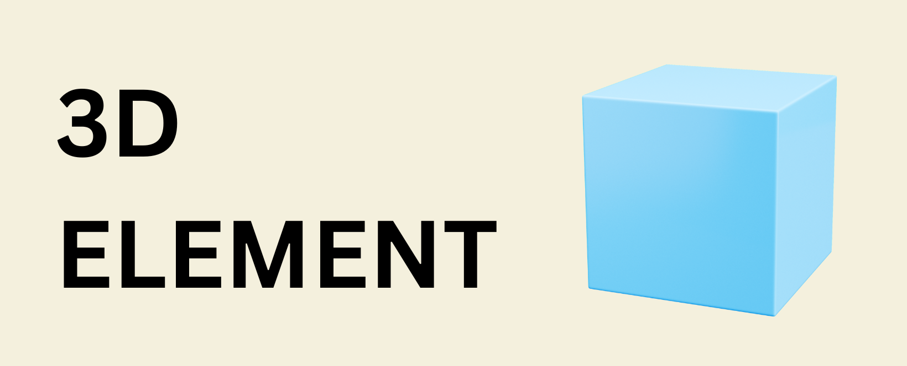
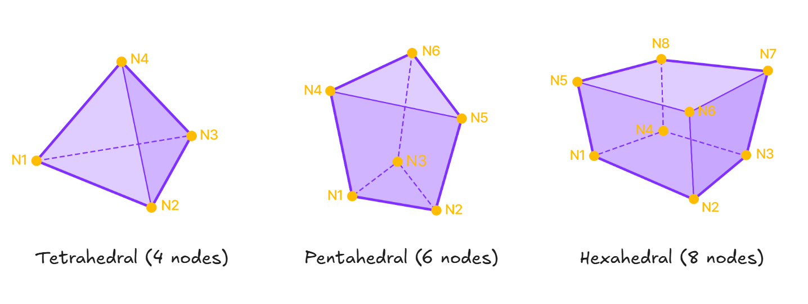

# 3D Elements




## SOLID
---
A nested class within Element used to create Solid elements.

### Object Attributes

`ID`: Element ID  
`TYPE`: Element type = <font color="red">'SOLID'</font>  
`MATL`: Material ID of the solid element  
`SECT`: Section ID of the solid element  
`NODE`: Nodes of element in list. eg: [1,2,3,4] for tetrahedral  
`STYPE`: Type of Solid element  

### Constructor
**<font color="green">`Element.Solid(nodes:list, mat = 1, sect = 0, group = '' , id = 0)`</font>**  
Creates a Solid element.

#### Parameters
* `nodes`: Nodes of the Solid element
  - **4 nodes**: Tetrahedral element
  - **6 nodes**: Pentahedral (wedge) element  
  - **8 nodes**: Hexahedral (brick) element
* `mat (default=1)`: Material ID of the Solid element  
* `sect (default=0)`: Section ID of the Solid element  
* `group (default='')`: Structure group of the element and its nodes (can be str or list eg. 'SG' or ['SG1','SG2'])
* `id (default=0)`: Manually assign an ID. If **0**, ID will be auto-assigned.  

#### Node Ordering



#### Examples
```py

# Hexahedral element
Node(0,0,0)    # Node 1
Node(1,0,0)    # Node 2
Node(1,1,0)    # Node 3
Node(0,1,0)    # Node 4
Node(0,0,1)    # Node 5
Node(1,0,1)    # Node 6
Node(1,1,1)    # Node 7
Node(0,1,1)    # Node 8

Element.Solid([1,2,3,4,5,6,7,8])

Node.create()
Element.create()
```


## Examples

### 1. Simple Tetrahedral

```py
# Create a simple tetrahedral mesh for a pyramid
base_size = 2.0
height = 3.0

# Base nodes (corrected order: N1, N2, N3)
Node(0, 0, 0)                    # Node 1 (N1)
Node(base_size, 0, 0)           # Node 2 (N2)
Node(base_size/2, base_size, 0) # Node 3 (N3)

# Apex node
Node(base_size/2, base_size/3, height)  # Node 4 (N4)

# Create tetrahedral element with correct node ordering
Element.Solid([1,2,3,4], mat=1)

Node.create()
Element.create()
```

### 2. Hexahedral Block

```py
# Create a structured 3D block using hexahedral elements
length = 4.0
width = 2.0
height = 1.0
n_x = 2  # Divisions in x direction
n_y = 2  # Divisions in y direction
n_z = 1  # Divisions in z direction

# Generate nodes
nodes = {}
node_id = 1

for k in range(n_z + 1):
    for j in range(n_y + 1):
        for i in range(n_x + 1):
            x = i * length / n_x
            y = j * width / n_y
            z = k * height / n_z
            Node(x, y, z)
            nodes[(i,j,k)] = node_id
            node_id += 1

# Create hexahedral elements with correct node ordering
elem_id = 1
for k in range(n_z):
    for j in range(n_y):
        for i in range(n_x):
            # Define 8 corner nodes following N1-N8 pattern
            n1 = nodes[(i,   j,   k)]      # N1
            n2 = nodes[(i+1, j,   k)]      # N2
            n3 = nodes[(i+1, j+1, k)]      # N3
            n4 = nodes[(i,   j+1, k)]      # N4
            n5 = nodes[(i,   j,   k+1)]    # N5
            n6 = nodes[(i+1, j,   k+1)]    # N6
            n7 = nodes[(i+1, j+1, k+1)]    # N7
            n8 = nodes[(i,   j+1, k+1)]    # N8
            
            Element.Solid([n1,n2,n3,n4,n5,n6,n7,n8], mat=1, id=elem_id)
            elem_id += 1

Node.create()
Element.create()
```

### 3. Pentahedral Elements

```py
# Create wedge elements for transitional meshing
# Bottom triangular face: N1, N2, N3
Node(0, 0, 0)    # Node 1 (N1)
Node(2, 0, 0)    # Node 2 (N2)
Node(1, 2, 0)    # Node 3 (N3)

# Top triangular face: N4, N5, N6
Node(0, 0, 1)    # Node 4 (N4)
Node(2, 0, 1)    # Node 5 (N5)
Node(1, 2, 1)    # Node 6 (N6)

# Create pentahedral element with correct node ordering
Element.Solid([1,2,3,4,5,6], mat=1)

Node.create()
Element.create()
```