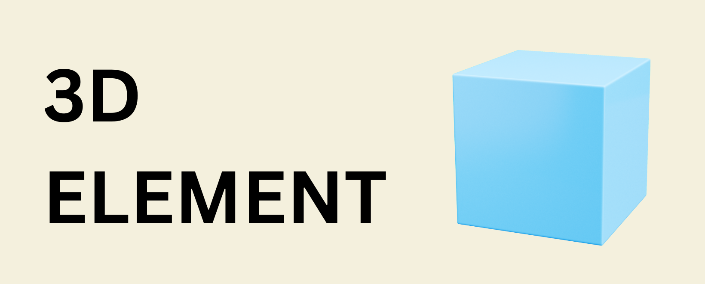
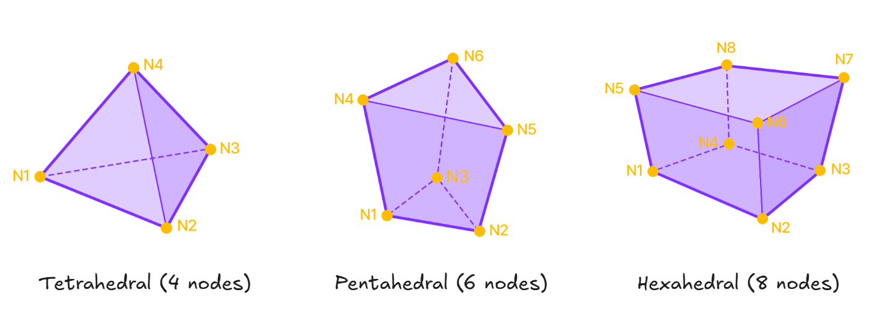
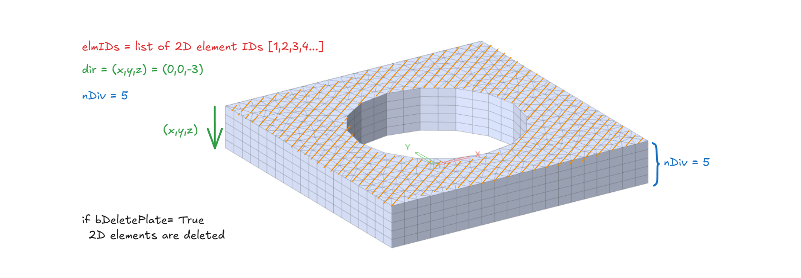
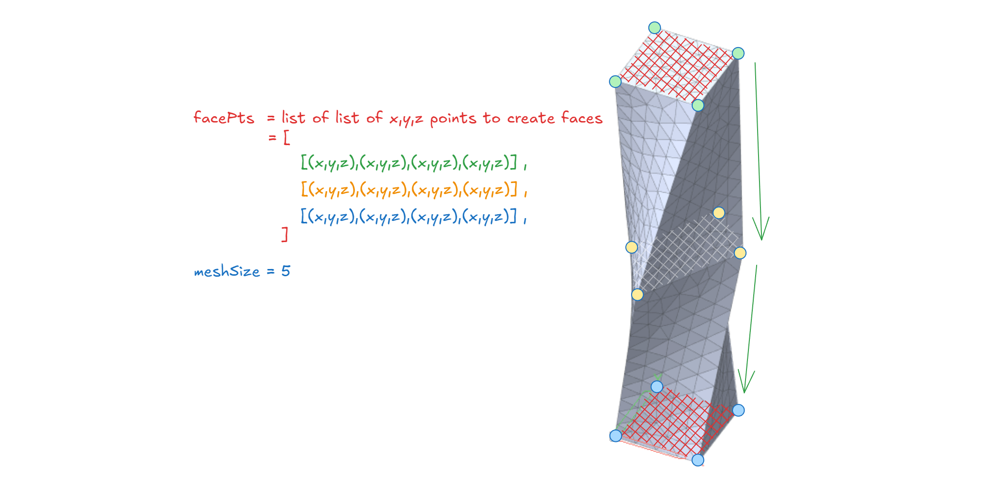
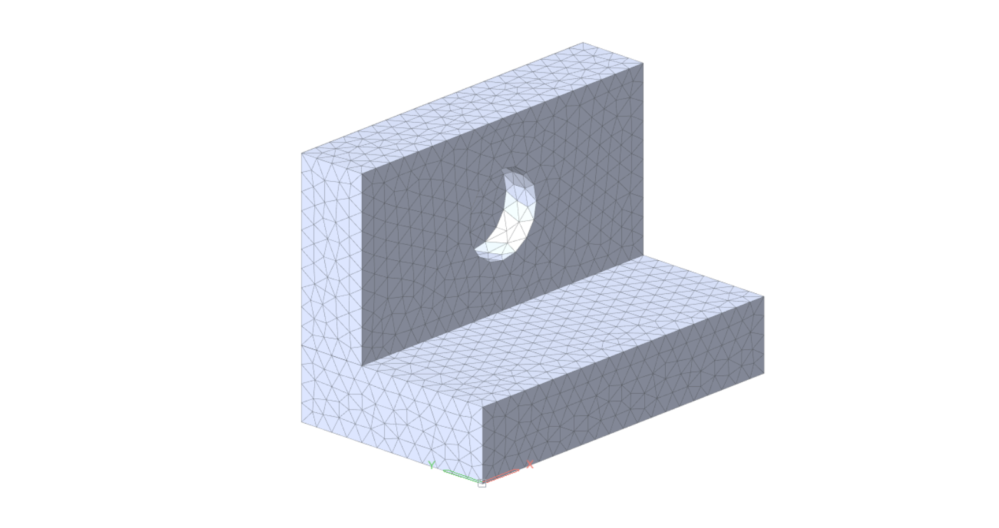

# 3D Elements




## SOLID
---
A nested class within Element used to create Solid elements.

### Object Attributes

`ID`: Element ID  
`TYPE`: Element type = <font color="red">'SOLID'</font>  
`MATL`: Material ID of the solid element  
`SECT`: Section ID of the solid element  
`NODE`: Nodes of element in list. eg: [1,2,3,4] for tetrahedral  
`STYPE`: Type of Solid element  

### 1. Solid
**<font color="green">`Element.Solid(nodes:list, mat = 1, group = '' , id=None)`</font>**  
Creates a Solid element.

#### Parameters
* `nodes`: Nodes of the Solid element
  - **4 nodes**: Tetrahedral element
  - **6 nodes**: Pentahedral (wedge) element  
  - **8 nodes**: Hexahedral (brick) element
* `mat (default=1)`: Material ID of the Solid element  
* `group (default='')`: Structure group of the element and its nodes (can be str or list eg. 'SG' or ['SG1','SG2'])
* `id (default=None)`: Manually assign an ID. If **0**, ID will be auto-assigned.  

#### Node Ordering



#### 1. Simple Tetrahedral

```py
# Create a simple tetrahedral mesh for a pyramid
base_size = 2.0
height = 3.0

# Base nodes (corrected order: N1, N2, N3)
Node(0, 0, 0)                    # Node 1 (N1)
Node(base_size, 0, 0)           # Node 2 (N2)
Node(base_size/2, base_size, 0) # Node 3 (N3)

# Apex node
Node(base_size/2, base_size/3, height)  # Node 4 (N4)

# Create tetrahedral element with correct node ordering
Element.Solid([1,2,3,4], mat=1)

Node.create()
Element.create()
```

#### 2. Hexahedral Block

```py

# Hexahedral element
Node(0,0,0)    # Node 1
Node(1,0,0)    # Node 2
Node(1,1,0)    # Node 3
Node(0,1,0)    # Node 4
Node(0,0,1)    # Node 5
Node(1,0,1)    # Node 6
Node(1,1,1)    # Node 7
Node(0,1,1)    # Node 8

Element.Solid([1,2,3,4,5,6,7,8])

Node.create()
Element.create()
```

#### 3. Pentahedral Elements

```py
# Create wedge elements for transitional meshing
# Bottom triangular face: N1, N2, N3
Node(0, 0, 0)    # Node 1 (N1)
Node(2, 0, 0)    # Node 2 (N2)
Node(1, 2, 0)    # Node 3 (N3)

# Top triangular face: N4, N5, N6
Node(0, 0, 1)    # Node 4 (N4)
Node(2, 0, 1)    # Node 5 (N5)
Node(1, 2, 1)    # Node 6 (N6)

# Create pentahedral element with correct node ordering
Element.Solid([1,2,3,4,5,6], mat=1)

Node.create()
Element.create()
```


---


### 2. Solid.extrudeFromPlates
**<font color="green">`Element.Solid.extrudeFromPlates(elmIDs,dir=[0,0,1],nDiv = 1, mat=1, group="", id=None, bDeletePlate=False)`</font>**  
Creates Solid elements by extruding existing 2D plate elements.




#### Parameters
* `elmIDs`: List of 2D plate element IDs to be extruded (`list(int)`). 
* `dir`: Direction and length of extrusion (eg. `(0,0,2)` - extrude along z direction by 2 units)       
* `nDiv`: No. of divisions along the extrusion.        
* `bDeletePlate`: Whether to delete the original source plate elements after extrusion.    
* `mat (default=1)`: Material ID of the Solid element  
* `group (default='')`: Structure group of the element and its nodes (can be str or list eg. 'SG' or ['SG1','SG2'])
* `id (default=None)`: Manually assign an ID. If **0**, ID will be auto-assigned.  


#### Examples
```py
from midas_civil import *
import math

# Creates circle with given radius and center - 2D Plate
def CirclePts(origin,radius,nSides):
    pts = []
    for i in range(nSides):
        theta = i*2*math.pi/nSides
        pts.append([origin[0]+radius*math.sin(theta),origin[1]+radius*math.cos(theta),origin[2]])
    return pts

innerHole=CirclePts((0,0,0),6,16)
outerBoundary = [(-10,-10,0),(10,-10,0),(10,10,0),(-10,10,0)]

Element.Plate.fromPoints(outerBoundary,1,'Tri',innerPoints=innerHole,sect=2,group='Cap')


# Extruding Plate in Z-direction to form solid
Element.Solid.extrudeFromPlates(elmIDs=elemsInGroup('Cap'),
                               dir=(0,0,-3),
                               nDiv=5,
                               bDeletePlate=True)


Node.create()
Element.create()
```

---

### 3. Solid.fromPoints
**<font color="green">`Element.Solid.fromPoints(facePts:list,meshSize:float=None,mat:int=1,group='',id:int=None)`</font>**  
Creates Solid elements by meshing the geometry created by lofting between faces created from input points.    
The geometry is meshed using tetrahedral elements.   





#### Parameters
* `facePts`: List of list of (x,y,z) points defining a face (`list(list())`). 
* `meshSize`: Mesh size .         
* `mat (default=1)`: Material ID of the Solid element  
* `group (default='')`: Structure group of the element and its nodes (can be str or list eg. 'SG' or ['SG1','SG2'])
* `id (default=None)`: Manually assign an ID. If **0**, ID will be auto-assigned.  


#### Examples
```py
from midas_civil import *
import math


Element.Solid.fromPoints(
    facePts=[
        [(0,0,0),(2,0,0),(2,2,0),(0,2,0)],
        [(1,-1,5),(2.4,1.4,5),(1,2.8,5),(-0.4,1.4,5)],
        [(2,0,10),(2,2,10),(0,2,10),(0,0,10),],
        ],
    meshSize=0.5)

Node.create()
Element.create()

```

---


### 4. Solid.fromMSHfile
**<font color="green">`Element.Solid.fromMSHfile(fileLoc:str,mat:int=1,group='',id:int=None)`</font>**  
Creates Solid elements imported from a *.MSH file.   
This file can be created using GMSH library.   





#### Parameters
* `fileLoc`: Location of MSH file .         
* `mat (default=1)`: Material ID of the Solid element  
* `group (default='')`: Structure group of the element and its nodes (can be str or list eg. 'SG' or ['SG1','SG2'])
* `id (default=None)`: Manually assign an ID. If **0**, ID will be auto-assigned.  


#### Examples
```py
from midas_civil import *
import math


# USING GMSH to create a MSH file of a bracket
import gmsh
gmsh.initialize()

L = 10.0       # length
W = 6.0        # width
H = 2.0        # base thickness

base = gmsh.model.occ.addBox(0, 0, 0, L, W, H)
back = gmsh.model.occ.addBox(0, W - 2.0, H,L, 2.0, 5.0)
hole = gmsh.model.occ.addCylinder(L / 2, W - 2.0, H + 2.5,0, 1, 0,1.2)

back_cut, _ = gmsh.model.occ.cut([(3, back)],[(3, hole)])

all_parts = [(3, base)] + back_cut

gmsh.model.occ.synchronize()
gmsh.option.setNumber("Mesh.MeshSizeMax", 0.5)

# Generate 3D tetrahedral mesh
gmsh.model.mesh.generate(3)

# Save the MSH file
gmsh.write("bracket_3d.msh")
gmsh.finalize()

# Loading the MSH file
Element.Solid.fromMSHfile("bracket_3d.msh")

Node.create()
Element.create()

```
