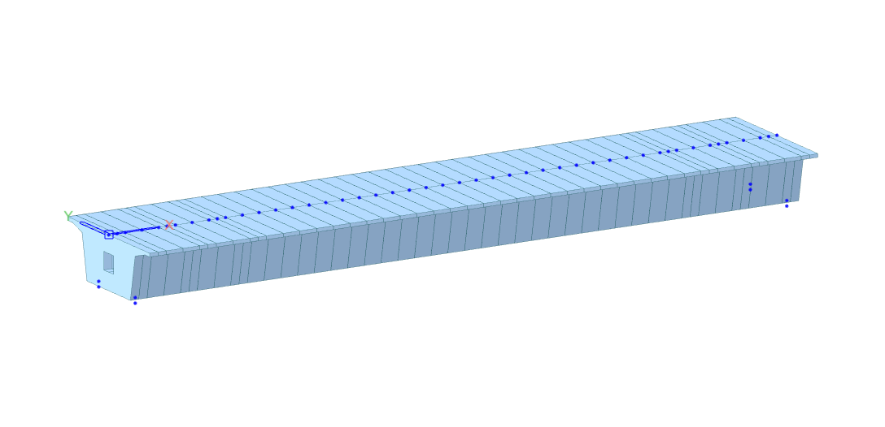

# PSC BOX GIRDER BRIDGE

---



## Complete Code

```python
from midas_civil import *
MAPI_KEY('xxxxxxxxxxxxxx')
MAPI_BASEURL.autoURL()

import math
# ==============================================================================
# 1. GEOMETRY INPUTS
# ==============================================================================

length_bridge = 40

sup_sec_length = 3
sup_sec_location = 0.5 

tapperd_lenght = 3    

bearing_left_loc = 0.5  
bearing_right_loc = 0.5 
bearing_th = 0.3    

# ==============================================================================
# 2. MATERIAL DEFINITIONS
# ==============================================================================

Model.units("KN", "M")

# Base Materials
Material.CONC("M50", "IRC(RC)", "M50")
Material.STEEL.User("Tendon", 1.9884e7, 0.3, 80.05, 0, 1.2e-5)

# Time-Dependent Properties
CreepShrinkage.IRC("M50", code_year=2020, fck=50000, notional_size=1, relative_humidity=70, age_shrinkage=3, type_cement='NR', id=1)
CompStrength.IRC("M50", code_year=2020, fck_delta=60000, cement_type=2)
TDMatLink(1, "M50", "M50")  
 

# ==============================================================================
# 3. SECTION DEFINITIONS
# ==============================================================================

mid_HO1 = 0.2
mid_HO2 = 0.3
mid_HO3 = 2.5
mid_BO2 = 0.5
mid_BO3 = 2.25

Section.PSC.CEL12(
    Name="Mid Section", Shape="1CEL", Joint=[1, 0, 0, 1, 0, 1, 0, 1],
    HO1=0.2,  HO2=0.3,  HO3=mid_HO3,
    BO1=1.5,  BO11=0.5, BO2=mid_BO2, BO3=mid_BO3,
    HI1=0.24, HI2=0.26, HI3=2.05,    HI31=0.71, HI4=0.2, HI5=0.25,
    BI1=2.2,  BI11=0.7, BI21=2.2,    BI3=1.932, BI31=0.7,
    Offset=Offset.CT(), useShear=True, use7Dof=False, id=1)

Section.PSC.CEL12(
    Name="Sup Section", Shape="1CEL", Joint=[1, 0, 0, 1, 0, 1, 0, 1],
    HO1=0.2,  HO2=0.3,  HO3=2.5,
    BO1=1.5,  BO11=0.5, BO2=0.5,     BO3=2.25,
    HI1=0.44, HI2=0.26, HI3=1.65,    HI31=0.71, HI4=0.2, HI5=0.45,
    BI1=2,    BI11=0.7, BI21=2,      BI3=1.732, BI31=0.7,
    Offset=Offset.CT(), useShear=True, use7Dof=False, id=2)

Section.PSC.CEL12(
    Name="Diaphragm", Shape="1CEL", Joint=[1, 0, 0, 0, 0, 0, 0, 0],
    HO1=0.2, HO2=0.3, HO3=2.5,
    BO1=1.5, BO11=0.5, BO2=0.5, BO3=2.25,
    HI1=1,   HI2=0,   HI3=1,   HI5=1,
    BI1=0.5, BI3=0.5, 
    Offset=Offset.CT(), useShear=True, use7Dof=False, id=3)

Section.Tapered.PSC12CEL(
    Name="Mid-Sup", Shape="1CEL", Joint=[1, 0, 0, 1, 0, 1, 0, 1],
    HO1_I=0.2,  HO2_I=0.3,  HO3_I=2.5,
    BO1_I=1.5,  BO11_I=0.5, BO2_I=0.5, BO3_I=2.25,
    HI1_I=0.24, HI2_I=0.26, HI3_I=2.05, HI31_I=0.71, HI4_I=0.2, HI5_I=0.25,
    BI1_I=2.2,  BI11_I=0.7, BI21_I=2.2, BI3_I=1.932, BI31_I=0.7,

    HO1_J=0.2,  HO2_J=0.3,  HO3_J=2.5,
    BO1_J=1.5,  BO11_J=0.5, BO2_J=0.5, BO3_J=2.25,
    HI1_J=0.44, HI2_J=0.26, HI3_J=1.65, HI31_J=0.71, HI4_J=0.2, HI5_J=0.45,
    BI1_J=2,    BI11_J=0.7, BI21_J=2,   BI3_J=1.732, BI31_J=0.7,
    Offset=Offset.CT(), useShear=True, use7Dof=False, id=4)

Section.Tapered.PSC12CEL(
    Name="Sup-Mid", Shape="1CEL", Joint=[1, 0, 0, 1, 0, 1, 0, 1],
    HO1_I=0.2,  HO2_I=0.3,  HO3_I=2.5,
    BO1_I=1.5,  BO11_I=0.5, BO2_I=0.5, BO3_I=2.25,
    HI1_I=0.44, HI2_I=0.26, HI3_I=1.65, HI31_I=0.71, HI4_I=0.2, HI5_I=0.45,
    BI1_I=2,    BI11_I=0.7, BI21_I=2,   BI3_I=1.732, BI31_I=0.7,

    HO1_J=0.2,  HO2_J=0.3,  HO3_J=2.5,
    BO1_J=1.5,  BO11_J=0.5, BO2_J=0.5, BO3_J=2.25,
    HI1_J=0.24, HI2_J=0.26, HI3_J=2.05, HI31_J=0.71, HI4_J=0.2, HI5_J=0.25,
    BI1_J=2.2,  BI11_J=0.7, BI21_J=2.2, BI3_J=1.932, BI31_J=0.7,
    Offset=Offset.CT(), useShear=True, use7Dof=False, id=5)


# ==============================================================================
# 4. GROUP DEFINITIONS
# ==============================================================================

Group.Structure("Girder")
Group.Boundary(["Rigid Link", "Elastic Link", "Support"])
Group.Load(["Self Weight", "SIDL", "Prestress Load"])

# ==============================================================================
# 5. NODE & ELEMENT GENERATION
# ==============================================================================

total_h = mid_HO1 + mid_HO2 + mid_HO3
bearing_loc_y = round(mid_BO3 * 0.84, 2)

# Calculate boundaries of each section based on the input
boundary_points = [
    0,                                                                  
    sup_sec_location,                                                   
    sup_sec_location + sup_sec_length,                                  
    sup_sec_location + sup_sec_length + tapperd_lenght,                 
    length_bridge - (sup_sec_location + sup_sec_length + tapperd_lenght),
    length_bridge - (sup_sec_location + sup_sec_length),                
    length_bridge - sup_sec_location,                                   
    length_bridge                                                       
]

# Combine 1m intervals with boundary points and remove duplicates
node_set = set([float(x) for x in range(length_bridge + 1)])
node_set.update(boundary_points)
all_node = sorted(list(node_set))

# Element Generation mapping specific sections based on location
for i in range(len(all_node) - 1):
    x1 = all_node[i]
    x2 = all_node[i+1]
    
    mid_x = (x1 + x2) / 2.0
    
    # Assign section ID based on the midpoint
    if mid_x <= boundary_points[1]:
        sect_id = 3 # Diaphragm
    elif mid_x <= boundary_points[2]:
        sect_id = 2 # Support Section
    elif mid_x <= boundary_points[3]:
        sect_id = 5 # Sup-Mid Tapered (Left side)
    elif mid_x <= boundary_points[4]:
        sect_id = 1 # Mid Section
    elif mid_x <= boundary_points[5]:
        sect_id = 4 # Mid-Sup Tapered (Right side)
    elif mid_x <= boundary_points[6]:
        sect_id = 2 # Support Section
    else:
        sect_id = 3 # Diaphragm

    st_node = [x1, 0, 0]
    end_node = [x2, 0, 0]
    
    Element.Beam.SE(st_node, end_node, mat=1, sect=sect_id, group="Girder")

mid_sup_id = list(Model.Select.Element(secID=4))
sup_mid_id = list(Model.Select.Element(secID=5))
Section.TaperedGroup("Sup-Mid", sup_mid_id, "LINEAR", id=1)
Section.TaperedGroup("Mid-Sup", mid_sup_id, "LINEAR", id=2)

# ==============================================================================
# 6. BOUNDARY CONDITIONS
# ==============================================================================

right_x = length_bridge - bearing_right_loc
z_top = -total_h
z_bot = -total_h - bearing_th

el_top_nodes = []
el_bot_nodes = []
sl1 = []
sl2 = []

# Create nodes, assign groups, and categorize IDs
for x in (bearing_left_loc, right_x):
    for y in (bearing_loc_y, -bearing_loc_y):
        top_id = Node(x, y, z_top, group="Girder").ID
        bot_id = Node(x, y, z_bot, group="Girder").ID

        el_top_nodes.append(top_id)
        el_bot_nodes.append(bot_id)

        if x == bearing_left_loc:
            sl1.append(top_id)
        else:
            sl2.append(top_id)

# Create Master Nodes
Rg1 = Node(bearing_left_loc, 0, 0).ID
Rg2 = Node(right_x, 0, 0).ID

# Apply Boundary Conditions
Boundary.Support(el_bot_nodes, "fix", "Support")
Boundary.RigidLink(Rg1, sl1, "Rigid Link")
Boundary.RigidLink(Rg2, sl2, "Rigid Link")

for top_id, bot_id in zip(el_top_nodes, el_bot_nodes):
    Boundary.ElasticLink(
        top_id, bot_id, "Elastic Link", "GEN", 
        1000000, 1000000, 1000, 10, 10, 10 )

# ==============================================================================
# 7. LOAD DEFINITIONS
# ==============================================================================

# Load Cases
Load_Case("CS", "SW", "SIDL-WC", "SIDL-CB", "Prestress Load")
Load_Case("T", "Temperature Rise", "Temperature Fail")
Load_Case("TPG", "Positive Temp. Grad", "Negative Temp. Grad")

# Static Loads
Load.SW("SW", "Z", -1, "Self Weight")

all_elm_id = elemsInGroup("Girder")
Load.Beam(all_elm_id, "SIDL-WC", "SIDL", -16.5)
Load.Beam(all_elm_id, "SIDL-CB", "SIDL", -7.5, use_ecc=True, eccn_type=1, ieccn=4.25)
Load.Beam(all_elm_id, "SIDL-CB", "SIDL", -7.5, use_ecc=True, eccn_type=1, ieccn=-4.25)

# Temperature Loads
Temperature.Element(all_elm_id, 12.5, "Temperature Rise")
Temperature.Element(all_elm_id, -12.5, "Temperature Fail")

Temperature.BeamSection(
    element=all_elm_id, lcname="Positive Temp. Grad",
    section_type='PSC', type='Element', ref_pos='Top',
    b_value=0, elast=0, thermal=0,
    value=[
        [0,    0.15, 17.8, 4  ],
        [0.15, 0.4,  4,    0  ],
        [2.85, 3,    0,    2.1],
    ]
)

Temperature.BeamSection(
    element=all_elm_id, lcname="Negative Temp. Grad",
    section_type='PSC', type='Element', ref_pos='Top',
    b_value=0, elast=0, thermal=0,
    value=[
        [0,    0.25, -10.3, -0.7],
        [0.25, 0.5,  -0.7,   0  ],
        [2.5,  2.75,  0,    -0.8],
    ]
)


# ==============================================================================
# 8. PRESTRESS LOADS & TENDON PROFILES
# ==============================================================================

relaxation = Tendon.Relaxation.IRC_112(
    factor=2, ult_st=1.86326e6, yield_st=1.56906e6, 
    curv_fric_fac=0.3, wob_fric_fac=0.0066
)

Tendon.Property(
    name="Tendon", type=2, matID=2, tdn_area=0.00266, duct_dia=0.11, 
    relaxation=relaxation, ext_mom_mag=0, anch_slip_begin=0.006, 
    anch_slip_end=0.006, bond_type=True
)

# Profile Generation Settings
num_tendons = 6   
num_points = 21   
num_pairs = num_tendons // 2

Y_cord = (mid_BO2 + mid_HO3) * 0.8
angle_rad = math.atan(mid_BO2 / mid_HO3)
angle_deg = math.degrees(angle_rad)

for p in range(num_pairs):
    t = p / (num_pairs - 1) if num_pairs > 1 else 0
        
    f0 = 0.33 + t * (0.45 - 0.33)  
    f1 = 0.60 + t * (0.70 - 0.50)  
    f2 = 0.85 + t * (0.95 - 0.85)  
    
    z_start = -total_h * f0
    z_quarter = -total_h * f1
    z_mid = -total_h * f2
    
    C = z_mid
    B = (-z_start + 16 * z_quarter - 15 * z_mid) / 3
    A = (4 * z_start - 16 * z_quarter + 12 * z_mid) / 3
    
    xyzr_cord_left = []
    xyzr_cord_right = []
    
    for i in range(num_points):
        x = (length_bridge * i) / (num_points - 1)
        u = (x - length_bridge / 2) / (length_bridge / 2)
        z = A * (u**4) + B * (u**2) + C
        
        xyzr_cord_left.append([x, Y_cord, z])
        xyzr_cord_right.append([x, -Y_cord, z])
        
    tendon_idx = p + 1
    
    Tendon.Profile(
        f"Tendon_L_{tendon_idx}", 1, 0, all_elm_id, "3D", "ROUND", 0, 0, 0, "AUTO", 
        ref_axis="ELEMENT", prof_xyzR=xyzr_cord_left, x_axis_rot_ang=-angle_deg
    )
    
    Tendon.Profile(
        f"Tendon_R_{tendon_idx}", 1, 0, all_elm_id, "3D", "ROUND", 0, 0, 0, "AUTO", 
        ref_axis="ELEMENT", prof_xyzR=xyzr_cord_right, x_axis_rot_ang=angle_deg
    )

for i in range(1, num_pairs + 1):
    Tendon.Prestress(f"Tendon_L_{i}", "Prestress Load", "Prestress Load", "STRESS", 'BOTH', 1395000, 1395000)
    Tendon.Prestress(f"Tendon_R_{i}", "Prestress Load", "Prestress Load", "STRESS", 'BOTH', 1395000, 1395000)


# ==============================================================================
# 9. MOVING LOADS
# ==============================================================================

MovingLoad.Code("INDIA")
MovingLoad.Vehicle.India("Class A", "IRC", "Class A")
MovingLoad.Vehicle.India("Class 70R", "IRC", "Class 70R")

mv_ecc = [2.45, -1.05, 1.155]

for i in range(len(mv_ecc) - 1):
    MovingLoad.LineLane.India(f"Lane_{i+1}", mv_ecc[i], 1.8, all_elm_id, 0, length_bridge)
 
MovingLoad.LineLane.India("Lane_3", mv_ecc[2], 1.93, all_elm_id, 0, length_bridge)

MovingLoad.Case.India("Case 1", 2, 1, False, False, [[1, 0, 2, "Class A", ['Lane_1', "Lane_2"]]])
MovingLoad.Case.India("Case 2", 2, 2, False, False, [[1, 0, 1, "Class 70R", ["Lane_3"]]])


# ==============================================================================
# 10. CONSTRUCTION STAGES
# ==============================================================================

CS.STAGE("CS1", 7, "Girder", 28, "A", ["Rigid Link", "Elastic Link", "Support"], "DEFORMED", "A", ["Self Weight"])
CS.STAGE("CS2", 14, l_group=["Prestress Load"], l_type="A")
CS.STAGE("CS3", 1000, l_group=["SIDL"])

# Initialize Model Creation
Model.create()
```