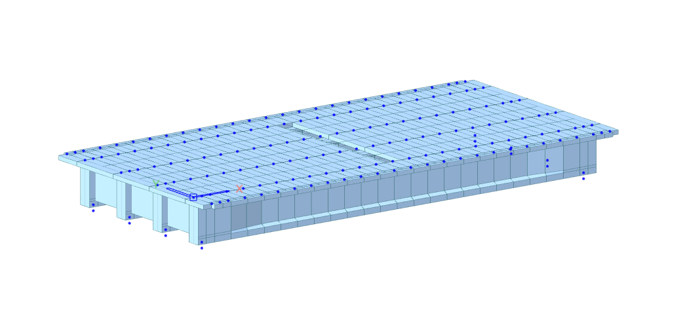

# PSC-I COMPOSITE BRIDGE

---



## Complete Code

```python
from midas_civil import *
MAPI_KEY('xxxxxxxxxxxxxx')
MAPI_BASEURL.autoURL()

# ==============================================================================
# 1. GEOMETRY INPUTS
# ==============================================================================

length_bridge = 24
tapperd_lenght = 2    
tapperd_location = 2  

diaphragm_location = [0.5, 12, 23.5]

number_of_girder = 4
girder_dist = 3 
bearing_th = 0.3    


# ==============================================================================
# 2. MATERIAL DEFINITIONS
# ==============================================================================

Model.units("KN", "M")

# Base Materials
Material.CONC("M50", "IRC(RC)", "M50")
Material.CONC("M40", "IRC(RC)", "M40")
Material.STEEL.User("Tendon", 1.9884e7, 0.3, 80.05, 0, 1.2e-5)
Material.CONC.User("Dummy", 2.7e7, 0.2, 0, 0, 1.0e-5)

# Time-Dependent Properties
CreepShrinkage.IRC("M50", code_year=2020, fck=50000, notional_size=1, relative_humidity=70, age_shrinkage=3, type_cement='NR', id=1)
CreepShrinkage.IRC("M40", code_year=2020, fck=40000, notional_size=1, relative_humidity=70, age_shrinkage=3, type_cement='NR', id=2)

CompStrength.IRC("M50", code_year=2020, fck_delta=60000, cement_type=2)
CompStrength.IRC("M40", code_year=2020, fck_delta=50000, cement_type=2)

TDMatLink(1, "M50", "M50")  
TDMatLink(2, "M40", "M40")  


# ==============================================================================
# 3. SECTION DEFINITIONS
# ==============================================================================

# Define the mid section
Bc_val = 3
tc_val = 0.225
HL1_val = 0.15
HL2_val = 0.1
HL3_val = 1.43
HL4_val = 0.12
HL5_val = 0.3
BL1_val = 0.14
BL2_val = 0.425
BL4_val = 0.375

mid_sect = Section.Composite.PSCI(
    Name="Mid-Section", Symm=True, 
    Bc=Bc_val, tc=tc_val, Hh=0,
    HL1=HL1_val, HL2=HL2_val, HL3=HL3_val, HL4=HL4_val, HL5=HL5_val, 
    BL1=BL1_val, BL2=BL2_val, BL4=BL4_val,
    EgdEsb=1.06922, DgdDsb=1.0, Pgd=0.2, Psb=0.2, TgdTsb=1.0,
    MultiModulus=False, Offset=Offset.CT(), useShear=True, use7Dof=False, id=1
)

# Define the end section
end_sect = Section.Composite.PSCI(
    Name="End-Section", Symm=True, Bc=3, tc=0.225, Hh=0,
    HL1=0.15, HL2=0.024, HL3=1.506, HL4=0.12, HL5=0.3, BL1=0.3749, BL2=0.425, BL4=0.375,
    EgdEsb=1.18, DgdDsb=1.0, Pgd=0.2, Psb=0.2, TgdTsb=1.0,
    Offset=Offset.CT(), useShear=True, use7Dof=False, id=2
)

# Tapered Sections
Section.Tapered.bySHAPE('End->Mid', end_sect, mid_sect, Offset.CT(), useShear=True, use7Dof=False, id=3)
Section.Tapered.bySHAPE('Mid->End', mid_sect, end_sect, Offset.CT(), useShear=True, use7Dof=False, id=4)

# Define the dummy and diaphragm sections
Section.DBUSER("Diaphragm", "SB", [1.8, 0.3], Offset=Offset("CT", VOffOpt=1, VOffset=-0.225, UsrOffOpt=1), id=5)
Section.DBUSER("Dummy Cross-Beam", "SB", [0.225, 1], Offset=Offset("CT"), id=6)
Section.DBUSER("Dummy Cross-Barrier", "SB", [0.225, 0.5], Offset=Offset("CT"), id=7)


# ==============================================================================
# 4. MODEL CREATION (NODES & ELEMENTS)
# ==============================================================================

total_h = tc_val + HL1_val + HL2_val + HL3_val + HL4_val + HL5_val
total_h = round(total_h, 3)

dummy_edge_beam = Bc_val * 0.5
total_gl = number_of_girder + 2

X_point = list(range(length_bridge + 1))

taper_points = [
    tapperd_location, 
    tapperd_location + tapperd_lenght, 
    length_bridge - tapperd_location - tapperd_lenght, 
    length_bridge - tapperd_location
]

all_pointsx = X_point + diaphragm_location + taper_points
all_pointsx = sorted(set(all_pointsx))

Y_point = [i * girder_dist for i in range(number_of_girder)]
extra_points = [Y_point[0] - dummy_edge_beam, Y_point[-1] + dummy_edge_beam]

all_Y_points = Y_point + extra_points
all_Y_points = sorted(set(all_Y_points))

def get_inner_sect(x1, x2):
    mid_x = (x1 + x2) / 2.0
    if mid_x <= tapperd_location:
        return 2
    elif mid_x <= tapperd_location + tapperd_lenght:
        return 3
    elif mid_x <= length_bridge - tapperd_location - tapperd_lenght:
        return 1
    elif mid_x <= length_bridge - tapperd_location:
        return 4
    else:
        return 2

elem_id = 1

for y in all_Y_points:
    is_outer = (y == all_Y_points[0] or y == all_Y_points[-1])
    
    if is_outer:
        for i in range(len(all_pointsx) - 1):
            s_loc = [all_pointsx[i], y, 0]
            e_loc = [all_pointsx[i+1], y, 0]
            Element.Beam.SE(s_loc=s_loc, e_loc=e_loc, mat=4, sect=7, id=elem_id)
            elem_id += 1
    else:
        segments = []
        for i in range(len(all_pointsx) - 1):
            x1 = all_pointsx[i]
            x2 = all_pointsx[i+1]
            sect_id = get_inner_sect(x1, x2)
            segments.append((x1, x2, sect_id))
            
        if not segments:
            continue
            
        grouped = []
        curr_sect = segments[0][2]
        curr_pts = [[segments[0][0], y, 0], [segments[0][1], y, 0]]
        
        for i in range(1, len(segments)):
            if segments[i][2] == curr_sect:
                curr_pts.append([segments[i][1], y, 0])
            else:
                grouped.append((curr_pts, curr_sect))
                curr_sect = segments[i][2]
                curr_pts = [[segments[i][0], y, 0], [segments[i][1], y, 0]]
                
        grouped.append((curr_pts, curr_sect))
        
        for pts, sect_id in grouped:
            for i in range(len(pts) - 1):
                Element.Beam.SE(s_loc=pts[i], e_loc=pts[i+1], mat=1, sect=sect_id, id=elem_id)
                elem_id += 1

end_mid_id = list(Model.Select.Element(secID=3))
mid_end_id = list(Model.Select.Element(secID=4))
Section.TaperedGroup("EndtoMid", end_mid_id, "LINEAR", id=1)
Section.TaperedGroup("MidtoEnd", mid_end_id, "LINEAR", id=2)

for x in all_pointsx:
    if x in diaphragm_location:
        pts_left = [[x, all_Y_points[0], 0], [x, Y_point[0], 0]]
        for i in range(len(pts_left) - 1):
            Element.Beam.SE(s_loc=pts_left[i], e_loc=pts_left[i+1], mat=4, sect=6, id=elem_id)
            elem_id += 1
        
        pts_mid = [[x, y, 0] for y in Y_point]
        for i in range(len(pts_mid) - 1):
            Element.Beam.SE(s_loc=pts_mid[i], e_loc=pts_mid[i+1], mat=1, sect=5, id=elem_id)
            elem_id += 1
        
        pts_right = [[x, Y_point[-1], 0], [x, all_Y_points[-1], 0]]
        for i in range(len(pts_right) - 1):
            Element.Beam.SE(s_loc=pts_right[i], e_loc=pts_right[i+1], mat=4, sect=6, id=elem_id)
            elem_id += 1
    else:
        pts_all = [[x, y, 0] for y in all_Y_points]
        for i in range(len(pts_all) - 1):
            Element.Beam.SE(s_loc=pts_all[i], e_loc=pts_all[i+1], mat=4, sect=6, id=elem_id)
            elem_id += 1


# ==============================================================================
# 5. GROUP DEFINITIONS
# ==============================================================================

Dummy_crash_barrier_elem_id = list(Model.Select.Element(secID=7))
girder_elem_id = list(Model.Select.Element(secID=[1, 2, 3, 4]))
crossbeam_elem_id = list(Model.Select.Element(secID=6))
diaphragm_elem_id = list(Model.Select.Element(secID=5))
moving_load_elem_id = list(Model.Select.Element(secID=[5, 6]))
dummy_elem_id = list(Model.Select.Element(secID=[6, 7]))

Group.Structure("Girder", elist=girder_elem_id)
Group.Structure("Diaphragm", elist=diaphragm_elem_id)
Group.Structure("Dummy Cross-Beam", elist=crossbeam_elem_id)
Group.Structure("Dummy Cross-Barrier", elist=Dummy_crash_barrier_elem_id)
Group.Structure("Moving Load Cross Beam ", elist=moving_load_elem_id)

Group.Load(["Self Weight", "SIDL", "Wet Concrete", "PS-1", "PS-2", "PS-3"])
Group.Boundary(["Rigid Link", "Elastic Link", "Support"])


# ==============================================================================
# 6. BOUNDARY CONDITIONS
# ==============================================================================

# Node for Boundary Conditions
for i in range(number_of_girder):
    Node(diaphragm_location[0], i * girder_dist, -total_h, group="Girder")
    Node(length_bridge - diaphragm_location[0], i * girder_dist, -total_h, group="Girder")
    Node(diaphragm_location[0], i * girder_dist, -total_h - 0.3, group="Girder")
    Node(length_bridge - diaphragm_location[0], i * girder_dist, -total_h - 0.3, group="Girder")

# Apply Boundary Conditions
LEL_top_node_id = []
REL_top_node_id = []
LSupport_node_id = []
RSupport_node_id = []

for i in range(number_of_girder):
    LEL_top_node = Node(diaphragm_location[0], i * girder_dist, -total_h).ID
    REL_top_node = Node(length_bridge - diaphragm_location[0], i * girder_dist, -total_h).ID
    LSupport_node = Node(diaphragm_location[0], i * girder_dist, -total_h - 0.3).ID
    RSupport_node = Node(length_bridge - diaphragm_location[0], i * girder_dist, -total_h - 0.3).ID
   
    LEL_top_node_id.append(LEL_top_node)
    REL_top_node_id.append(REL_top_node)
    LSupport_node_id.append(LSupport_node)
    RSupport_node_id.append(RSupport_node)
 
LRG_top_node_id = []
RRG_top_node_id = []

for i in range(number_of_girder):
    id = Node(diaphragm_location[0], i * girder_dist, 0).ID
    id2 = Node(length_bridge - diaphragm_location[0], i * girder_dist, 0).ID

    LRG_top_node_id.append(id)
    RRG_top_node_id.append(id2)

Boundary.Support(LSupport_node_id, constraint="fix", group="Support")
Boundary.Support(RSupport_node_id, constraint="fix", group="Support")

for i in range(len(LRG_top_node_id)):
    Boundary.RigidLink(LRG_top_node_id[i], LEL_top_node_id[i], "Rigid Link")
    Boundary.RigidLink(RRG_top_node_id[i], REL_top_node_id[i], "Rigid Link")

for i in range(len(LRG_top_node_id)):
    Boundary.ElasticLink(LEL_top_node_id[i], LSupport_node_id[i], "Elastic Link", "GEN", 1000000, 1000000, 1000000, 10, 10, 10)
    Boundary.ElasticLink(REL_top_node_id[i], RSupport_node_id[i], "Elastic Link", "GEN", 1000000, 1000000, 1000000, 10, 10, 10)


# ==============================================================================
# 7. LOAD DEFINITIONS
# ==============================================================================

Load_Case("D", "SW")
Load_Case("L","SIDL-WC", "SIDL-CB", "Wet Concrete Load")
Load_Case("PS","Prestress Load")

# Static Loads
Load.SW("SW", "Z", -1, "Self Weight")
Load.Beam(Dummy_crash_barrier_elem_id, "SIDL-CB", "SIDL", -8.4)
Load.Beam(girder_elem_id, "SIDL-WC", "SIDL", -5)
Load.Beam(girder_elem_id, "Wet Concrete Load", "Wet Concrete", -18.8)


# ==============================================================================
# 8. PRESTRESS LOADS & TENDON PROFILES
# ==============================================================================

relaxation = Tendon.Relaxation.IRC_112(factor=2, ult_st=1.86326e6, yield_st=1.56906e6, curv_fric_fac=0.3, wob_fric_fac=0.0066)

Tendon.Property(
    name="Tendon", type=2, matID=3, tdn_area=0.00266, duct_dia=0.11, 
    relaxation=relaxation, ext_mom_mag=0, anch_slip_begin=0.006, 
    anch_slip_end=0.006, bond_type=True
)

xyr_cord_1 = [[0, 0], [length_bridge, 0]]
xzr_cord_1 = [[0, total_h * (-0.4)], [length_bridge * 0.5, total_h * (-0.85)], [length_bridge, total_h * (-0.4)]]

xyr_cord_2 = [[0, 0], [length_bridge, 0]]
xzr_cord_2 = [[0, total_h * (-0.6)], [length_bridge * 0.5, total_h * (-0.95), 0], [length_bridge, total_h * (-0.6)]]

xyr_cord_3 = [[0, BL4_val * 0.48], [length_bridge, BL4_val * 0.48]]
xzr_cord_3 = [[0, total_h * (-0.8)], [length_bridge * 0.5, total_h * (-0.95), 0], [length_bridge, total_h * (-0.8)]]

xyr_cord_4 = [[0, -BL4_val * 0.48], [length_bridge, -BL4_val * 0.48]]
xzr_cord_4 = [[0, total_h * (-0.8)], [length_bridge * 0.5, total_h * (-0.95), 0], [length_bridge, total_h * (-0.8)]]

# Calculate how many elements exist along the X-axis per longitudinal line
elements_per_girder_line = len(all_pointsx) - 1

# Loop through each actual girder to assign tendons
for i in range(1, number_of_girder + 1):
    start_elem = (i * elements_per_girder_line) + 1
    end_elem = (i + 1) * elements_per_girder_line
    elm_list = list(range(start_elem, end_elem + 1))
    
    # Generate the tendon profiles
    Tendon.Profile(f"Girder_{i}_1", 1, 0, elm_list, "2D", "SPLINE", 0, 0, 0, "AUTO", ref_axis="ELEMENT", prof_xyR=xyr_cord_1, prof_xzR=xzr_cord_1)
    Tendon.Profile(f"Girder_{i}_2", 1, 0, elm_list, "2D", "SPLINE", 0, 0, 0, "AUTO", ref_axis="ELEMENT", prof_xyR=xyr_cord_2, prof_xzR=xzr_cord_2)
    Tendon.Profile(f"Girder_{i}_3", 1, 0, elm_list, "2D", "SPLINE", 0, 0, 0, "AUTO", ref_axis="ELEMENT", prof_xyR=xyr_cord_3, prof_xzR=xzr_cord_3)
    Tendon.Profile(f"Girder_{i}_4", 1, 0, elm_list, "2D", "SPLINE", 0, 0, 0, "AUTO", ref_axis="ELEMENT", prof_xyR=xyr_cord_4, prof_xzR=xzr_cord_4)

for i in range(1, number_of_girder + 1):
    Tendon.Prestress(f"Girder_{i}_1", "Prestress Load", "PS-1", "STRESS", 'BOTH', 1395000, 1395000)
    Tendon.Prestress(f"Girder_{i}_2", "Prestress Load", "PS-2", "STRESS", 'BOTH', 1395000, 1395000)
    Tendon.Prestress(f"Girder_{i}_3", "Prestress Load", "PS-3", "STRESS", 'BOTH', 1395000, 1395000)
    Tendon.Prestress(f"Girder_{i}_4", "Prestress Load", "PS-4", "STRESS", 'BOTH', 1395000, 1395000)


# ==============================================================================
# 9. CONSTRUCTION STAGES
# ==============================================================================

CS.STAGE("CS1", 7, "Girder", 28, "A", ["Rigid Link", "Elastic Link", "Support"], "DEFORMED", "A", ["Self Weight", "PS-1", "PS-2", "PS-3", "PS-4"])
CS.STAGE("CS2", 14, l_group="Wet Concrete", l_type="A")
CS.STAGE("CS3", 21, ["Diaphragm", "Dummy Cross-Beam", "Dummy Cross-Barrier"], [14, 14, 14], "A", l_group="Wet Concrete", l_type="D")
CS.STAGE("CS4", 1000, l_group=["SIDL"])

# Composite Section For CS
CS.CompSec("CS1", 1, "NORMAL", False, [
    [1, "ELEM", "", "CS1", 28, 0.268, 1.5, 1, 1, 1, 1, 1, 1, 1, 1, 1],
    [2, "MATL", "2", "CS3", 14, 0.209, 0,   0, 1, 1, 1, 1, 1, 1, 1, 1]
])

CS.CompSec("CS1", 2, "NORMAL", False, [
    [1, "ELEM", "", "CS1", 28, 0.54, 1.5, 1, 1, 1, 1, 1, 1, 1, 1, 1],
    [2, "MATL", "2", "CS3", 14, 0.209, 0,   0, 1, 1, 1, 1, 1, 1, 1, 1]
])

CS.CompSec("CS1", 3, "NORMAL", True, [
    [1, "ELEM", "", "CS1", 28, 0.4, 1.5, 1, 1, 1, 1, 1, 1, 1, 1, 1],
    [2, "MATL", "2", "CS3", 14, 0.209, 0,   0, 1, 1, 1, 1, 1, 1, 1, 1]
])

CS.CompSec("CS1", 4, "NORMAL", True, [
    [1, "ELEM", "", "CS1", 28, 0.4, 1.5, 1, 1, 1, 1, 1, 1, 1, 1, 1],
    [2, "MATL", "2", "CS3", 14, 0.209, 0,   0, 1, 1, 1, 1, 1, 1, 1, 1]
])


# ==============================================================================
# 10. MOVING LOADS
# ==============================================================================

mv_start_elem = elements_per_girder_line + 1
mv_end_elem = 2 * elements_per_girder_line

mv_elm_list = list(range(mv_start_elem, mv_end_elem + 1))

MovingLoad.Code("INDIA")
mv_ecc = [-1.55, -5.05, -8.55, -9.155]

for i, ecc in enumerate(mv_ecc, start=1):
    lane_width = 1.93 if i == len(mv_ecc) else 1.8  
    MovingLoad.LineLane.India(f"Lane_{i}", ecc, lane_width, mv_elm_list, 0, length_bridge, Group_Name="Moving Load Cross Beam")

MovingLoad.Vehicle.India("Class A", "IRC", "Class A")
MovingLoad.Vehicle.India("Class 70R", "IRC", "Class 70R")

MovingLoad.Case.India("Case 1", 2, 1, False, False, [[1, 0, 3, "Class A", ['Lane_1', "Lane_2", "Lane_3"]]])
MovingLoad.Case.India("Case 2", 2, 2, False, False, [[1, 0, 1, "Class 70R", ["Lane_4"]]])

# ==============================================================================
# Initialize Model Creation
# ==============================================================================
Model.create()
```