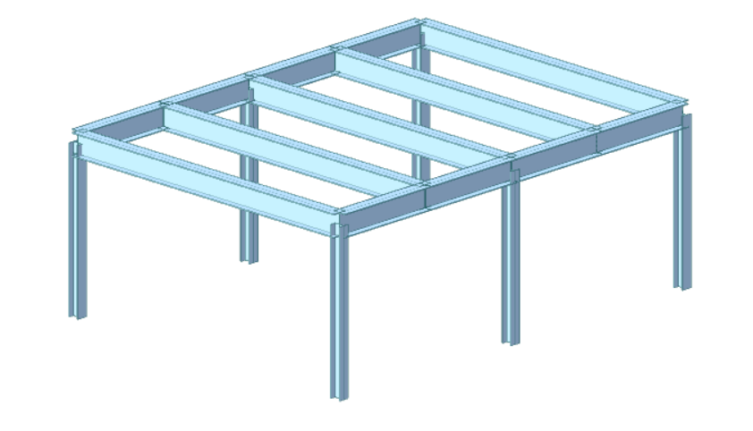

# Examples

This page shares practical examples of Python code for structural analysis using the `midas_civil` library in MIDAS Civil NX. The scripts demonstrate a typical automated workflow—defining materials and sections, creating nodes and elements, applying supports and loads, running the analysis, and retrieving results.   

These examples are meant to show the basic structure of a MIDAS Civil NX Python script and provide a solid starting point for building more advanced, parametric, and automated structural analysis models.

## CIVIL NX Tutorials
---

  

    <a href="ex01">
      
      
3-D Simple 2–Bay Frame

    </a>
  

---
