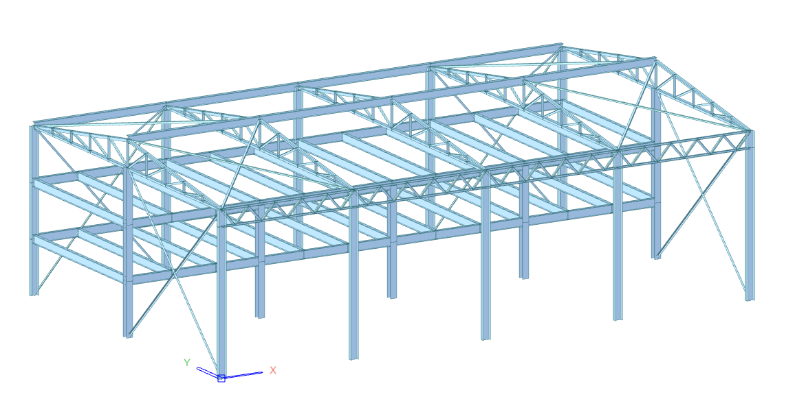
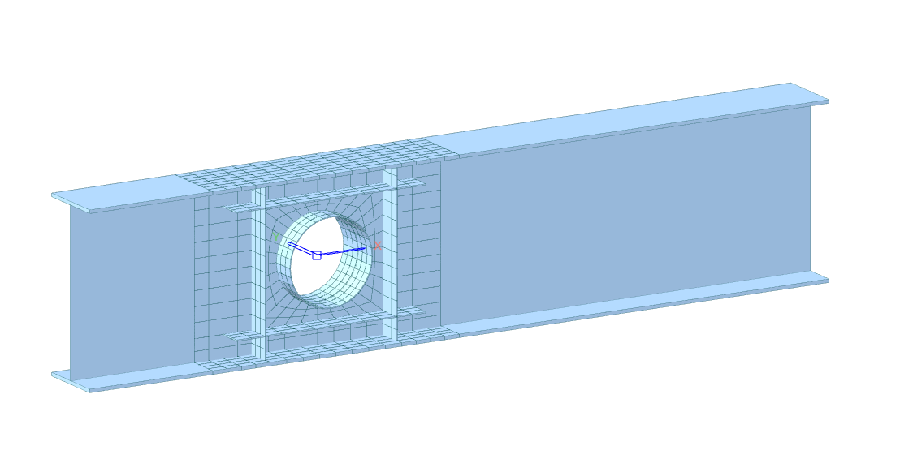
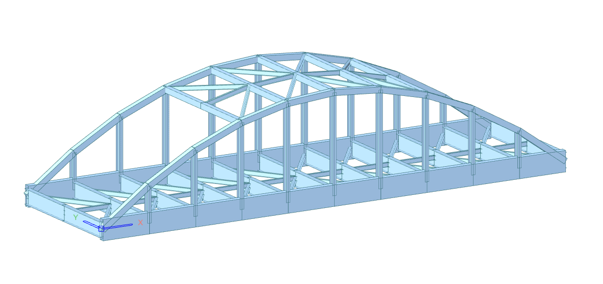
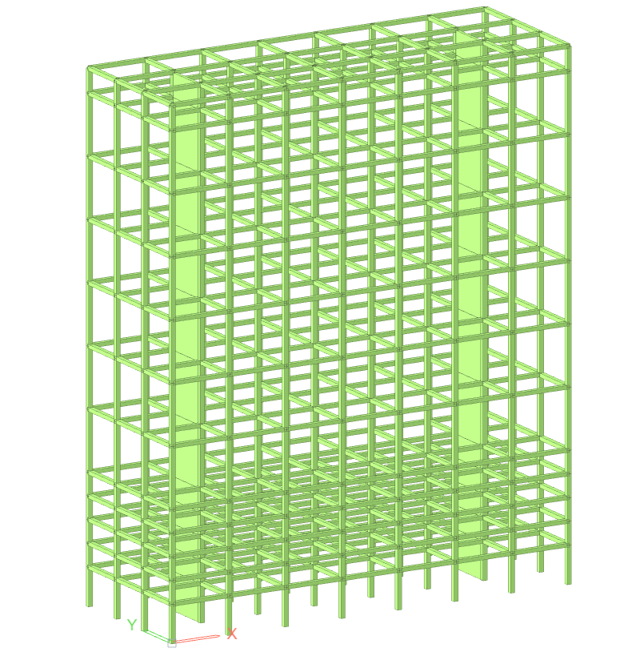

# Examples

This page shares practical examples of Python code for structural analysis using the `midas_civil` library in MIDAS Civil NX. The scripts demonstrate a typical automated workflow—defining materials and sections, creating nodes and elements, applying supports and loads, running the analysis, and retrieving results.   

These examples are meant to show the basic structure of a MIDAS Civil NX Python script and provide a solid starting point for building more advanced, parametric, and automated structural analysis models.

## CIVIL NX Tutorials
---

  

    <a href="ex01">
      
      
3-D SIMPLE 2-BAY FRAME

    </a>
  

  

    <a href="ex02">
      
      
PLANT STRUCTURE

    </a>
  

  

    <a href="ex03">
      
      
WEB–OPENING DETAIL ANALYSIS

    </a>
  

  

    <a href="ex04">
      
      
ARCH BRIDGE

    </a>
  

  

    <a href="ex05">
      
      
PSC BOX GIRDER BRIDGE

    </a>
  

  

    <a href="ex06">
      
      
PSC-I COMPOSITE BRIDGE

    </a>
  

## GEN NX Tutorials
---

  

    <a href="gen_ex01">
      
      
RC BUILDING

    </a>
  

  <!-- 

    <a href="ex02">
      
      
PLANT STRUCTURE 

    </a>
  

  

    <a href="ex03">
      
      
WEB–OPENING DETAIL ANALYSIS

    </a>
  

  

    <a href="ex04">
      
      
ARCH BRIDGE

    </a>
  
 -->

---
