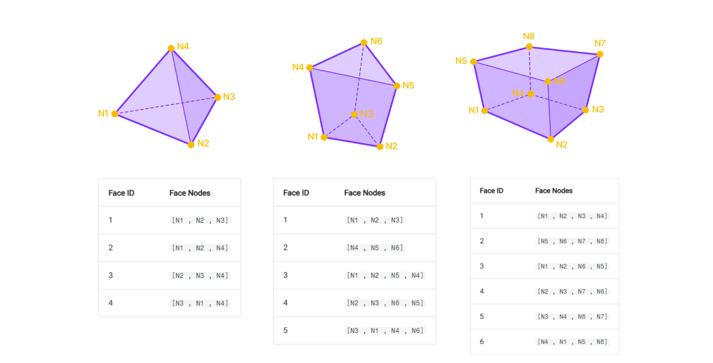

# Element Convection Boundary

A nested class within `HoH.Convection` used to define convection boundary.    

---

## Constructor

Assigns a constant convection coefficient.

**`HoH.Convection.Boundary(elmID:int,faceID:int,conv_coeff_func:str='',amb_temp_func:str='',group:str='',id:int=None)`**

#### Parameters
* `elmID`: Element ID of solid element.   
* `faceID`: Face ID of the convection surface.
* `conv_coeff_func`: Convection Coefficient function name.
* `amb_temp_func`: Ambient Temp function name
* `group`: Boundary group name
* `id`: Manually assign an ID. If **None**, ID will be auto-assigned.



#### Class Attributes
*HoH.Convection.Boundary.data* -> List of all convection coefficient function instances (Constant and User types).

#### Object Attributes
* `ELM` (int): Element ID of solid element     
* `FACE` (int): Face ID of the convection surface    
* `CONV_FUNC` (str): Convection Coefficient function name    
* `AMB_FUNC` (str): Ambient Temp function name    
* `GROUP` (str): Boundary group name    
* `ID` (int): ID of the Convection Boundary    

---


## Methods
---

### bySelectedNodes

**`HoH.Convection.Boundary.bySelectedNodes(elmID:int,faceID:int,conv_coeff_func:str='',amb_temp_func:str='',group:str='',id:int=None)`**

Automatically get face IDs based on entered node id list.

#### Parameters
* `elmID`: Element ID of solid element.   
* `faceID`: Face ID of the convection surface.
* `conv_coeff_func`: Convection Coefficient function name.
* `amb_temp_func`: Ambient Temp function name
* `group`: Boundary group name
* `id`: Manually assign an ID. If **None**, ID will be auto-assigned.


```py
HoH.Convection.Boundary.bySelectedNodes([1,2,3],'CONV_FN','AMB_FN','BG_GROUP')
```

---

#### json
Generates the properly formatted JSON payload for MidasAPI.

```py
HoH.Convection.Boundary(1,1,'CONV_FN','AMB_FN','BG_GROUP')
print(HoH.Convection.Boundary.json())
# Output:
# {'Assign': {1: {'ITEMS': [{'ID': 1, 'GROUP_NAME': 'BG_GROUP', 'FACE_NO': 1, 'CCFC_NAME': 'CONV_FN', 'ETFC_NAME': 'AMB_FN'}]}}}
```

#### create
Sends the PUT request to create all stored Convection Coefficient Boundary in Civil NX.

```py
HoH.Convection.Boundary.create()
```

#### get
Retrieves the Convection Coefficient Boundary configuration from Civil NX.

```py
print(HoH.Convection.Boundary.get())
```

#### sync
Fetches data from Civil NX and reconstructs the local class instances.

```py
HoH.Convection.Boundary.sync()
```

#### delete
Deletes all Convection Coefficient Boundary objects from both Python and Civil NX.

```py
HoH.Convection.Boundary.delete()
```

#### clear
Clears all locally stored Convection Coefficient Boundary objects without affecting the Civil NX database.

```py
HoH.Convection.Boundary.clear()
```
