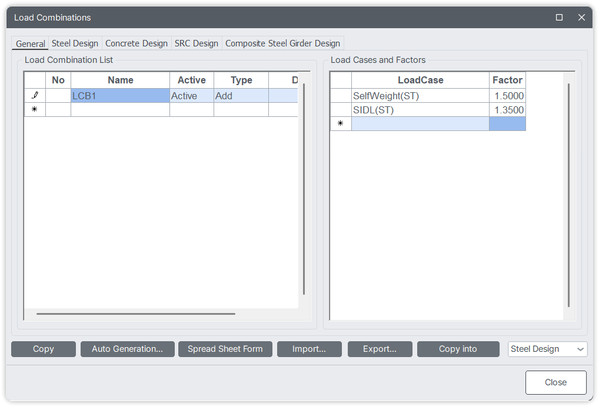

# Load Combination



The LoadCombination class is designed to define and manage load combinations defined in MIDAS CIVIL NX.   
It supports classification-specific combinations such as Steel, Concrete, Seismic, etc., and provides functionality for creating, syncing, retrieving, and deleting these combinations.


## Constructor
---

`LoadCombination(name, case, classification="General", active="ACTIVE", typ="Add", id=0, desc="")`


### Parameters

* `name (str)`: Name of the load combination.

* `case (list[tuple])` : List of tuples with load case names and factors.   
‎ ‎ ‎ ‎ ‎ ‎ ‎ ‎ ‎ 
Example: `[('Dead Load(CS)', 1.5), ('Live Load(ST)', 0.9)]`

* `classification (str)` : Category of the load combination.   
‎ ‎ ‎ ‎ ‎ ‎ ‎ ‎ ‎
Must be one of : 
General <font color="orange">&nbsp;&nbsp;|&nbsp;&nbsp;</font>
Steel <font color="orange">&nbsp;&nbsp;|&nbsp;&nbsp;</font>
Concrete <font color="orange">&nbsp;&nbsp;|&nbsp;&nbsp;</font>
SRC <font color="orange">&nbsp;&nbsp;|&nbsp;&nbsp;</font>
Composite <font color="orange">&nbsp;&nbsp;|&nbsp;&nbsp;</font>
Steel Girder <font color="orange">&nbsp;&nbsp;|&nbsp;&nbsp;</font>
Seismic      
‎ ‎ ‎ ‎ ‎ ‎ ‎ ‎ ‎
Defaults to *`General`*.

* `active (str)` : Activation status. ACTIVE, INACTIVE, STRENGTH, or SERVICE.

* `typ (str | int)` : Combination type: "Add", "Envelope", "ABS", "SRSS" or corresponding integers 0–3.

* `id (int)` : Unique identifier. Auto-incremented if set to 0.

* `desc (str)` : Optional description.


### Object Attributes
   
`NAME`: Name of Load Combination

`CASE`: Load Case and Scale factors in the Load Combination

`CLS`: Classification of the Load Combination (General, Steel, Concrete, SRC, Composite Steel Girder, Seismic)

`ACT`: Activation status of the Load Combination ('ACTIVE' , 'INACTIVE, 'STRENGTH', 'SERVICE')  

`TYPE`: Type of the Load Combination (Add, Envelope, ABS, SRSS)

`ID`: ID of the Load Combination

`DESC`: Description of the Load Combination


#### Class Attributes

*LoadCombination.data* -> List of all Result combination data.


!!! info "NOTE :"
    * Load case names must include their analysis type in parentheses, e.g., `"Load1(ST)"`.
    * Supported analysis types: `ST`, `CS`, `MV`, `SM`, `RS`, `TH`, `CB`, `CBC`, `CBS`, `CBR`, `CBSC`, `CBSM`.


## Methods
---

### json

Returns a JSON dictionary of the defined load combinations.

- Filters by classification or includes all if `"All"` is passed.

```py
Load_Case('USER','SelfWeight','SIDL') # Static Load cases
LoadCombination('LCB1',[('SelfWeight(ST)',1.5),('SIDL(ST)',1.35)],'Steel') # Load Combination for Steel design
LoadCombination('LCB2',[('SelfWeight(ST)',1.5),('SIDL(ST)',1.35)],'Concrete') # Load Combination for Concrete design

print(LoadCombination.json('Steel')) # Printing only steel design load combination
# Output
# {'Steel': {'Assign': {1: {'NAME': 'LCB1', 'ACTIVE': 'STRENGTH', 'iTYPE': 0, 'DESC': '', 'vCOMB': [{'ANAL': 'ST', 'LCNAME': 'SelfWeight', 'FACTOR': 1.5}, {'ANAL': 'ST', 'LCNAME': 'SIDL', 'FACTOR': 1.35}]}}}}
```


### create

Creates (or replaces) combinations in the MIDAS model.

```py
Load_Case('USER','SelfWeight','SIDL')
LoadCombination('LCB1',[('SelfWeight(ST)',1.5),('SIDL(ST)',1.35)],'Steel')

Load_Case.create()
LoadCombination.create()
```


### get

Gets load combinations from the MIDAS CIVIL NX model.

- Returns combinations as a dictionary grouped by classification.

```py
print(LoadCombination.get())
# Output
# {'Steel': {'LCOM-STEEL': {'1': {'NAME': 'LCB1', 'ACTIVE': 'STRENGTH', 'bES': False, 'bCB': False, 'iTYPE': 0, 'DESC': '', 'iSERV_TYPE': 0, 'nLCOMTYPE': 0, 'nSEISTYPE': 0, 'vCOMB': [{'ANAL': 'ST', 'LCNAME': 'SelfWeight', 'FACTOR': 1.5}, {'ANAL': 'ST', 'LCNAME': 'SIDL', 'FACTOR': 1.35}]}}}}
```


### sync

Synchronizes internal Python data with what's present in the MIDAS CIVIL NX model.

```py
LoadCombination.sync()

for comb in LoadCombination.data:
    print(f'Name -> {comb.NAME}  | Design -> {comb.CLS}  | Cases -> {comb.CASE}')

# Output
# Name -> LCB1  | Design -> Steel  | Cases -> [{'ANAL': 'ST', 'LCNAME': 'SelfWeight', 'FACTOR': 1.5}, {'ANAL': 'ST', 'LCNAME': 'SIDL', 'FACTOR': 1.35}]

```

### delete

Deletes specific combinations from the MIDAS model.

```py
LoadCombination.delete()
```

---

## Example Usage

```python
# Define a new load combination
lc = LoadCombination(
    name="LCB1",
    case=[('Dead Load(CS)', 1.5), ('Live Load(ST)', 1.0)],
    classification="General",
    active="ACTIVE",
    typ="Add"
)

# Export combinations to JSON
print(LoadCombination.json())

# Create combinations in the MIDAS model
LoadCombination.create()
```

