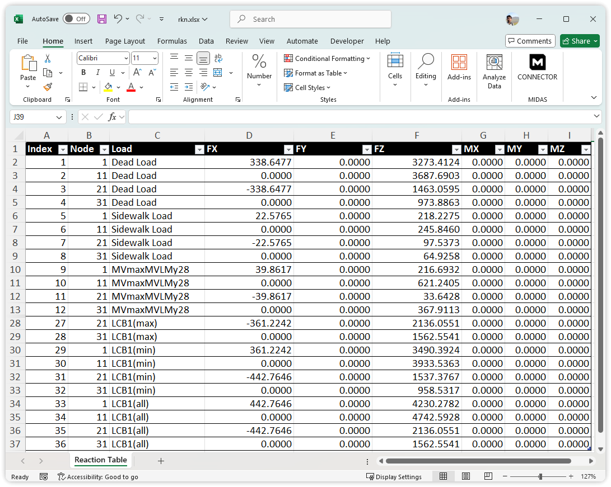
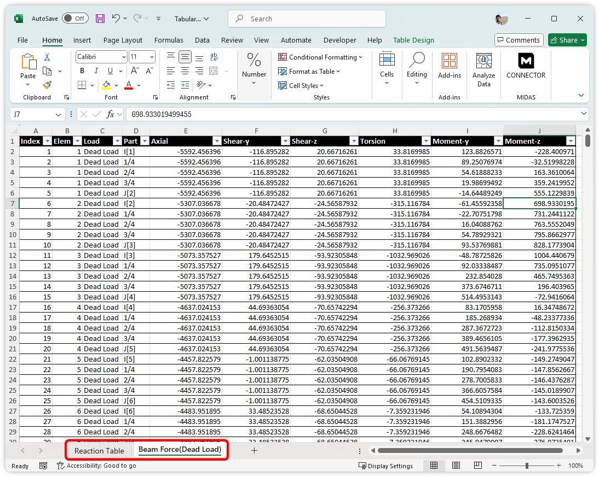

# Result Table
Fetches result tables like reactions or displacements for given elements and load cases.

## Constructor
---
**Result.ResultTable(` tabletype , elements=[] , loadcase=[] , cs_stage=[] , force_unit='KN' , len_unit='M'`)**


### Parameters

- `tabletype` (`str`): Analysis Results Table type. 

| Result Table         | Table Type               |
|------------------|-------------------|
| Reaction (Global)           | REACTIONG             |
| Displacement (Global)           | DISPLACEMENTG             |
| Truss Force           | TRUSSFORCE             |
| Truss Stress           | TRUSSSTRESS             |
| Beam Force           | BEAMFORCE             |
| Beam Stress           | BEAMSTRESS             |
Details of all available tables can be found [here](https://support.midasuser.com/hc/en-us/articles/33016922742937-MIDAS-API-Online-Manual).


- `keys` (`list[int] or str`): Optional. Element or Node IDs (Default : All) | list[int] -> IDs or str -> Group Name.
- `loadcase` (`list[str]`): Optional. Load case names (Default : All).
- `cs_stage` (`list` or `'all'`): Construction stages.
- `force_unit` (`str`): Force unit (KN, N, KGF, TONF, LBF, KIPS).
- `len_unit` (`str`): Length unit (M, CM, MM, FT, IN).


#### Returns:
 - [Polars Dataframe](https://pola.rs)

Polars is a high-performance DataFrame library, designed to provide fast and efficient data processing capabilities.   
Polar dataframe supports exporting the tabular data as CSV and Excel sheets.

Write Excel : [https://docs.pola.rs/api/python/dev/reference/api/polars.DataFrame.write_excel.html](https://docs.pola.rs/api/python/dev/reference/api/polars.DataFrame.write_excel.html)

---

## Example Usage  

### 1. Printing Result table

```python
rkn_res = Result.ResultTable('REACTIONG') # Reaction table for all nodes and load cases
print(rkn_res)

# Output
# shape: (36, 9)
# +-------+------+------------+-----------+-------+-----------+---------+---------+---------+
# | Index | Node |   Load     |    FX     |  ...  |    FZ     |   MX    |   MY    |   MZ    |
# +-------+------+------------+-----------+-------+-----------+---------+---------+---------+
# |   1   |   1  | Dead Load  |  338.647  |  ...  |  3273.412 |  0.000  |  0.000  |  0.000  |
# |   2   |  11  | Dead Load  |    0.000  |  ...  |  3687.690 |  0.000  |  0.000  |  0.000  |
# |   3   |  21  | Dead Load  | -338.647  |  ...  |  1463.059 |  0.000  |  0.000  |  0.000  |
# |  ...  | ...  |    ...     |    ...    |  ...  |    ...    |   ...   |   ...   |   ...   |
# |  35   |  21  | LCB1(all)  | -442.764  |  ...  |  2136.055 |  0.000  |  0.000  |  0.000  |
# |  36   |  31  | LCB1(all)  |   0.000   |  ...  |  1562.554 |  0.000  |  0.000  |  0.000  |
# +-------+------+------------+-----------+-------+-----------+---------+---------+---------+

```


### 2. Result table to Excel

```python
rkn_res = Result.ResultTable('REACTIONG')
rkn_res.write_excel("rkn.xlsx", "Reaction Table", header_format={"bold":True}, autofit=True, table_style="Table Style Light 8" )

```



### 3. Multiple Result table to Excel

```python
rkn_res = Result.ResultTable('REACTIONG')
beam_res = Result.ResultTable('BEAMFORCE',loadcase=['Dead Load(ST)'])

with xlsxwriter.Workbook("Tabular.xlsx") as Wb:
    rkn_res.write_excel(Wb,"Reaction Table", header_format={"bold":True}, autofit=True, table_style="Table Style Light 8")
    beam_res.write_excel(Wb,"Beam Force(Dead Load)", header_format={"bold":True}, autofit=True, table_style="Table Style Light 8")

```
3