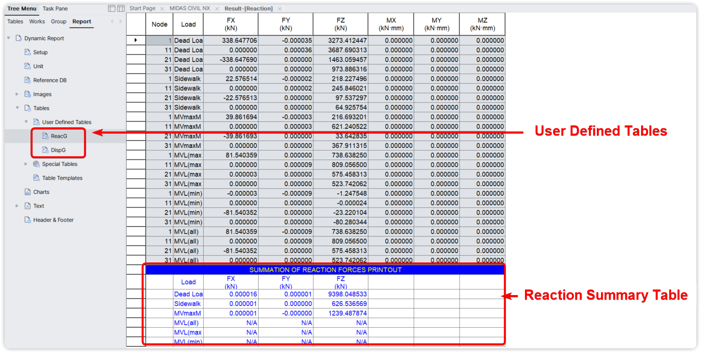
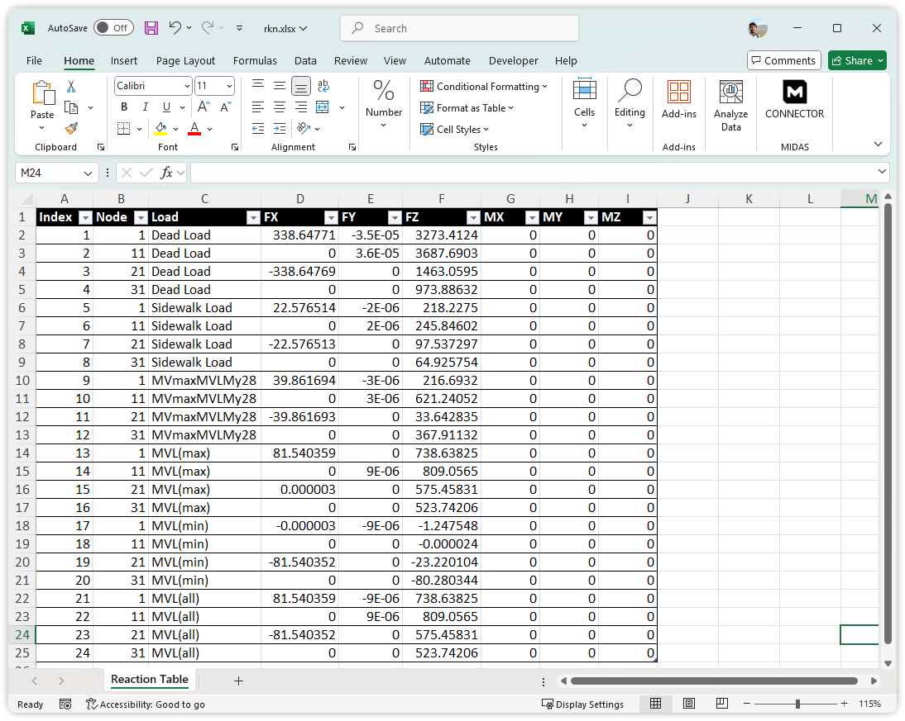
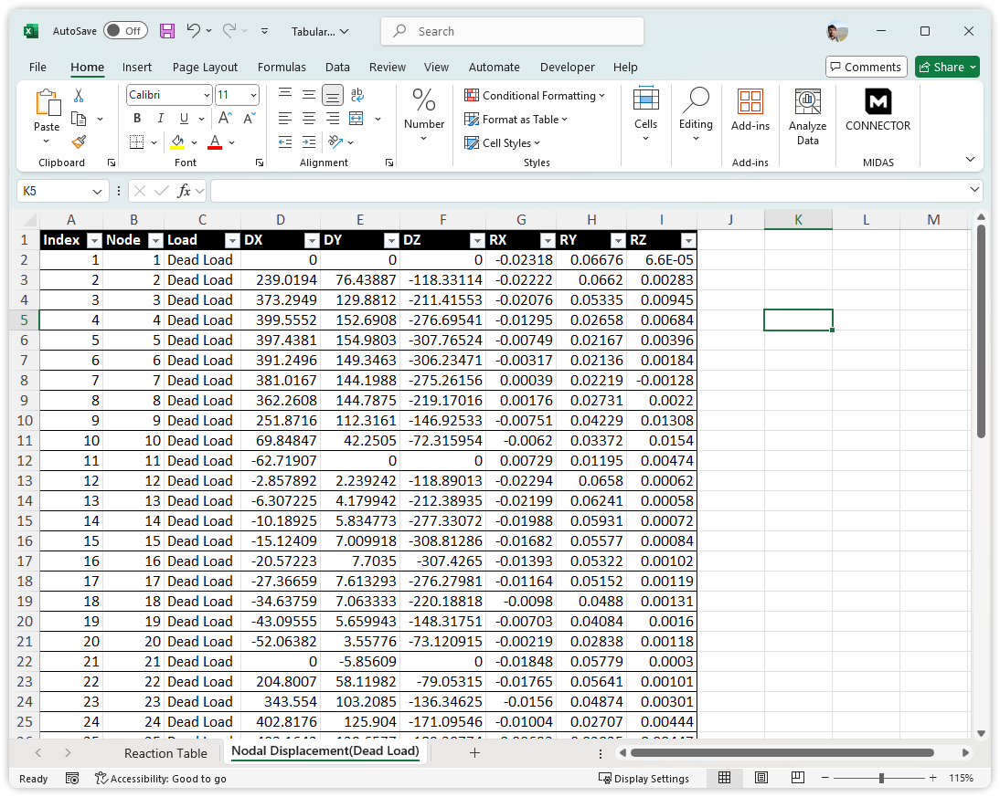
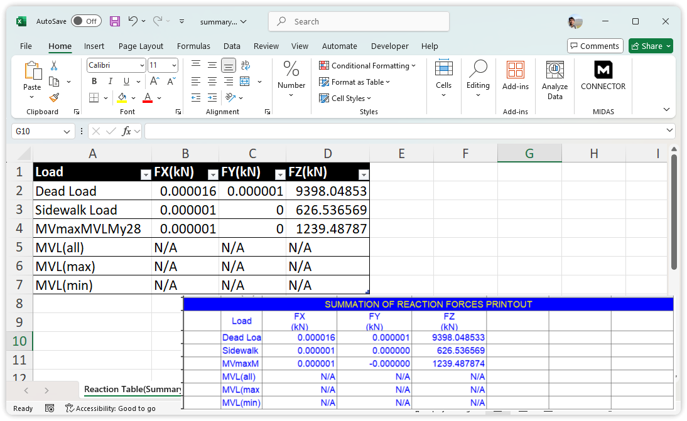

# User Defined Table
Fetches User defined tables(dynamic report table) from MIDAS CIVIL NX.





## Constructor
---
**Result.UserDefinedTable(` tableName , summary=0 , force_unit='KN', len_unit='M' `)**


### Parameters

- `tableName` (`str`): Name of User Defined Table
- `summary` (`int`): Optional. Extract Summary tables of Reaction, Eigen value mass participation etc.
- `force_unit` (`str`): Force unit (KN, N, KGF, TONF, LBF, KIPS).
- `len_unit` (`str`): Length unit (M, CM, MM, FT, IN).


#### Returns:
 - [Polars Dataframe](https://pola.rs)

Polars is a high-performance DataFrame library, designed to provide fast and efficient data processing capabilities.
Polar dataframe supports exporting the tabular data as CSV and Excel sheets.

Write Excel : [https://docs.pola.rs/api/python/dev/reference/api/polars.DataFrame.write_excel.html](https://docs.pola.rs/api/python/dev/reference/api/polars.DataFrame.write_excel.html)

---


### List all tables
```python
Result.UserDefinedTables_print()

# Output
# Available user-defined tables in Civil NX are : 
# ReacG , DispG
```
Prints all user-defined table names available in the CIVIL NX model.


## Example Usage  

### 1. Printing Result table

```python
rkn_res = Result.UserDefinedTable('ReacG')
print(rkn_res)

# Output
# shape: (24, 9)
# +-------+------+----------------+--------------+-----+--------------+----------+----------+----------+
# | Index | Node |      Load      |     FX       | ... |      FZ      |    MX    |    MY    |    MZ    |
# +-------+------+----------------+--------------+-----+--------------+----------+----------+----------+
# | 1     | 1    | Dead Load      | 338.647706   | ... | 3273.412447  | 0.000000 | 0.000000 | 0.000000 |
# | 2     | 11   | Dead Load      | 0.000000     | ... | 3687.690313  | 0.000000 | 0.000000 | 0.000000 |
# | ...   | ...  | ...            | ...          | ... | ...          | ...      | ...      | ...      |
# | 22    | 11   | MVL(all)       | 0.000000     | ... | 809.056500   | 0.000000 | 0.000000 | 0.000000 |
# | 23    | 21   | MVL(all)       | -81.540352   | ... | 575.458313   | 0.000000 | 0.000000 | 0.000000 |
# | 24    | 31   | MVL(all)       | 0.000000     | ... | 523.742062   | 0.000000 | 0.000000 | 0.000000 |
# +-------+------+----------------+--------------+-----+--------------+----------+----------+----------+


```


### 2. Result table to Excel

```python
rkn_res = Result.UserDefinedTable('ReacG')
rkn_res.write_excel("rkn.xlsx", "Reaction Table", header_format={"bold":True}, autofit=True, table_style="Table Style Light 8" )

```



### 3. Multiple Result table to Excel

```python
rkn_res = Result.UserDefinedTable('ReacG')
disp_res = Result.UserDefinedTable('DispG')

with xlsxwriter.Workbook("Tabular.xlsx") as Wb:
    rkn_res.write_excel(Wb,"Reaction Table", header_format={"bold":True}, autofit=True, table_style="Table Style Light 8")
    disp_res.write_excel(Wb,"Nodal Displacement(Dead Load)", header_format={"bold":True}, autofit=True, table_style="Table Style Light 8")

```



### 4. Summary table

Obtain Reaction summary table

```python
rkn_res = Result.UserDefinedTable('ReacG',summary=1)
rkn_res.write_excel("summary.xlsx", "Reaction Table(Summary)", header_format={"bold":True}, autofit=True, table_style="Table Style Light 8" )

```
