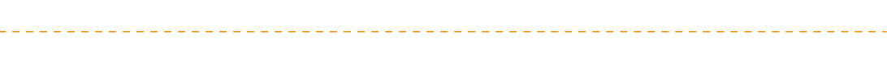

## Section.fromSHAPE

Function to create parametric general sections (non-composite or composite).      
This function requires `Shape` object to create sections.

### Constructor

**<font color="green">`Section.FromShape(Name:str,shape1:Shape,shape2:Shape=None,shape3:Shape=None,shape4:Shape=None, Offset:Offset=Offset(),useShear:bool=True,use7Dof:bool=False,id:int=None)`</font>**

Creates a Section from shape objects.    

### Parameters
* `Name`: Section name
* `shape1`: Shape object.     
* `shape2`: Shape object (Part 2 of composite section).     
* `shape3`: Shape object (Part 3 of composite section).     
* `shape4`: Shape object (Part 4 of composite section).     
* `Offset (default=Offset.CC())`: Section offset parameters
* `useShear (default=True)`: Enable shear deformation
* `use7Dof (default=False)`: Enable warping (7DOF)
* `id (default=None)`: Section ID (auto-assigned if 0)


### Method
* `plot`: Show a matplotlib plot of the Shape object.     


### Non-Composite Section

Non-Composite sections are created as PSC-Value sections.     


#### 1. Hollow Box section


```py
from midas_civil import *

Element.Beam.SE((0,0,0),(5,0,0),5)
Node.create()
Element.create()

hollowShape = Shape(
    outerPTs=Shape.roundRect(3,0.5,0.1),
    innerPTs=[Shape.roundRect(0.3,0.3,0.1,origin_X=1.0),
              Shape.roundRect(0.3,0.3,0.1,origin_X=0.35),
              Shape.roundRect(0.3,0.3,0.1,origin_X=-1.0),
              Shape.roundRect(0.3,0.3,0.1,origin_X=-0.35)]
    )

Section.FromShape('Hollow Rect',hollowShape,id=1)

Section.create()

```

#### 2. Built-up Section

```py
from midas_civil import *

Element.Beam.SE((0,0,0),(5,0,0),5)
Node.create()
Element.create()

Shape1 = Shape(outerPTs=
               [Shape.c_shape(1,0.5,0.1,0.1,r1=0.05,r2=0.05,origin_X=-1),
                Shape.c_shape(1,0.5,0.1,0.1,r1=0.05,r2=0.05,origin_X=1,angle=180),
                Shape.rect(2,0.05,origin_Y=0.54),
                Shape.rect(2,0.05,origin_Y=-0.54)]
                )
               

Section.FromShape('CustomShape',Shape1)

Section.create()

```


### Composite Section

Composite Sections are created as Composite General Sections.     
Material properties of Part-1 is taken as reference material for other parts.    

#### 1. Composite Super-T section


```py
from midas_civil import *

Element.Beam.SE((0,0,0),(5,0,0),5)
Node.create()
Element.create()

SuperT = Shape(Shape.AS_SuperT_RMS2019('T2','M'),mat=(35000,0.2,24))
Slab = Shape(Shape.rect(2.5,0.25,origin_Y=0.68),mat=(35000,0.2,24))

Section.FromShape('Composite Section',SuperT,Slab)

Section.create()

```


---




# Shape

A separate class to create section shape object (polygon + material properties).   

---

## Constructor

**<font color="green">`Shape(outerPTs,innerPTs=None,mat=(2.1e8,0.3,7.85))`</font>**

Creates a shape object with given outer points (outer shape)  , inner points (holes) and material properties.


```py
from midas_civil import *

Shape(Shape.angle_shape(10,12,1.5,1.5,1,1))

```

### Parameters
* `outerPTs`: List of (x,y) points representing the outer polygon. Can be List of list of (x,y) points for multiple outer polygons. 
* `innerPTs`: List of (x,y) points representing the inner polygon. Can be List of list of (x,y) points for multiple inner polygons.
* `mat`: Tuple (E (Modulus of elasticity) , v (Poisson's Ratio) , w (Weight density)) . Eg. `(2.1e8 , 0.3 , 7.85)`         


### Method
* `plot`: Show a matplotlib plot of the Shape object.     

```py
from midas_civil import *

shape1 = Shape(Shape.angle_shape(10,12,1.5,1.5,1,1))
shape1.plot()

```

---


## Shapes
Standard Shape function can generate various shapes points [(x,y)...] to easily create parametric sections.


#### Common Parameters

* `nSides`: No. of sides create for any arc/curve segment.      
* `origin_X`: Offset section along x-direction (horizontal)      
* `origin_Y`: Offset section along y-direction (vertical)      
* `angle`: Rotate section about z-axis passing through origin (red circle).     

### Rectangle


**<font color="green">`Shape.rect(b:float,d:float, origin_X:float=0,origin_Y:float=0,angle:float=0)`</font>**


### Rounded Rectangle

**<font color="green">`Shape.roundRect(b:float,d:float,radius:float=0,nSides:int=8,origin_X:float=0,origin_Y:float=0,angle:float=0)`</font>**


### Circle

**<font color="green">`Shape.circle(r:float,nSides:int=18,  origin_X:float=0,origin_Y:float=0,angle:float=0)`</font>**

   


### I-shape

**<font color="green">`Shape.i_shape(H,B1,tw,tf1,B2=None,tf2=None,r1=0,r2=0,nSides=8, origin_X:float=0,origin_Y:float=0,angle:float=0)`</font>**

   


### Angle

**<font color="green">`Shape.angle_shape(H,B,tw,tf,r1=0,r2=0,nSides=8, origin_X:float=0,origin_Y:float=0,angle:float=0)`</font>**

   


### T- shape

**<font color="green">`Shape.t_shape(H,B,tw,tf,r1=0,r2=0,nSides=8,  origin_X:float=0,origin_Y:float=0,angle:float=0))`</font>**


### C- shape

**<font color="green">`Shape.c_shape(H,B1,tw,tf1,B2=None,tf2=None,r1=0,r2=0,nSides=8,  origin_X:float=0,origin_Y:float=0,angle:float=0)`</font>**

 


### AS Super T (RMS 2019)

**<font color="green">`AS_SuperT_RMS2019(type:_AS_ST19='T1',ModelUnit:str=None)`</font>**

* `type` : Type of Super T section. Eg. 'T1', 'T2', 'T3', 'T4' or 'T5'        
* `ModelUnit` : Unit in which section co-ordinates are desired.  Eg. 'MM', 'IN', 'CM', 'FT' or 'M          
&nbsp;&nbsp;&nbsp;&nbsp;&nbsp;&nbsp;&nbsp;&nbsp;&nbsp;&nbsp;&nbsp;&nbsp;&nbsp;&nbsp;&nbsp;&nbsp;&nbsp;&nbsp;&nbsp;&nbsp;&nbsp;&nbsp;&nbsp;&nbsp;
If `None` is provided, units is automatically taken from the model.      


