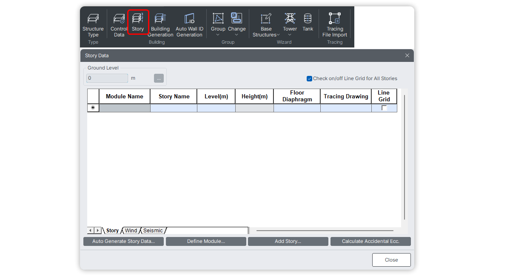

# Story

Options related to defining and managing Story data in GEN NX.



## Constructor
---
**<font color="green">`Story(name:str, level:float, floor_width_X=0, floor_width_Y=0, floor_cent_X=0, floor_cent_Y=0, wind_ecc_X=0, wind_ecc_Y=0, seis_acc_ecc_X=0, seis_acc_ecc_Y=0, seis_inh_ecc_X=0, seis_inh_ecc_Y=0, seis_torAmp_fac_X=1, seis_torAmp_fac_Y=1, bFloorDiaph=True, id:int=None)`</font>**

Creates a Story definition.

### Parameters
* `name`: Name of the story (e.g., "1F", "Roof").
* `level`: The elevation of the story in the GCS Z-axis.
* `floor_width_X (default=0)`: Effective width of the building along the X-axis for Wind Load.
* `floor_width_Y (default=0)`: Effective width of the building along the Y-axis for Wind Load.
* `floor_cent_X (default=0)`: X-coordinate of the position where wind load is applied.
* `floor_cent_Y (default=0)`: Y-coordinate of the position where wind load is applied.
* `wind_ecc_X (default=0)`: Wind eccentricity along the X-axis.
* `wind_ecc_Y (default=0)`: Wind eccentricity along the Y-axis.
* `seis_acc_ecc_X (default=0)`: Accidental eccentricity distance in the X-direction for calculating accidental torsional moments due to seismic loads in the Y-direction.
* `seis_acc_ecc_Y (default=0)`: Accidental eccentricity distance in the Y-direction for calculating accidental torsional moments due to seismic loads in the X-direction.
* `seis_inh_ecc_X (default=0)`: Inherent seismic eccentricity along X.
* `seis_inh_ecc_Y (default=0)`: Inherent seismic eccentricity along Y.
* `seis_torAmp_fac_X (default=1)`: Seismic torsional amplification factor in X.
* `seis_torAmp_fac_Y (default=1)`: Seismic torsional amplification factor in Y.
* `bFloorDiaph (default=True)`: Enable/Disable rigid floor diaphragm action at this story level. When enabled, it constrains Dx, Dy, and Rz for all nodes at this level.
* `id (default=None)`: Story ID. Auto-assigned if not provided.

## Methods
---
#### json
Returns the JSON representation of all currently defined stories.

```py
Story.json()
```

#### create
Pushes all the defined stories from Python into MIDAS GEN NX.

```py
Story.create()
```

#### get
Retrieves the story data currently present in MIDAS GEN NX in JSON format.

```py
Story.get()
```

#### sync
Fetches all story data from MIDAS GEN NX to Python.

```py
Story.sync()
```

#### delete
Deletes all story data from both MIDAS GEN NX to Python.

```py
Story.delete()
```

#### clear
Clears the story data locally in Python without affecting the model.

```py
Story.clear()
```

#### autoGenerate
Automatically generates story data based on the Z-coordinates of all existing nodes in the model. It automatically calculates the floor extents (Width X, Width Y) and geometric centers (Center X, Center Y).

```py
Story.autoGenerate()
Story.create() # Push the generated stories to the software
```

## Examples
---
#### 1. Defining Stories Manually
```py
from midas_civil import *

# Clear previous data
Story.clear()

# Define stories
Story("Base", level=0.0, bFloorDiaph=False)
Story("1F", level=3.0, floor_width_X=10, floor_width_Y=15, bFloorDiaph=True)
Story("2F", level=6.0, floor_width_X=10, floor_width_Y=15, bFloorDiaph=True)
Story("Roof", level=9.0, floor_width_X=10, floor_width_Y=15, bFloorDiaph=True)

# Send to MIDAS Civil NX
Story.create()
```

#### 2. Auto-Generating Stories from Nodes
```py
from midas_civil import *

# Assuming nodes have already been created at Z = 0, 3, 6, 9
Story.autoGenerate()

# Send generated stories to MIDAS
Story.create()
```