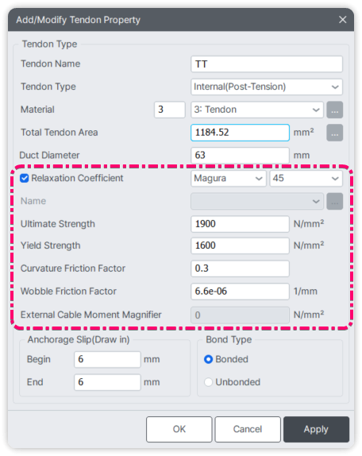

# Tendon Property

Manages tendon properties and integrates relaxation models.

<figure markdown>
{ width="400"}
</figure>

> Property highlighted in the box is defined through Relaxation defintion.

## Constructor
---
**`Tendon.Property(name, type, matID: int, tdn_area, duct_dia, relaxation, ext_mom_mag=0, anch_slip_begin=0, anch_slip_end=0, bond_type: bool=True, id=0)`**


Creates a tendon property

### Parameters
* `name` (str): Name for the tendon property.
* `type` (int): 1=Internal (Pre-tension) |  2=Internal (Post-tension) |  3=External.
* `matID` (int): Steel Material ID.
* `tdn_area` (float): Area of tendon.
* `duct_dia` (float): Duct diameter.
* `relaxation`: Relaxation definition.
* `ext_mom_mag` (float, default=0): External moment magnifier.
* `anch_slip_begin` (float, default=0): Anchorage slip at begin.
* `anch_slip_end` (float, default=0): Anchorage slip at end.
* `bond_type` (bool, default=True): Whether the tendon is bonded or unbonded.
* `id` (int, default=0): Optional ID for tendon property.

### Object Attributes
* `ID`: Unique identifier (auto-generated)
* `NAME`: Tendon name
* `TYPE`: Tendon type (INTERNAL or EXTERNAL)
* `TENS`: Tension type (PRE or POST)
* `MAT`: Material ID
* `TDN_AREA`: Tendon area
* `DUCT_DIA`: Duct diameter
* `RELAX`: Relaxation object
* `EXT_MOM_MAG`: External moment magnitude
* `ANC_SLIP_B`: Anchor slip at beginning
* `ANC_SLIP_E`: Anchor slip at end
* `BOND_TYP`: Bonded (True) or unbonded (False)

#### Class Attributes
*Tendon.Property.properties* -> List of all tendon properties defined.

```py
Tendon.Property('TD_Prop',2,1,1700,100,Tendon.Relaxation.Null(1800,1500))
Tendon.Property('TD_Prop 2',1,1,1700,100,Tendon.Relaxation.CEBFIP_2010(0,2,1800,1500))

for prop in Tendon.Property.properties:
    print(f'NAME : {prop.NAME}  | TYPE: {prop.TYPE} {prop.TENS} TENSION ')

# Output:
# NAME : TD_Prop  | TYPE: INTERNAL POST TENSION
# NAME : TD_Prop 2  | TYPE: INTERNAL PRE TENSION
```
## Methods
---
#### json
Returns a JSON representation of all Tendon Properties defined in python.

```py
Tendon.Property('TD_Prop',2,1,1700,100,Tendon.Relaxation.Null(1800,1500))
print(Tendon.Property.json())

# Output:
# {'Assign': {1: {'NAME': 'TD_Prop', 'TYPE': 'INTERNAL', 'LT': 'POST', 'MATL': 1, 'AREA': 1700, 'D_AREA': 100, 'ASB': 0, 'ASE': 0, 'bBONDED': True, 'ALPHA': 0, 'RM': 0, 'RV': 0, 'US': 1800, 'YS': 1500, 'FF': 0, 'WF': 0, 'bRELAX': False}}}
```

#### create
Sends the current tendon properties defined to the Civil NX using a PUT request.   
New properties are created and existing property(same ID) in Civil NX will be updated.

```py
Tendon.Property('TD_Prop',2,1,1700,100,Tendon.Relaxation.Null(1800,1500)) # Assumes Material with ID=1
Tendon.Property.create()
```

#### get
Fetches tendon properties from the Civil NX and return the JSON representation.

```py
print(Tendon.Property.get())
# Output:
# {'TDNT': {'1': {'NAME': 'TD_Prop', 'TYPE': 'INTERNAL', 'MATL': 1, 'AREA': 1700, 'D_AREA': 100, 'RM': 0, 'RV': 0, 'US': 1800, 'YS': 1500, 'LT': 'POST', 'ASB': 0, 'ASE': 0, 'bBONDED': True, 'ALPHA': 0, 'bRELAX': False, 'TDMFK': 0, 'FF': 0, 'WF': 0}}}

```

#### sync
Retrieves Tendon property data from the Civil NX and rebuilds the internal tendon property list.

```py
Tendon.Property.sync()
```

#### delete
Deletes all tendon properties from both Python and Civil NX.

```py
Tendon.Property.delete()
```


## Relaxation
---
The Relaxation class contains several code-specific inner classes to define tendon relaxation properties.   
Each standard/code has its own constructor parameters and object attributes.

If no relaxation is required, Tendon.Relaxation.Null( ) should be used.


??? sumit_block "Null - No Relaxation"
    ### Null
    #### Constructor  
    **`Tendon.Relaxation.Null(    ult_st,    yield_st,    curv_fric_fac=0,    wob_fric_fac=0)`**

    #### Parameters  
    * `ult_st` (float): Ultimate strength.  
    * `yield_st` (float): Yield strength.  
    * `curv_fric_fac` (float, optional): Curvature friction factor (default is 0).  
    * `wob_fric_fac` (float, optional): Wobble friction factor (default is 0).  

    #### Object Attributes  
    * `CODE` (str): 'No Relaxation'  
    * `ULT_ST` (float): Ultimate strength.  
    * `YIELD_ST` (float): Yield strength.  
    * `CURV_FF` (float): Curvature friction factor.  
    * `WOBBLE_FF` (float): Wobble friction factor.  


??? sumit_block "CEB-FIP Code (2010)"
    ### CEBFIP_2010
    #### Constructor

    **`Tendon.Relaxation.CEBFIP_2010(    rho,    rel_class,    ult_st,    yield_st,    curv_fric_fac=0,    wob_fric_fac=0,    unint_ang_disp=0)`**


    #### Parameters
    * `rho` (float): Relative relaxation loss after 1000 hours.   
    * `rel_class` (int): Relaxation class (1: Slow, 2: Mean, 3: Rapid).   
    * `ult_st` (float): Ultimate strength .   
    * `yield_st` (float): Yield strength.   
    * `curv_fric_fac` (float, optional): Curvature friction factor (default: 0).   
    * `wob_fric_fac` (float, optional): Wobble friction factor (default: 0).   
    * `unint_ang_disp` (float, optional): Unintentional angular displacement (default: 0).   

    #### Object Attributes
    * `CODE` (str): 'CEB FIP-2010'   
    * `RHO` (float): Relative relaxation value.   
    * `CLASS` (int): Relaxation class.   
    * `ULT_ST` (float): Ultimate strength.   
    * `YIELD_ST` (float): Yield strength.   
    * `CURV_FF` (float): Curvature friction factor.   
    * `WOBBLE_FF` (float): Wobble friction factor.   
    * `UNINT_AD` (float): Unintentional angular displacement.   


??? sumit_block "CEB-FIP Code (1978)"
    ### CEBFIP_1978
    #### Constructor  
    **`Tendon.Relaxation.CEBFIP_1978(    rho,    ult_st,    yield_st,    curv_fric_fac=0,    wob_fric_fac=0,    unint_ang_disp=0)`**

    #### Parameters  
    * `rho` (float): Relative relaxation value.  
    * `ult_st` (float): Ultimate strength.  
    * `yield_st` (float): Yield strength.  
    * `curv_fric_fac` (float, optional): Curvature friction factor (default: 0).  
    * `wob_fric_fac` (float, optional): Wobble friction factor (default: 0).  
    * `unint_ang_disp` (float, optional): Unintentional angular displacement (default: 0).  

    #### Object Attributes  
    * `CODE` (str): 'CEB FIP-1978'  
    * `RHO` (float): Relative relaxation value.  
    * `ULT_ST` (float): Ultimate strength.  
    * `YIELD_ST` (float): Yield strength.  
    * `CURV_FF` (float): Curvature friction factor.  
    * `WOBBLE_FF` (float): Wobble friction factor.  
    * `UNINT_AD` (float): Unintentional angular displacement.  


??? sumit_block "CEB-FIP Code (1990)"
    ### CEBFIP_1990
    #### Constructor  
    **`Tendon.Relaxation.CEBFIP_1990(    rho,    ult_st,    yield_st,    curv_fric_fac=0,    wob_fric_fac=0,    unint_ang_disp=0)`**

    #### Parameters  
    * `rho` (float): Relative relaxation value.  
    * `ult_st` (float): Ultimate strength.  
    * `yield_st` (float): Yield strength.  
    * `curv_fric_fac` (float, optional): Curvature friction factor (default: 0).  
    * `wob_fric_fac` (float, optional): Wobble friction factor (default: 0).  
    * `unint_ang_disp` (float, optional): Unintentional angular displacement (default: 0).  

    #### Object Attributes  
    * `CODE` (str): 'CEB FIP-1990'  
    * `RHO` (float): Relative relaxation value.  
    * `ULT_ST` (float): Ultimate strength.  
    * `YIELD_ST` (float): Yield strength.  
    * `CURV_FF` (float): Curvature friction factor.  
    * `WOBBLE_FF` (float): Wobble friction factor.  
    * `UNINT_AD` (float): Unintentional angular displacement.  

??? sumit_block "European"
    ### European
    #### Constructor  
    **`Tendon.Relaxation.European(    rel_class,    ult_st,    yield_st,    curv_fric_fac=0,    wob_fric_fac=0,    unint_ang_disp=0)`**

    #### Parameters  
    * `rel_class` (int): Relaxation class (1: Ordinary, 2: Low, 3: HotRolled).  
    * `ult_st` (float): Ultimate strength.  
    * `yield_st` (float): Yield strength.  
    * `curv_fric_fac` (float, optional): Curvature friction factor (default: 0).  
    * `wob_fric_fac` (float, optional): Wobble friction factor (default: 0).  
    * `unint_ang_disp` (float, optional): Unintentional angular displacement (default: 0).  

    #### Object Attributes  
    * `CODE` (str): 'European'  
    * `CLASS` (int): Relaxation class.  
    * `ULT_ST` (float): Ultimate strength.  
    * `YIELD_ST` (float): Yield strength.  
    * `CURV_FF` (float): Curvature friction factor.  
    * `WOBBLE_FF` (float): Wobble friction factor.  
    * `UNINT_AD` (float): Unintentional angular displacement.  

??? sumit_block "IRC 18 - 2000"
    ### IRC_18
    #### Constructor  
    **`Tendon.Relaxation.IRC_18(    factor,    ult_st,    yield_st,    curv_fric_fac=0,    wob_fric_fac=0)`**

    #### Parameters  
    * `factor` (float): Relaxation factor.  
    * `ult_st` (float): Ultimate strength.  
    * `yield_st` (float): Yield strength.  
    * `curv_fric_fac` (float, optional): Curvature friction factor (default: 0).  
    * `wob_fric_fac` (float, optional): Wobble friction factor (default: 0).  

    #### Object Attributes  
    * `CODE` (str): 'IRC:18-2000'  
    * `FACTOR` (float): Relaxation factor.  
    * `ULT_ST` (float): Ultimate strength.  
    * `YIELD_ST` (float): Yield strength.  
    * `CURV_FF` (float): Curvature friction factor.  
    * `WOBBLE_FF` (float): Wobble friction factor.  

??? sumit_block "IRC 112 - 2020"
    ### IRC_112
    #### Constructor  
    **`Tendon.Relaxation.IRC_112(    factor,    ult_st,    yield_st,    curv_fric_fac=0,    wob_fric_fac=0)`**

    #### Parameters  
    * `factor` (float): Relaxation factor (code-specific parameter).  
    * `ult_st` (float): Ultimate strength.  
    * `yield_st` (float): Yield strength.  
    * `curv_fric_fac` (float, optional): Curvature friction factor (default is 0).  
    * `wob_fric_fac` (float, optional): Wobble friction factor (default is 0).  

    #### Object Attributes  
    * `CODE` (str): 'IRC:112-2011'  
    * `FACTOR` (float): Relaxation factor.  
    * `ULT_ST` (float): Ultimate strength.  
    * `YIELD_ST` (float): Yield strength.  
    * `CURV_FF` (float): Curvature friction factor.  
    * `WOBBLE_FF` (float): Wobble friction factor.  

??? sumit_block "Magura et al. 1964"
    ### Magura
    #### Constructor  
    **`Tendon.Relaxation.Magura(    factor,    ult_st,    yield_st,    curv_fric_fac=0,    wob_fric_fac=0)`**

    #### Parameters  
    * `factor` (int): Relaxation factor; must be either 10 or 45. If not, defaults to 45.  
    * `ult_st` (float): Ultimate strength.  
    * `yield_st` (float): Yield strength.  
    * `curv_fric_fac` (float, optional): Curvature friction factor (default is 0).  
    * `wob_fric_fac` (float, optional): Wobble friction factor (default is 0).  

    #### Object Attributes  
    * `CODE` (str): 'Magura'  
    * `FACTOR` (int): Relaxation factor (either 10 or 45).  
    * `ULT_ST` (float): Ultimate strength.  
    * `YIELD_ST` (float): Yield strength.  
    * `CURV_FF` (float): Curvature friction factor.  
    * `WOBBLE_FF` (float): Wobble friction factor.


## Examples
---
```py

from midas_civil import *

Material.STEEL('TD_steel','IS(S)','E450')
Tendon.Property('TD_Prop',2,1,1700,100,Tendon.Relaxation.Null(1800,1500))
Tendon.Property('TD_Prop 2',1,1,1700,100,Tendon.Relaxation.CEBFIP_2010(0,2,1800,1500))

Model.create()

```


