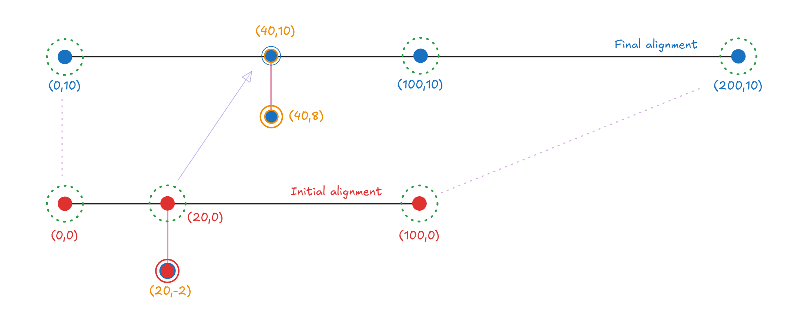

# Utilities
The module provides additional functions to modify existing model in MIDAS CIVIL NX

!!! info "Note."
    All the codes below assumes the initial import and MAPI Key definition.

```py
from midas_civil import *
MAPI_KEY('eyJ1ciI6InN1bWl0QG1pZGFzaXQuY29tIiwicGciO252k81571d')
```


## LineToPlate

**`utils.LineToPlate(nDiv:int = 10 , mSizeDiv:float = 0, bRigdLnk:bool=True , meshSize:float=0.5, elemList:list=None)`**  
The LineToPlate converts selected or specified line elements into shell (plate) elements in CIVIL NX.  
It provides flexible options for controlling the mesh density, division method, and boundary connectivity between elements.


#### Parameters
* `nDiv : int`: Number of divisions along the span. Used when `mSizeDiv = 0`.
* `mSizeDiv : float`: Division control based on mesh size (in meters). 
* `bRigdLnk : bool`: Whether to create rigid links at the ends of the span for connectivity and boundary constraint.   
&emsp;&emsp;&emsp;&emsp;
 **True**: Create rigid links at end. <font color="orange">&nbsp;&nbsp;|&nbsp;&nbsp;</font> 
 **False**: No links are created.
* `meshSize : float` : Desired mesh size (in meters) for the resulting plate elements. Controls plate element fineness.
* `elemList : list[int]` : List of element IDs to be converted.
If `None`, the currently selected elements in CIVIL NX are used.

!!! info "Note."
    Either `nDiv` or `mSizeDiv` should be specified (not both simultaneously):  
    ‎ ‎ ‎ 1. Use `nDiv` when we want an exact number of divisions.  
    ‎ ‎ ‎ 2. Use `mSizeDiv` when we want divisions based on mesh size.  
    To use with tapersections assigned to a Tapered Group, we first need to Convert them into individual tapered section


#### Examples  

```py
# USE ONLY ONE AT A TIME

# Example 1: Convert selected line elements with 10 divisions
utils.LineToPlate(20)

# Example 2: Convert lines based on mesh size of 0.25 m
utils.LineToPlate(nDiv=0, mSizeDiv=0.25)

# Example 3: Convert specific element list without rigid links
utils.LineToPlate(elemList=[101, 102, 103], bRigdLnk=False)

# Example 4: Use custom mesh size for the plate elements
utils.LineToPlate(mSizeDiv=0.5,meshSize=0.5)

```  

#### Supported Sections

Uniform and Tapered sections mentioned below can be converted to shell representation.  

| NAME	 |	SHAPE	|
|--------|-------|
| Angle	|	"L"	|
| Channel	|	"C"	|
| H/I-Section	|	"H"	|
| T-Section	|	"T"	|
| Box	|	"B"	|
| Pipe	|	"P"	|
| Solid Rectangle	|	"SB"	|
| PSC 1-2 Cell | "1-CEL" & "2-CEL"|

---

## Alignment
**`utils.Alignment(points:list, type: str = 'cubic')`**  

The Alignment class creates a smooth curve (alignment) that interpolates between a series of given (x, y) points.
It provides an interpolated curve representation (e.g. cubic spline, Akima, Makima, PCHIP) that can be later used to:   

* Transform points from one alignment system to another.


#### Parameters
* `points : list`: A list of coordinate pairs [[x₁, y₁], [x₂, y₂], ...] defining the alignment path.
* `type : str`: The type of interpolation used to generate the alignment curve. Options:  
&emsp;&emsp;&emsp;&emsp;
1 : `cubic` - Cubic Spline (default)   
&emsp;&emsp;&emsp;&emsp;
2 : `akima` - Akima spline  
&emsp;&emsp;&emsp;&emsp;
3 : `makima` - Modified Akima spline  
&emsp;&emsp;&emsp;&emsp;
4 : `pchip` - Piecewise Cubic Hermite Interpolating Polynomial  


!!! info "Note."
    Ensure that x-values in points are monotonic (increasing) to avoid errors in interpolation.

#### Object Attributes

`PT_X`: Input points X-coordinates  
`PT_Y`: Input points Y-coordinates  
`TOTALLENGTH`: Total length of the Alignment  

#### Object Functions

`getPoint`: Returns (x,y) point at specific distance from start  
`getSlope`: Returns slope(in radians) at specific distance from start  

### Alignment.transformPoint
**`utils.Alignment.transformPoint(point, initial_align, final_align)`**  
The transformPoint method maps a given point from one alignment to another.
It is used to realign geometric data — for instance, transforming model node coordinates from an original (initial) alignment to a modified (final) alignment.

#### Parameters
* `point : tuple(float,float)`: The coordinate (x, y) of the point to transform.  
* `initial_align : Alignment`: The original alignment object that defines the reference geometry before modification.  
* `initial_align : Alignment`: The target alignment object defining the new geometry.  

#### Examples  

##### Obtaining new location  

```py
from midas_civil import *

# Define two alignments
initial_align = utils.Alignment([[0, 0], [20, 0], [100, 0]])
final_align   = utils.Alignment([[0, 10], [100, 10], [200, 10]])

# Transform a single point from the initial to the final alignment
pt_original = (20, -2)
pt_transformed = utils.Alignment.transformPoint(pt_original, initial_align, final_align)

print(pt_transformed)
# Example output: (40, 8)
```  

##### Modify alignment  
```py
# Modifies existing model
from midas_civil import *

initial_align = utils.Alignment([[0,0],[80,-1.6],[160,-14.5]])
final_align = utils.Alignment([[0,0],[80,-5],[140,20]])

Node.sync()

for node in Node.nodes:
    node.X , node.Y = utils.Alignment.transformPoint((node.X,node.Y),initial_align,final_align)
Node.create()
```  