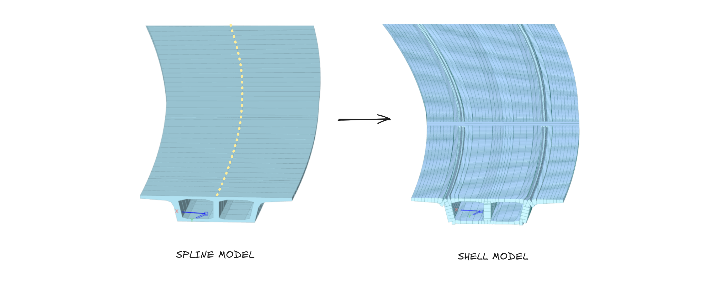
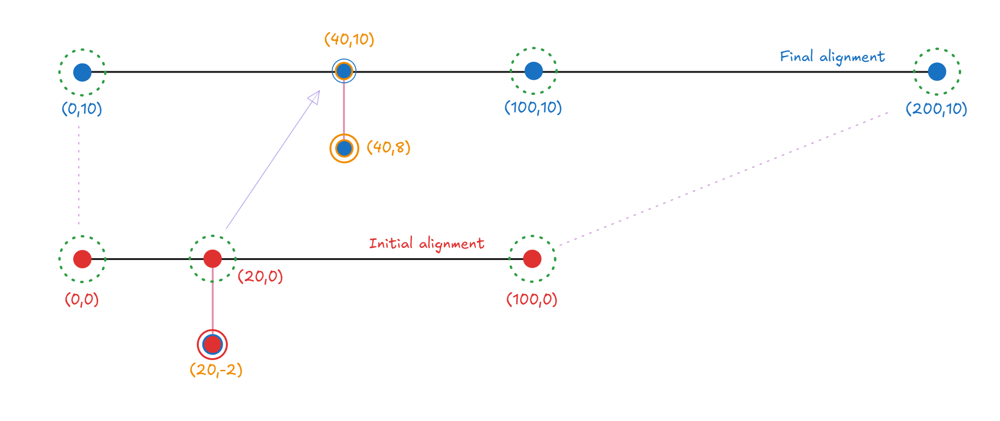
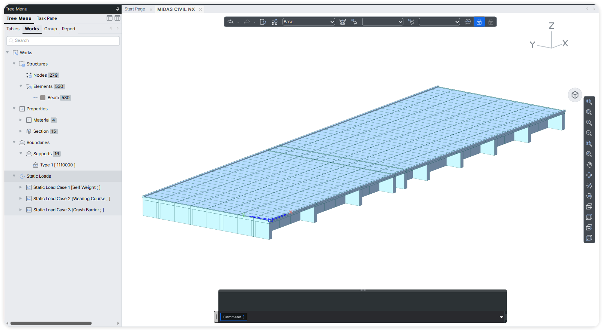
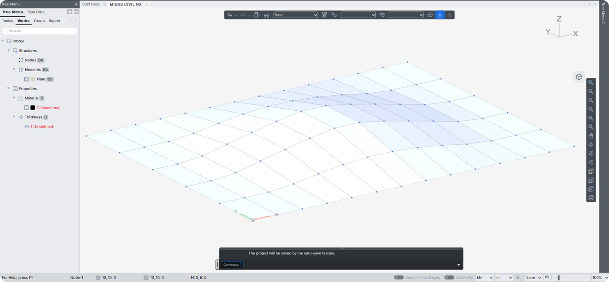

# Utilities
The module provides additional functions to modify existing model in MIDAS CIVIL NX

!!! info "Note."
    All the codes below assumes the initial import and MAPI Key definition.

```py
from midas_civil import *
MAPI_KEY('eyJ1ciI6InN1bWl0QG1pZGFzaXQuY29tIiwicGciO252k81571d')
```


## LineToPlate

**`utils.LineToPlate(nDiv:int = 10 , mSizeDiv:float = 0, bRigdLnk:bool=True , meshSize:float=0.5, elemList:list=None, reverse=False)`**  
The LineToPlate converts selected or specified line elements into shell (plate) elements in CIVIL NX.  
It provides flexible options for controlling the mesh density, division method, boundary connectivity between elements, and handling of asymmetric cross-sections.



#### Parameters
* `nDiv : int`: Number of divisions along the span. Used when `mSizeDiv = 0`.
* `mSizeDiv : float`: Division control based on mesh size (in meters). 
* `bRigdLnk : bool`: Whether to create rigid links at the ends of the span for connectivity and boundary constraint.   
&emsp;&emsp;&emsp;&emsp;
 **True**: Create rigid links at end. <font color="orange">&nbsp;&nbsp;|&nbsp;&nbsp;</font> 
 **False**: No links are created.
* `meshSize : float` : Desired mesh size (in meters) for the resulting plate elements. Controls plate element fineness.
* `elemList : list[int]` : List of element IDs to be converted.
If `None`, the currently selected elements in CIVIL NX are used.
* `reverse : bool` : Reverses the logical I-to-J end direction during the conversion process. This is particularly useful for ensuring correct orientation when converting tapered sections where the start and end dimensions are asymmetric.

!!! info "Note."
    Either `nDiv` or `mSizeDiv` should be specified (not both simultaneously):  
    ‎ ‎ ‎ 1. Use `nDiv` when we want an exact number of divisions.  
    ‎ ‎ ‎ 2. Use `mSizeDiv` when we want divisions based on mesh size.  
    To use with tapersections assigned to a Tapered Group, we first need to Convert them into individual tapered section


#### Examples  

```py
# USE ONLY ONE AT A TIME

# Example 1: Convert selected line elements with 10 divisions
utils.LineToPlate(20)

# Example 2: Convert lines based on mesh size of 0.25 m
utils.LineToPlate(nDiv=0, mSizeDiv=0.25)

# Example 3: Convert specific element list without rigid links
utils.LineToPlate(elemList=[101, 102, 103], bRigdLnk=False)

# Example 4: Use custom mesh size for the plate elements
utils.LineToPlate(mSizeDiv=0.5,meshSize=0.5)

# Example 5: Convert selected tapered line elements, reversing the I and J ends
utils.LineToPlate(nDiv=10, reverse=True)
```

#### Supported Sections

Uniform and Tapered sections mentioned below can be converted to shell representation.  

| NAME	 |	SHAPE	|
|--------|-------|
| Angle	|	"L"	|
| Channel	|	"C"	|
| H/I-Section	|	"H"	|
| T-Section	|	"T"	|
| Box	|	"B"	|
| Pipe	|	"P"	|
| Solid Rectangle	|	"SB"	|
| PSC 1-2 Cell | "1-CEL" & "2-CEL"|
| Steel Tub Type 1 | "Tub"|

---

## Alignment
**`utils.Alignment(points:list, type: str = 'cubic', xz_interp: str = 'linear', yEcc: float = 0)`**  

The Alignment class creates a smooth curve (alignment) that interpolates between a series of given (x, y) or (x, y, z) points.
It provides an interpolated curve representation (e.g. cubic spline, Akima, Makima, PCHIP) that can be later used to:   

* Transform points from one alignment system to another.


#### Parameters
* `points : list`: A list of coordinate pairs `[[x₁, y₁], [x₂, y₂], ...]` or `[[x₁, y₁, z₁], [x₂, y₂, z₂], ...]` defining the alignment path.
* `type : str`: The type of interpolation used to generate the alignment curve in X-Y. Options:  
&emsp;&emsp;&emsp;&emsp;
1 : `cubic` - Cubic Spline (default)   
&emsp;&emsp;&emsp;&emsp;
2 : `akima` - Akima spline  
&emsp;&emsp;&emsp;&emsp;
3 : `makima` - Modified Akima spline  
&emsp;&emsp;&emsp;&emsp;
4 : `pchip` - Piecewise Cubic Hermite Interpolating Polynomial  
* `xz_interp : str`: The type of interpolation used to generate the alignment curve in X-Z. Options:  
&emsp;&emsp;&emsp;&emsp;
1 : `linear` - Linear interpolation (default)   
&emsp;&emsp;&emsp;&emsp;
2 : `quadratic` - Quadratic interpolation  
&emsp;&emsp;&emsp;&emsp;
3 : `cubic` - Cubic interpolation  
* `yEcc : float`: Eccentricity offset applied to the points in the local Y direction before interpolation (default = `0`).


!!! info "Note."
    Ensure that x-values in points are monotonic (increasing) to avoid errors in interpolation.

#### Object Attributes

`PT_X`: Input points X-coordinates  
`PT_Y`: Input points Y-coordinates  
`TOTALLENGTH`: Total length of the Alignment  

#### Object Functions

`getPoint`: Returns (x,y) point at specific distance from start  
`getSlope`: Returns slope(in radians) at specific distance from start  

### Alignment.transformPoint
**`utils.Alignment.transformPoint(point, initial_align, final_align)`**  
The transformPoint method maps a given point from one alignment to another.
It is used to realign geometric data — for instance, transforming model node coordinates from an original (initial) alignment to a modified (final) alignment.

#### Parameters
* `point : tuple(float,float)`: The coordinate (x, y) of the point to transform.  
* `initial_align : Alignment`: The original alignment object that defines the reference geometry before modification.  
* `initial_align : Alignment`: The target alignment object defining the new geometry.  

#### Examples  

##### Obtaining new location  

```py
from midas_civil import *

# Define two alignments
initial_align = utils.Alignment([[0, 0], [20, 0], [100, 0]])
final_align   = utils.Alignment([[0, 10], [100, 10], [200, 10]])

# Transform a single point from the initial to the final alignment
pt_original = (20, -2)
pt_transformed = utils.Alignment.transformPoint(pt_original, initial_align, final_align)

print(pt_transformed)
# Example output: (40, 8)
```  

##### Modify alignment  
```py
# Modifies existing model
from midas_civil import *

initial_align = utils.Alignment([[0,0],[80,-1.6],[160,-14.5]])
final_align = utils.Alignment([[0,0],[80,-5],[140,20]])

Node.sync()

for node in Node.nodes:
    node.X , node.Y = utils.Alignment.transformPoint((node.X,node.Y),initial_align,final_align)
Node.create()
```  

---


## RC Grillage

**`utils.RC_Grillage(span_length = 20, width = 8, support:Literal['fix','pin']='fix', dia_no=2,start_loc = [0,0,0], girder_depth = 0, girder_width = 0, girder_no = 0, web_thk = 0, slab_thk = 0, dia_depth = 0, dia_width = 0, overhang = 0, skew = 0, mat_E = 30_000_000)`**  





RC Grillage Utility wizard to generate an RC grillage model in CIVIL NX with configurable geometry, supports, and material properties.   
Use `Model.create()` at the end to send data to CIVIL NX.


#### Parameters

* `span_length : float` : Span length of the structure (default = 20).
* `width : float` : Overall deck width (default = 8).
* `support : {'fix','pin'}` : Support condition at span ends.  
&emsp;&emsp;&emsp;&emsp;
**fix**: Fixed support <font color="orange">&nbsp;&nbsp;|&nbsp;&nbsp;</font>
**pin**: Pinned support  

* `dia_no : int` : Number of diaphragms (default = 2).
* `start_loc : list[float]` : Starting coordinates `[x, y, z]` for grillage placement.
* `girder_depth : float` : Depth of girder section.
* `girder_width : float` : Width of girder section.
* `girder_no : int` : Number of longitudinal girders.
* `web_thk : float` : Thickness of girder web.
* `slab_thk : float` : Thickness of deck slab.
* `dia_depth : float` : Depth of diaphragm.
* `dia_width : float` : Width of diaphragm.
* `overhang : float` : Overhang length beyond outer girders.
* `skew : float` : Skew angle in degrees.
* `mat_E : float` : Modulus of elasticity of material (default = 30,000,000).


```py
from midas_civil import *           

utils.RC_Grillage(12,8,'pin',4,start_loc=[0,0,0])
utils.RC_Grillage(15,8,'pin',6,start_loc=[11,0,0])

Model.create()
```  

## SoftSelection

**`utils.SoftSelection(location=(0,0,0), radius:float=5, falloffType='Linear')`**  
The SoftSelection function finds all nodes within a specified radius from a given location (or list of locations) and assigns them a proportional weight from 0.0 to 1.0 based on their distance from the center. 



#### Parameters
* `location`: Center of the selection area. Can be a coordinate tuple `(x, y, z)` or a list of node IDs/locations. Default is `(0, 0, 0)`.
* `radius : float`: The radius of influence around the location(s).
* `falloffType`: The mathematical curve used to calculate the weight as distance increases. Options:  
&emsp;&emsp;&emsp;&emsp;
`'Linear'` : Weight decreases linearly (Default). <font color="orange">&nbsp;&nbsp;|&nbsp;&nbsp;</font> 
`'Parabolic'` : Weight follows a quadratic curve. <font color="orange">&nbsp;&nbsp;|&nbsp;&nbsp;</font> 
`'Smooth'` : Weight follows a smooth cubic curve.

#### Returns
* `list`: A list of tuples containing the Node ID and its calculated weight, e.g., `[(nodeID_1, weight_1), (nodeID_2, weight_2), ...]`.

!!! info "Note."
    The function returns the calculated weights but does not apply any automatic modifications to the model itself:  
    ‎ ‎ ‎ 1. The weight evaluates to `1.0` at the center of the selection and decays to `0.0` at the edge of the radius.  
    ‎ ‎ ‎ 2. These weights are meant to be used as multipliers for custom transformations (e.g., smoothly raising/lowering a mesh, proportional load distribution, tapering thicknesses, etc.), leaving you free to apply them however you see fit.

#### Examples

```py
from midas_civil import *

MAPI_KEY("eyJ1ciI6InAuaGFyc2hAbWlkYXNpdC5jb20iLCJwZyI6ImNpdmlsIiwiY24iOiJMOGU0Q3B1M1NBIn0.5945a6d1c34ef0f9317fdc9b09517110a345286557457cf9d556415984ea74d8")
Model.clear()

# Create baseline nodes for extrusion
loft = []
for i in range(14):
    Node(i,0,0)
    loft.append(Node(i,0,0).ID)

# Extrude nodes to create a plate mesh
Element.Plate.extrude('NODE_ID', loft, [0,10,0], 5, False, 2)

# Perform a Soft Selection at coordinate (6.5, 5, 0) with a radius of 5 units
test = utils.SoftSelection((6.5, 5, 0), radius=5, falloffType='Linear')

# Use the obtained weights to modify the Z-coordinates of the selected nodes proportionally
for data in test:
    nodeByID(data[0]).Z += data[1] * 1.12

# Push the newly created nodes and elements to Civil NX
Node.create()
Element.create()
```