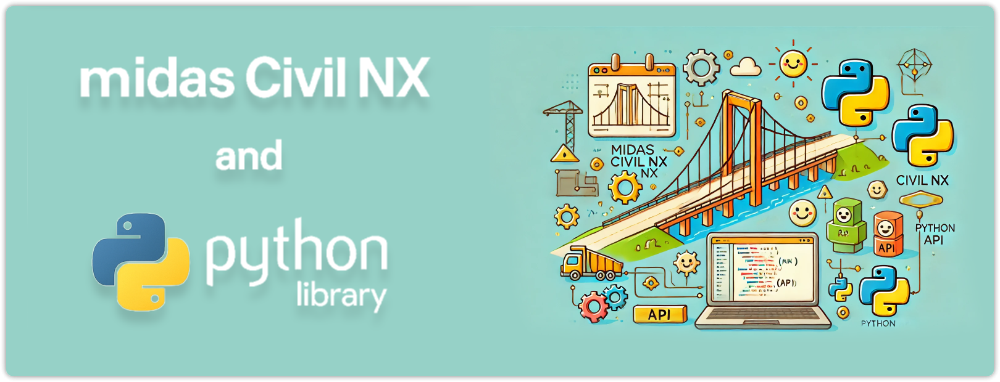

title: Introduction
summary: to MIDAS Python interface


{ .off-glb }

This module provides a Python interface to interact with the MIDAS Civil NX API using HTTP requests. It includes functionality to manage the MAPI key required for authentication and to send API requests using various HTTP methods.


## Installation
---

Make sure you have Python 3 installed.  
Install the MIDAS Python interface via Pip command.

```py
pip install midas-civil
```

If already installed, upgrade the package to latest version.
```py
pip install midas-civil --upgrade
```

Additional libraries required by the modules are

* Numpy
* Polars
* xlsxwriter
* Requests 
* SciPy

---
To import the package use the import *

```py
from midas_civil import *
```

### Video Guide
---

<iframe width="900" height="480" src="https://www.youtube.com/embed/1MSzdb2IX1c" title="How to Install MIDAS Civil Python Library | MIDAS API" allowfullscreen></iframe>


## Functions available

---


### MAPI_KEY
Handles and stores the MIDAS API key used for authenticating requests.

```py
#Importing the midas-civil package
from midas_civil import * 

#Sets the MAPI Key for Python interface
MAPI_KEY('eyJ1ciI6InN1bWl0QG1pZGFzaXQuY29tIiwicGciO.252a81571d')
```


!!! info "NOTE :"
    * Ensure your MIDAS Civil NX application is open and connected.
    * The MAPI key used in your Python script must match the key in the Civil NX application.


### MAPI_BASEURL
Handles and stores the MIDAS API Base URL used for sending requests.

```py
#Importing the midas-civil package
from midas_civil import * 

#Sets the Base URL for Python interface
MAPI_BASEURL('https://moa-engineers.midasit.com:443/civil')
```


#### MAPI_BASEURL.autoURL

When using python library in a web environment, `.com` (moa-engineers.midasit.com) server may be different for the MIDAS CIVIL NX and the system on which python is running.
In such scenario, python may fail to connect with (https://moa-engineers.midasit.com:443/civil) Base URL.

There are total 5 MIDAS API servers located across the globe :

| No. | Region | Base URL |
|-----|-----|----|
| 1. | South Korea | moa-engineers-kr.midasit.com |
| 2. | India | moa-engineers-in.midasit.com |
| 3. | Europe | moa-engineers-gb.midasit.com |
| 4. | USA | moa-engineers-us.midasit.com |
| 5. | China | moa-engineers.midasit.cn |

The `.com` URL automatically connects to the nearest API server based on the system’s network location.


For example, a user in India may have **MIDAS CIVIL NX** connected to the **India server**, but run a Python script in **Google Colab**, which is hosted on a **US server**.

Because the servers are different, Python library may not connect correctly.

In this situation, we can use the `MAPI_BASEURL.autoURL()` function.
This function automatically finds and sets the correct Base URL based on the provided MAPI Key, ensuring a successful connection.

```py
from midas_civil import * 

# Sets the MAPI Key for autoURL to connect
MAPI_KEY('xxxxxxxxxxxxxxxxxx')

# Automatically set the Base URL for Python interface
MAPI_BASEURL.autoURL()

```


### MAPI_COUNTRY
The `MAPI_COUNTRY `function allows users to define the country of CIVIL NX version, which in turn automatically retrieves and sets the appropriate MAPI Key and Base URL from the system registry. 

```py
#Importing the midas-civil package
from midas_civil import * 


MAPI_COUNTRY('CH') # For Chinese version
MAPI_COUNTRY('KR') # For Korean version
MAPI_COUNTRY('US') # For US / English version
```

!!! info "NOTE :"
    * If retriving Base URL and MAPI-Key from registry fails, then :    
    a.   Define Base URL using **MAPI_BASEURL( )**   
    b.   Define MAPI Key using **MAPI_KEY( )**


### MidasAPI
Send requests to MIDAS Civil NX.

#### Parameters :
* `method (str)`: HTTP method ("GET", "POST", "PUT", "DELETE")
* `command (str)`: API endpoint (e.g., "/db/NODE")
* `body (dict)`: Request payload (JSON format). Optional for "GET" and "DELETE"

#### Returns :

* A dict representing the JSON response from the API.

#### Example :
```py

from midas_civil import*

MAPI_KEY("eyJ1ciI6IklOMjQwN0ZZVDIiLCJw") #Paste your Mapi Key

# Create a node
MidasAPI("PUT","/db/NODE",{"Assign": {"1": {"X": -1,"Y": -1,"Z": -1}}})
 
```

---


### getID
Return ID of objects(Node,Element,Section,Material)


#### Parameters :
* `*objects (list)`: Objects or List of Objects of type Node, Element, Section and Material

    ⭐ Supports nested list

#### Returns :
* An array with ID of inputted objects

#### Example :
```py
from midas_civil import *
MAPI_KEY('eyJ1ciI6InN1bWl0QG1pZGFzaXQuY29tIiwicGciO252a81571d')

Node(0,0,0,id=1)    # Create Node at 0,0,0 with ID = 1
Node(1,1,1,id=2)    # Create Node at 1,1,1 with ID = 2
Node(2,2,2,id=3)    # Create Node at 2,2,2 with ID = 3

beam_1 = Element.Beam(1,2)  # Create Beam connecting Node 1 and Node 2 (default ID = 1)
beam_2 = Element.Beam(2,3)  # Create Beam connecting Node 2 and Node 3 (default ID = 2)


print(getID(beam_1))
print(getID(beam_2))
print(getID(beam_1,beam_2))

#   Output :
#   [1]
#   [2]
#   [1, 2]
```

---


### getNodeID
Return Node ID of Element objects 

#### Parameters :
* `*objects (list)`: Objects or List of Objects of type Element(Beam, Truss...)

    ⭐ Supports nested list

#### Returns :
* An array with Node IDs of inputted objects

#### Example :
```py
from midas_civil import *
MAPI_KEY('eyJ1ciI6InN1bWl0QG1pZGFzaXQuY29tIiwicGciO252a81571d')

Node(0,0,0,id=1)    # Create Node at 0,0,0 with ID = 1
Node(1,1,1,id=2)    # Create Node at 1,1,1 with ID = 2
Node(2,2,2,id=3)    # Create Node at 2,2,2 with ID = 3

beam_1 = Element.Beam(1,2)  # Create Beam connecting Node 1 and Node 2 (default ID = 1)
beam_2 = Element.Beam(2,3)  # Create Beam connecting Node 2 and Node 3 (default ID = 2)


print(getNodeID(beam_1))
print(getNodeID(beam_2))
print(getNodeID(beam_1,beam_2))

#   Output :
#   [[1, 2]]
#   [[2, 3]]
#   [[1, 2], [2, 3]]
```