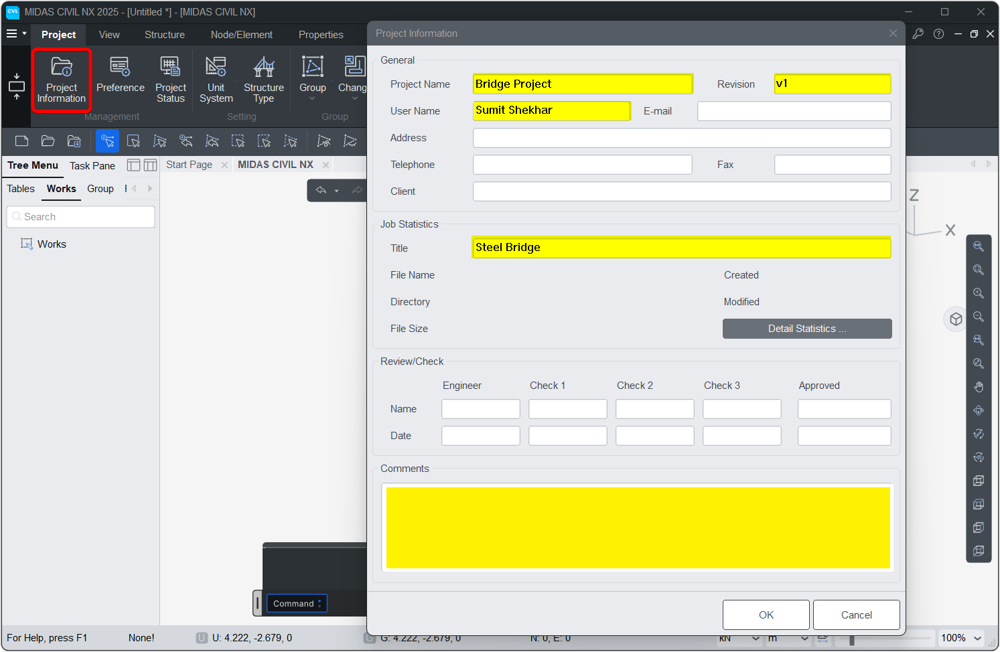
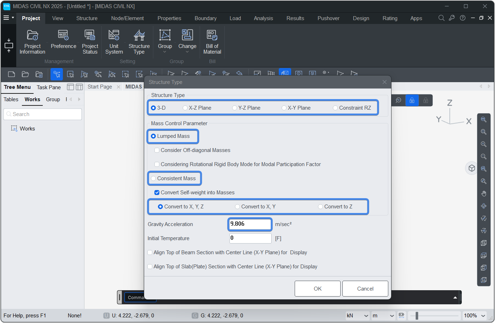

# Model

This manual provides detailed documentation of the Model class methods used for managing structural analysis models via Midas API.


---
## <font style="font-size:0px">Model.</font>new
Creates a new model file.
```py
Model.new()
```


## <font style="font-size:0px">Model.</font>open
Opens an existing model file.


```py
Model.open("D://model.mcb")
```

## <font style="font-size:0px">Model.</font>close
Closes an opened model file.


```py
Model.close()
```


## <font style="font-size:0px">Model.</font>save
Saves the current model. For first-time saves, provide a path.

!!! info "NOTE"
    If path is not provided for the first time GUI prompt will appear

```py
Model.save()
Model.save("D://model.mcb")
```

## <font style="font-size:0px">Model.</font>saveAs
Saves the model to the specified file path.
```py
Model.saveAs("D://model.mcb")
```

## <font style="font-size:0px">Model.</font>saveStageAs
Save Construction Stage as separate model


```py
Model.saveStageAs("CS0","D://Stage_CS0.mcb")
```

## <font style="font-size:0px">Model.</font>importMCT
Imports MCT data file in MIDAS CIVIL NX.

```py
Model.importMCT('D:\\model.mct')
```


## <font style="font-size:0px">Model.</font>importJSON
Imports JSON data file in MIDAS CIVIL NX.

```py
Model.importJSON('D:\\model.json')
```


## <font style="font-size:0px">Model.</font>exportMCT
Exports MIDAS CIVIL NX model as MCT file.

```py
Model.exportMCT('D:\\model.mct')
```


## <font style="font-size:0px">Model.</font>exportJSON
Exports MIDAS CIVIL NX model as JSON file.

```py
Model.exportJSON('D:\\model.json')
```


## <font style="font-size:0px">Model.</font>info
Sets the project information.  
`info(project_name="", revision="", user="", title="",comment="")`  


```py
Model.info(project_name="Bridge Project", revision="v1", user="Sumit Shekhar", title="Steel Bridge")

```



## <font style="font-size:0px">Model.</font>units
Sets the model's working units.  
`Model.units(force="KN", length="M", heat="BTU", temp="C")`  

#### Parameters
* `force`: KN, N, KGF, TONF, LBF, KIPS
* `length`: M, CM, MM, FT, IN
* `heat`: CAL, KCAL, J, KJ, BTU
* `temp`: C, F


```py
Model.units() # Set the SI unit system
Model.units(force='TONF') # Set the Force unit to Tonf
```
!!! info "NOTE :" 
    Make sure the units are in all caps


## <font style="font-size:0px">Model.</font>type
Sets structure and mass type information for the model.  
`Model.type(strc_type=0, mass_type=1, gravity=0, mass_dir=1)`  

#### Parameters
* `strc_type`: &nbsp;&nbsp;0 : 3D <font color="orange">&nbsp;&nbsp;|&nbsp;&nbsp;</font> 
1 : X-Z <font color="orange">&nbsp;&nbsp;|&nbsp;&nbsp;</font> 
2 : Y-Z  <font color="orange">&nbsp;&nbsp;|&nbsp;&nbsp;</font> 
3 : X-Y  <font color="orange">&nbsp;&nbsp;|&nbsp;&nbsp;</font> 
4 : RZ constraint  
* `mass_type`: &nbsp;&nbsp;1 : Lumped <font color="orange">&nbsp;&nbsp;|&nbsp;&nbsp;</font> 2 : Consistent  
* `gravity`: &nbsp;&nbsp; &nbsp;&nbsp;Gravity acceleration (l/t²)
* `mass_dir`: &nbsp;&nbsp;1 : Convert to XYZ <font color="orange">&nbsp;&nbsp;|&nbsp;&nbsp;</font> 
2 : Convert to XY <font color="orange">&nbsp;&nbsp;|&nbsp;&nbsp;</font> 
3 : Convert to Z only


```py
Model.type()
```



## <font style="font-size:0px">Model.</font>create
Creates all model components: materials, sections, nodes, elements, groups, and boundaries.  
>*Equivalent to executing all the create commands individually*
```py
Model.create()
```

## <font style="font-size:0px">Model.</font>clear
Clears all internal python data of the model, including nodes, elements, materials, groups, loads, and boundaries.  
>*Equivalent to executing all the clear commands individually*   
>*It does not delete data from CIVIL NX*
```py
Model.clear()
```


## <font style="font-size:0px">Model.</font>analyse
Checks whether a model has been analyzed. If not, saves it and then analysis.

```py
Model.analyse()
```

---


## <font style="font-size:0px">Model.</font>Select

Selects nodes and elements based on geometric criteria or material/section properties and returns output.

* `output`: Output of the Select command.   

    `NODE_ID` → Return selected Node IDs   
    `NODE` → Return selected Node Objects   
    `ELEM_ID` → Return selected Element IDs   
    `ELEM` → Return selected Element Objects  

Model.Select commands returns a `Set` of selected items.  
All the python operations related to Set type can be utilised to modify selection.   
Set Operators: [Geeks for Geeks reference](https://www.geeksforgeeks.org/python/python-set-operations-union-intersection-difference-symmetric-difference/)


```py
# & Set Operator to select only the truss elements on XZ plane
IDs_truss_on_XZ = Model.Select.Plane_XZ((0,0,0) ,'ELEM_ID') & Model.Select.Element('TRUSS')
```

---

### Model.Select.Line

**`Model.Select.Line(point1:tuple = (0,0,0) , point2:tuple=(1,0,0) , output:_SelectOutput='NODE_ID' , radius:float=0.001)`**

Selects nodes / elements that lies on the line connecting two given points.   
The output is sorted based on the distance from start point (`point1`)

#### Parameters
* `point`: Start location [x, y, z]
* `point2`: End location [x, y, z]
* `output`: Output of the Select command.
* `radius`: Selection radius around the line


### Model.Select.Line_alongX

**`Model.Select.Line_alongX(point:tuple = (0,0,0), output:_SelectOutput='NODE_ID',radius:float=0.001)`**

Selects nodes / elements that lies on the line parallel to X axis passing through given point.   
The output is sorted based on the ascending X location.   

#### Parameters
* `point`: Point location [x, y, z]
* `output`: Output of the Select command.
* `radius`: Selection radius around the line

### Model.Select.Line_alongY

**`Model.Select.Line_alongY(point:tuple = (0,0,0), output:_SelectOutput='NODE_ID',radius:float=0.001)`**

Selects nodes / elements that lies on the line parallel to Y axis passing through given point.   
The output is sorted based on the ascending Y location.   

#### Parameters
* `point`: Point location [x, y, z]
* `output`: Output of the Select command.
* `radius`: Selection radius around the line

### Model.Select.Line_alongZ

**`Model.Select.Line_alongZ(point:tuple = (0,0,0), output:_SelectOutput='NODE_ID',radius:float=0.001)`**

Selects nodes / elements that lies on the line parallel to Z axis passing through given point.   
The output is sorted based on the ascending Z location.   

#### Parameters
* `point`: Point location [x, y, z]
* `output`: Output of the Select command.
* `radius`: Selection radius around the line


### Model.Select.Box

**`Model.Select.Box(point1:tuple = (0,0,0) , point2:tuple=(1,1,1) , output:_SelectOutput='NODE_ID')`**

Selects nodes / elements that lies within the box.
For elements, the selection is based on whether its mid-point lies inside the box or not.

#### Parameters
* `point1`: First Corner of the box selection [x, y, z]
* `point2`: Diagonally opposite Corner of the box selection [x, y, z]
* `output`: Output of the Select command.


### Model.Select.Plane_XY

**`Model.Select.Plane_XY(point:tuple = (0,0,0) , output:_SelectOutput='NODE_ID')`**

Selects nodes / elements that lies on XY plane passing through given point.
For elements, the selection is based on whether its mid-point lies on the plane or not.

#### Parameters
* `point`: First Corner of the box selection [x, y, z]
* `output`: Output of the Select command.

### Model.Select.Plane_YZ

**`Model.Select.Plane_YZ(point:tuple = (0,0,0) , output:_SelectOutput='NODE_ID')`**

Selects nodes / elements that lies on YZ plane passing through given point.
For elements, the selection is based on whether its mid-point lies on the plane or not.

#### Parameters
* `point`: First Corner of the box selection [x, y, z]
* `output`: Output of the Select command.

### Model.Select.Plane_XZ

**`Model.Select.Plane_XZ(point:tuple = (0,0,0) , output:_SelectOutput='NODE_ID')`**

Selects nodes / elements that lies on XZ plane passing through given point.
For elements, the selection is based on whether its mid-point lies on the plane or not.

#### Parameters
* `point`: First Corner of the box selection [x, y, z]
* `output`: Output of the Select command.


### Model.Select.Element

**`Model.Select.Element(type=None,matID=None,secID=None,output:_SelectOutputElem='ELEM_ID')`**

Selects elements based on type, material and section properties

#### Parameters
* `type`: `str` or `list[str]` of element types.       Eg. `type='TRUSS'` or `type=['TRUSS','BEAM']`
* `matID`: `int` or `list[int]` of Material IDs.       Eg. `matID=1` or `matID=[1,2,3]`
* `secID`: `int` or `list[int]` of Section IDs.         Eg. `secID=1` or `secID=[1,2,3]`
* `output`: Output of the Select command. `ELEM_ID` or `ELEM`

---

## <font style="font-size:0px">Model.</font>IMAGE
Capture the image in the viewport

**`Model.IMAGE(location='', image_size = View.Image_Size , view='pre',CS_StageName:str='' , _boutputImage=True)`**


The `IMAGE` function captures the image of the current viewport.   
It allows you to control image size, output location, and optional construction stage settings.

>*Examples can be found in View Section*   

#### Parameters

- `location` (`str`): Optional. File path where the image will be saved

- `image_size` (`tuple`): (Width , Height) of the output image in pixels.

- `CS_StageName` (`str`): Optional. Construction stage name

- `_bOutputImage` (`bool`): Optional. Whether to return `Image` object or JSON.

#### Returns

- Pillow `Image` object  or
- JSON dictionary


```py
Model.IMAGE("E://API//temp//ModelImage.jpg")
```
