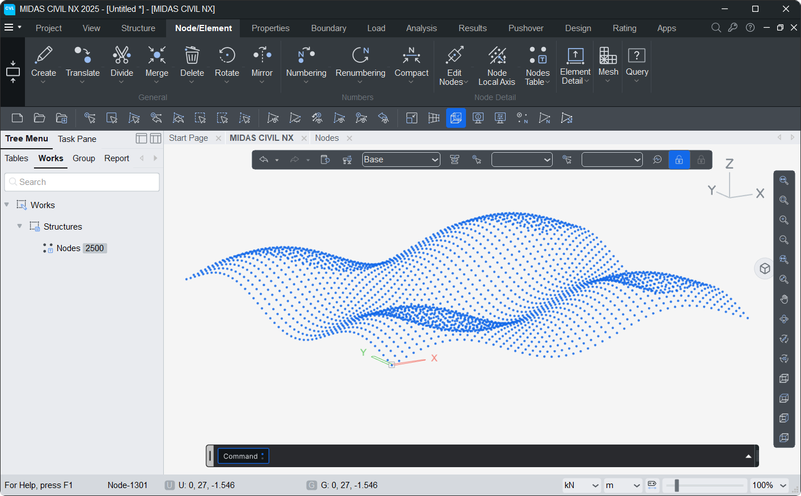
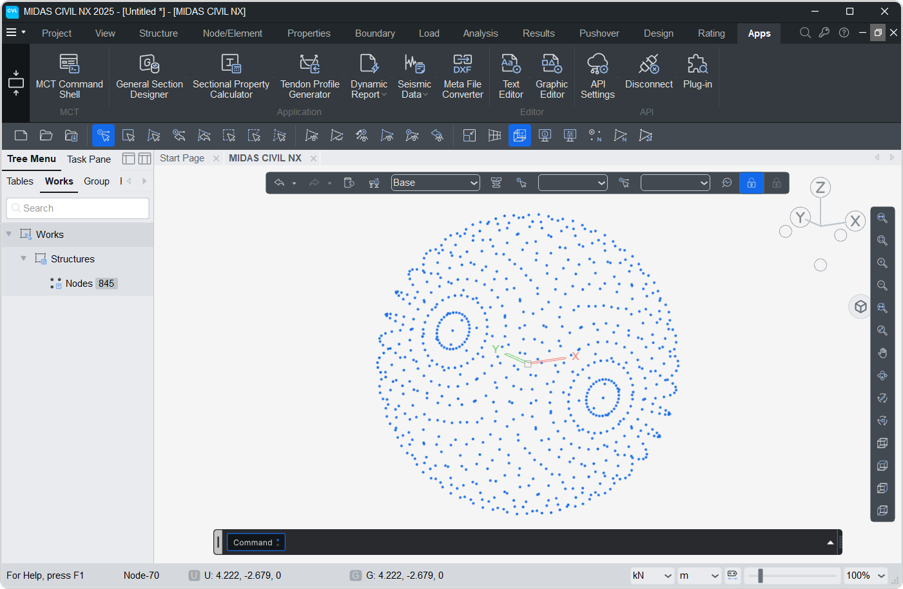
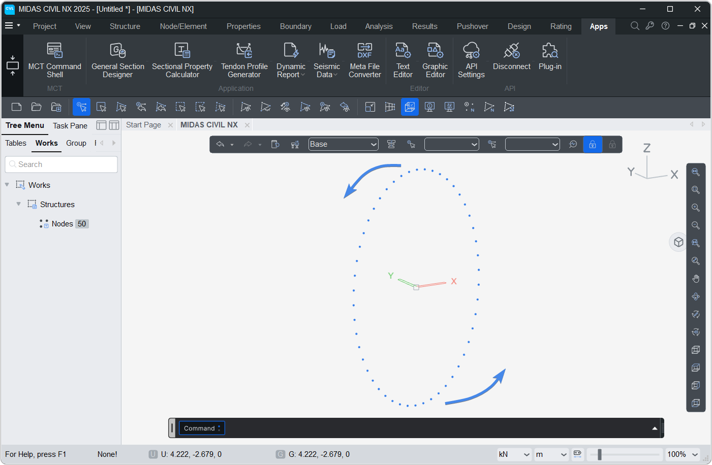
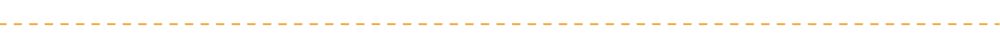

# Node
Represents a 3D point in space with ID.
It facilitates node creation, synchronization, and deletion.

!!! info "Note."
    All the codes below assumes the initial import and MAPI Key definition.

```py
from midas_civil import *
MAPI_KEY('eyJ1ciI6InN1bWl0QG1pZGFzaXQuY29tIiwicGciO252a81571d')
```

---

### Node

**Node(`x , y , z , id=None , group = '' , merge = 1`)**

#### Parameters
* `x, y, z`: Coordinates of the node.
* `id (default=None)`: Manually assign an ID.   If None, ID will be auto-assigned.
* `group (default='')`: Structure group of the node (can be str or list eg. 'SG' or ['SG1','SG2'])
* `merge (default=1)`: If enabled, checks for existing nodes and return their IDs.  No additional/duplicate node will be created.


---

### Node.SE

**Node.SE(`s_loc: list, e_loc: list, n: int = 1, id=None , group = '' , merge = 1`)**

#### Parameters
* `s_loc`: Start location. [x,y,z]    
* `e_loc`: End location. [x,y,z]    
* `n (default=1)`: Number of division. n+1 nodes are created.     
* `id (default=None)`: Manually assign an ID.   If None, ID will be auto-assigned.    
* `group (default='')`: Structure group of the node (can be str or list eg. 'SG' or ['SG1','SG2'])    
* `merge (default=1)`: If enabled, checks for existing nodes and return their IDs.  No additional/duplicate node will be created.   


---

### Node.SDL

**Node.SDL(`s_loc: list, dir: list, l: float, n: int = 1, id=None , group = '' , merge = 1`)**

#### Parameters
* `s_loc`: Start location. [x,y,z]   
* `dir`: Direction vector [dx, dy, dz]   
* `l`: Total length of created nodes (see `Element.Beam.SDL`).     
* `n (default=1)`: Number of division. n+1 nodes are created.    
* `id (default=None)`: Manually assign an ID.   If None, ID will be auto-assigned.    
* `group (default='')`: Structure group of the node (can be str or list eg. 'SG' or ['SG1','SG2'])    
* `merge (default=1)`: If enabled, checks for existing nodes and return their IDs.  No additional/duplicate node will be created.    


---

### Node.fromList

**Node.fromList(`nodesList: list, id=None , group = '' , merge = 1`)**

#### Parameters
* `nodesList`: List of `[x, y, z]` coordinates. e.g. `[[0,0,0], [1,0,0], [2,0,0]]`. 
* `id (default=None)`: Manually assign an ID.   If None, ID will be auto-assigned.    
* `group (default='')`: Structure group of the node (can be str or list eg. 'SG' or ['SG1','SG2'])    
* `merge (default=1)`: If enabled, checks for existing nodes and return their IDs.  No additional/duplicate node will be created.    


---

### Object Attributes

`X, Y, Z`: Coordinates of the node.    
`ID`: Unique identifier.    
`LOC`: (x,y,z) Coordinates of the node in tuple.     
`AXIS`: Local direction of the node eg. `[(1,0,0),(0,1,0),(0,0,1)]` represent local X,Y,Z respectively. Created by `bLocalAxis` option of Beam element.        

### Retrieve Node by ID

`nodeByID(id:int)` : Returns `NODE` object with given ID.

#### Class Attributes

*Node.nodes* -> List of all nodes.

```py
n1 = Node(0,1,2,10)    # Create Node at 0,1,2 with ID = 10
n2 = Node(0,3,4,20)    # Create Node at 0,3,4 with ID = 20

for n in Node.nodes:
    print(f' NODE ID = {n.ID} | X = {n.X} , Y = {n.Y} , Z = {n.Z}')

# Output :
# NODE ID = 10 | X = 0 , Y = 1 , Z = 2
# NODE ID = 20 | X = 0 , Y = 3 , Z = 4

```


## Methods
---
### <font style="font-size:0px">Node.</font>json 
Returns a JSON representation of all Nodes defined in python.

```py
n1 = Node(0,1,2,10)    # Create Node at 0,1,2 with ID = 10
n2 = Node(0,3,4,20)    # Create Node at 0,3,4 with ID = 20

print(Node.json())

# Output :
# {'Assign': {10: {'X': 0, 'Y': 1, 'Z': 2}, 20: {'X': 0, 'Y': 3, 'Z': 4}}}

```

### <font style="font-size:0px">Node.</font>create
Sends the current node list to the Civil NX using a PUT request.  
New nodes are created and existing nodes(same ID) in Civil NX will be updated.

```py
n1 = Node(0,1,2,10)    # Create Node at 0,1,2 with ID = 10
n2 = Node(0,3,4,20)    # Create Node at 0,3,4 with ID = 20

Node.create()

```

### <font style="font-size:0px">Node.</font>get
Fetches nodes from the Civil NX and return the JSON representation.  
*-Here, Civil model had 2 nodes* 
```py
print(Node.get())
# Output
# {'NODE': {'1': {'X': 1, 'Y': 2, 'Z': 3}, '2': {'X': 1, 'Y': 3, 'Z': 2}}}
```

### <font style="font-size:0px">Node.</font>sync
Retrieves Node data from the Civil NX and rebuilds the internal node list.  
*-Here, Civil model had 2 nodes* 
```py
Node.sync()
for n in Node.nodes:
    print(f' NODE ID = {n.ID} | X = {n.X} , Y = {n.Y} , Z = {n.Z}')

# Output
# NODE ID = 1 | X = 1 , Y = 2 , Z = 3
# NODE ID = 2 | X = 1 , Y = 3 , Z = 2

```

### <font style="font-size:0px">Node.</font>clear
Deletes all node data from Python.

```py
Node.clear()
```

### <font style="font-size:0px">Node.</font>delete
Deletes all node data from both Python and Civil NX.

```py
Node.delete()
```

## Examples
---
### 1. Sine Grid

```py
import math
n=50
for j in range(n):
    for i in range(n):
        Node(i,j,2*(math.sin(i/5)+math.sin(j/5)),100*i+j+1)

Node.create()
```


---------------------------------------------------------

### 2. Sphere Nodes

```py
import math
n=50
R=5
phi=0
for j in range(40):
    for i in range(n):
        theta = i*2*math.pi/n
        Node(R*math.sin(theta)*math.cos(phi),R*math.cos(theta),R*math.sin(theta)*math.sin(phi))

    phi+=math.pi/16
    
Node.create()
```


---------------------------------------------------------

### 3. Rotating Nodes

```py
import math
n=50
R=5
phi=0
for j in range(40):
    for i in range(n):
        theta = i*2*math.pi/n
        Node(R*math.sin(theta)*math.cos(phi),R*math.cos(theta),R*math.sin(theta)*math.sin(phi),i+1)

    phi+=math.pi/16
    Node.create()
```


     
     
 


## Node Local Axis
In MIDAS CIVIL NX, nodes can have a local axis orientation different from the global axis. This is used to apply boundary conditions or interpret results in a skewed (rotated) coordinate system.


**NodeLocalAxis(`nodeID: int, type: Literal['X','Y','Z','XYZ','Vector'], angle`)**


Two definition methods are supported:

- **Angle** (``type='X'``, ``'Y'``, ``'Z'``, or ``'XYZ'``): Rotations
    about one or more global axes in degrees. Corresponds to API
    ``iMETHOD = 1``.
- **Vector** (``type='Vector'``): Explicit definition of the local X and Y
    axes as unit vectors. Corresponds to API ``iMETHOD = 3``.


#### Parameters

- `nodeID`: ID of the node to assign the local axis to.
- `type`: Method used to define the local axis.
    * `'X'` - Rotation angle (degrees) about the global X-axis.
    * `'Y'` - Rotation angle (degrees) about the global Y-axis.
    * `'Z'` - Rotation angle (degrees) about the global Z-axis.
    * `'XYZ'` - Three rotation angles `[rx, ry, rz]` (degrees) about global X, Y and Z.
    * `'Vector'` - Two direction vectors `[[v1x,v1y,v1z],[v2x,v2y,v2z]]` defining the local X and Y axes explicitly.
- `angle`: Value matching the chosen `type`.
    * `'X'`, `'Y'`, `'Z'` : a single angle in degrees. e.g. `30`
    * `'XYZ'` : list of three angles. e.g. `[0, 0, 45]`
    * `'Vector'` : list of two vectors. e.g. `[[1,0,0],[0,0,1]]`

!!! note
    If a local axis is defined again for a node that already has one, the existing definition is updated.        
    When `type` is `'X'`, `'Y'` or `'Z'`, the angles of the other two axes are preserved from the existing definition.

---

#### Object Attributes

`ID`: Node ID to which the local axis is assigned.  
`TYPE`: Definition method. `'ANGLE'` for `'X'`, `'Y'`, `'Z'`, `'XYZ'` and `'VEC'` for `'Vector'`.  
`ANGLE`: Rotation angles `[rx, ry, rz]` in degrees. Used when `TYPE = 'ANGLE'`.  
`VEC`: Local X and Y axis vectors `[[v1x,v1y,v1z],[v2x,v2y,v2z]]`. Used when `TYPE = 'VEC'`.

#### Class Attributes

*NodeLocalAxis.skew* -> List of all node local axis objects.  
*NodeLocalAxis.ids* -> List of node IDs having a local axis.

```py
NodeLocalAxis(10, 'Z', 30)
NodeLocalAxis(20, 'Vector', [[1,0,0],[0,0,1]])

for ax in NodeLocalAxis.skew:
    print(f' NODE ID = {ax.ID} | TYPE = {ax.TYPE}')

# Output :
# NODE ID = 10 | TYPE = ANGLE
# NODE ID = 20 | TYPE = VEC
```

## Methods

---

### <font style="font-size:0px">NodeLocalAxis.</font>json

Returns a JSON representation of all node local axes defined in python.  
Angle based definitions use `iMETHOD = 1` and vector based definitions use `iMETHOD = 3`.

```py
NodeLocalAxis(10, 'Z', 30)
NodeLocalAxis(20, 'Vector', [[1,0,0],[0,0,1]])

print(NodeLocalAxis.json())

# Output :
# {'Assign': {10: {'iMETHOD': 1, 'ANGLE_X': 0, 'ANGLE_Y': 0, 'ANGLE_Z': 30},
#             20: {'iMETHOD': 3, 'V1X': 1, 'V1Y': 0, 'V1Z': 0, 'V2X': 0, 'V2Y': 0, 'V2Z': 1}}}
```

### <font style="font-size:0px">NodeLocalAxis.</font>create

Sends the current node local axis list to the Civil NX using a PUT request.  
New local axes are created and existing ones (same node) in Civil NX will be updated.

```py
NodeLocalAxis(10, 'Z', 30)
NodeLocalAxis(20, 'Vector', [[1,0,0],[0,0,1]])

NodeLocalAxis.create()
```

### <font style="font-size:0px">NodeLocalAxis.</font>get

Fetches node local axis data from the Civil NX and returns the JSON representation.

```py
print(NodeLocalAxis.get())
```

### <font style="font-size:0px">NodeLocalAxis.</font>sync

Retrieves node local axis data from the Civil NX and rebuilds the internal list.  
Angle based (`iMETHOD = 1`) axes are imported as `'XYZ'` and vector based (`iMETHOD = 3`) axes are imported as `'Vector'`.  
A warning is printed for nodes whose local axis type is not supported.

```py
NodeLocalAxis.sync()
for ax in NodeLocalAxis.skew:
    print(f' NODE ID = {ax.ID} | TYPE = {ax.TYPE}')
```

### <font style="font-size:0px">NodeLocalAxis.</font>clear

Deletes all node local axis data from Python.

```py
NodeLocalAxis.clear()
```

### <font style="font-size:0px">NodeLocalAxis.</font>delete

Deletes all node local axis data from both Python and Civil NX.

```py
NodeLocalAxis.delete()
```

## Examples

---

#### 1. Rotation about a single axis

```py
Node(0,0,0,1)
Node(5,0,0,2)

NodeLocalAxis(2, 'Z', 30)      # Rotate local axis of node 2 by 30° about global Z

Node.create()
NodeLocalAxis.create()
```


#### 2. Combining rotations

Defining a single-axis rotation again for the same node keeps the previous angles of the other axes.

```py
NodeLocalAxis(10, 'Z', 30)
NodeLocalAxis(10, 'X', 15)     # Node 10 now has X = 15° , Y = 0° , Z = 30°

print(NodeLocalAxis.json())

# Output :
# {'Assign': {10: {'iMETHOD': 1, 'ANGLE_X': 15, 'ANGLE_Y': 0, 'ANGLE_Z': 30}}}
```


#### 3. Three angles at once

```py
NodeLocalAxis(20, 'XYZ', [0, 45, 0])    # Rotate 45° about global Y

NodeLocalAxis.create()
```


#### 4. Using vectors

Define the local X and Y axes directly. The local Z axis follows from these two.

```py
NodeLocalAxis(30, 'Vector', [[1,0,0],[0,0,1]])    # Local X = global X , Local Y = global Z

NodeLocalAxis.create()
```


#### 5. Skewed support at multiple nodes

```py
import math

for i, nID in enumerate([1, 2, 3, 4]):
    NodeLocalAxis(nID, 'Z', i*15)      # Progressive rotation of 0°, 15°, 30°, 45°

NodeLocalAxis.create()
```
