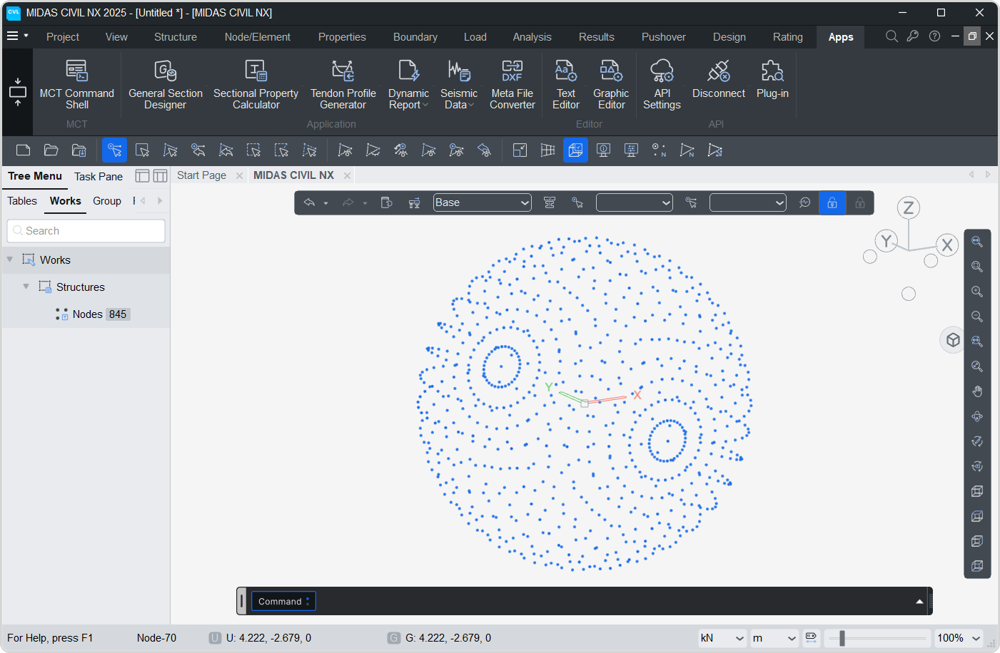

# Node
Represents a 3D point in space with ID.
It facilitates node creation, synchronization, and deletion.

!!! info "Note."
    All the codes below assumes the initial import and MAPI Key definition.

```py
from midas_civil import *
MAPI_KEY('eyJ1ciI6InN1bWl0QG1pZGFzaXQuY29tIiwicGciO252a81571d')
```


## Constructor
---
**Node(`x , y , z , id = 0 , group = '' , merge = 1`)**

### Parameters
* `x, y, z`: Coordinates of the node.
* `id (default=0)`: Manually assign an ID.   If 0, ID will be auto-assigned.
* `group (default='')`: Structure group of the node (can be str or list eg. 'SG' or ['SG1','SG2'])
* `merge (default=1)`: If enabled, checks for existing nodes and return their IDs.  No additional/duplicate node will be created.


### Object Attributes

`X, Y, Z`: Coordinates of the node.

`ID`: Unique identifier.

#### Class Attributes

*Node.nodes* -> List of all nodes.

```py
n1 = Node(0,1,2,10)    # Create Node at 0,1,2 with ID = 10
n2 = Node(0,3,4,20)    # Create Node at 0,3,4 with ID = 20

for n in Node.nodes:
    print(f' NODE ID = {n.ID} | X = {n.X} , Y = {n.Y} , Z = {n.Z}')

# Output :
# NODE ID = 10 | X = 0 , Y = 1 , Z = 2
# NODE ID = 20 | X = 0 , Y = 3 , Z = 4

```


## Methods
---
### <font style="font-size:0px">Node.</font>json 
Returns a JSON representation of all Nodes defined in python.

```py
n1 = Node(0,1,2,10)    # Create Node at 0,1,2 with ID = 10
n2 = Node(0,3,4,20)    # Create Node at 0,3,4 with ID = 20

print(Node.json())

# Output :
# {'Assign': {10: {'X': 0, 'Y': 1, 'Z': 2}, 20: {'X': 0, 'Y': 3, 'Z': 4}}}

```

### <font style="font-size:0px">Node.</font>create
Sends the current node list to the Civil NX using a PUT request.  
New nodes are created and existing nodes(same ID) in Civil NX will be updated.

```py
n1 = Node(0,1,2,10)    # Create Node at 0,1,2 with ID = 10
n2 = Node(0,3,4,20)    # Create Node at 0,3,4 with ID = 20

Node.create()

```

### <font style="font-size:0px">Node.</font>get
Fetches nodes from the Civil NX and return the JSON representation.  
*-Here, Civil model had 2 nodes* 
```py
print(Node.get())
# Output
# {'NODE': {'1': {'X': 1, 'Y': 2, 'Z': 3}, '2': {'X': 1, 'Y': 3, 'Z': 2}}}
```

### <font style="font-size:0px">Node.</font>sync
Retrieves Node data from the Civil NX and rebuilds the internal node list.  
*-Here, Civil model had 2 nodes* 
```py
Node.sync()
for n in Node.nodes:
    print(f' NODE ID = {n.ID} | X = {n.X} , Y = {n.Y} , Z = {n.Z}')

# Output
# NODE ID = 1 | X = 1 , Y = 2 , Z = 3
# NODE ID = 2 | X = 1 , Y = 3 , Z = 2

```


### <font style="font-size:0px">Node.</font>delete
Deletes all node data from both Python and Civil NX.

```py
Node.delete()
```

## Examples
---
### 1. Sine Grid

```py
import math
n=50
for j in range(n):
    for i in range(n):
        Node(i,j,2*(math.sin(i/5)+math.sin(j/5)),100*i+j+1)

Node.create()
```


---------------------------------------------------------

### 2. Sphere Nodes

```py
import math
n=50
R=5
phi=0
for j in range(40):
    for i in range(n):
        theta = i*2*math.pi/n
        Node(R*math.sin(theta)*math.cos(phi),R*math.cos(theta),R*math.sin(theta)*math.sin(phi))

    phi+=math.pi/16
    
Node.create()
```


---------------------------------------------------------

### 3. Rotating Nodes

```py
import math
n=50
R=5
phi=0
for j in range(40):
    for i in range(n):
        theta = i*2*math.pi/n
        Node(R*math.sin(theta)*math.cos(phi),R*math.cos(theta),R*math.sin(theta)*math.sin(phi),i+1)

    phi+=math.pi/16
    Node.create()
```
